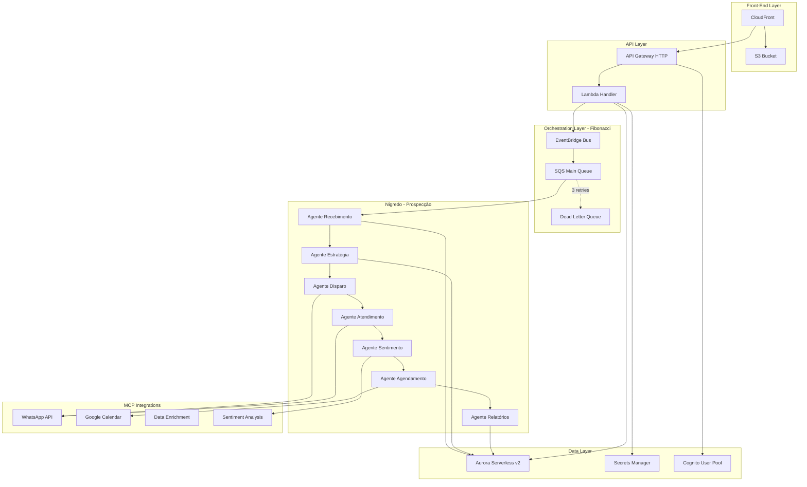
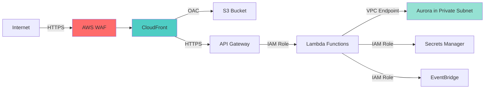

# Design Document - Ecossistema Alquimista.AI

## Overview

O Ecossistema Alquimista.AI é uma arquitetura fractal serverless na AWS que integra três núcleos principais:

1. **Fibonacci** - Orquestrador central que coordena comunicação entre agentes
2. **Nigredo** - Núcleo de prospecção B2B com 7 agentes especializados
3. **Alquimista** - Plataforma SaaS multi-tenant com marketplace de agentes

A arquitetura segue princípios fractais onde cada agente é autônomo, reentrante, reusável e conversacional, comunicando-se via protocolo padronizado através do EventBridge.

## Architecture

### High-Level Architecture



### Network Architecture

A infraestrutura utiliza uma VPC com 2 Availability Zones:

- **Public Subnets**: Para recursos que precisam acesso à internet (futuras integrações)
- **Private Isolated Subnets**: Para Aurora PostgreSQL (sem acesso direto à internet)
- **NAT Gateways**: Desabilitados (natGateways: 0) para reduzir custos em dev/staging

### Security Architecture



## Components and Interfaces

### 1. Front-End (CloudFront + S3)

**Purpose**: Servir aplicação SPA da plataforma Alquimista.AI

**Components**:
- S3 Bucket com versionamento e BlockPublicAccess
- CloudFront Distribution com OAC (Origin Access Control)
- Error pages customizadas para rotas SPA

**Configuration**:
```typescript
const siteBucket = new s3.Bucket(this, 'SiteBucket', {
  blockPublicAccess: s3.BlockPublicAccess.BLOCK_ALL,
  enforceSSL: true,
  versioned: true,
  encryption: s3.BucketEncryption.S3_MANAGED
});
```


**Interface**:
- Input: Requisições HTTPS do usuário
- Output: Assets estáticos (HTML, CSS, JS) com cache otimizado

### 2. API Gateway + Lambda Handler

**Purpose**: Ponto de entrada para todas as requisições HTTP e publicação de eventos

**Endpoints**:
- `GET /health` - Health check retornando `{ok: true}`
- `POST /events` - Recebe eventos dos agentes e publica no EventBridge
- `POST /api/leads` - Recebe novos leads para processamento
- `GET /api/agents` - Lista agentes disponíveis no marketplace
- `POST /api/agents/{id}/activate` - Ativa agente para tenant

**Lambda Configuration**:
```typescript
const apiFn = new nodejs.NodejsFunction(this, 'ApiHandler', {
  entry: 'lambda/handler.ts',
  handler: 'handler',
  runtime: lambda.Runtime.NODEJS_20_X,
  memorySize: 512,
  timeout: cdk.Duration.seconds(10),
  environment: {
    POWERTOOLS_SERVICE_NAME: 'fibonacci-api',
    EVENT_BUS_NAME: 'fibonacci-bus',
    DB_SECRET_ARN: dbSecret.secretArn,
    USER_POOL_ID: userPool.userPoolId
  },
  bundling: {
    minify: true,
    sourceMap: true,
    target: 'es2021'
  }
});
```

**Interface**:
- Input: HTTP requests (JSON payload)
- Output: HTTP responses (JSON) + EventBridge events

### 3. EventBridge - Orquestrador Fibonacci

**Purpose**: Barramento central de eventos para comunicação assíncrona entre agentes fractais

**Event Bus**: `fibonacci-bus`

**Event Pattern Structure**:
```json
{
  "lead_id": "uuid-v4",
  "context": {
    "source": "whatsapp|email|web",
    "last_message": "string",
    "history": [],
    "metadata": {
      "tenant_id": "string",
      "campaign_id": "string"
    }
  },
  "classification": {
    "intent": "question|interest|objection|refusal",
    "priority": 0-100,
    "authentic_need": boolean
  },
  "proposed_action": "forward_to_scheduler|nurture|disqualify",
  "logs": [
    {
      "timestamp": "ISO-8601",
      "agent": "agent-name",
      "decision": "string",
      "trace_id": "uuid-v4"
    }
  ]
}
```

**Rules**:
1. **Nigredo Routing Rule**
   - Pattern: `{"source": ["nigredo.*"]}`
   - Targets: Filas SQS específicas de cada agente

2. **Alquimista Routing Rule**
   - Pattern: `{"source": ["alquimista.*"]}`
   - Targets: Lambda de processamento da plataforma

3. **Demo Rule** (para testes)
   - Pattern: `{"source": ["fibonacci.demo"]}`
   - Target: Fila SQS de demonstração

### 4. SQS Queues Architecture

**Main Queue**:
- visibilityTimeout: 30 segundos
- receiveMessageWaitTime: 10 segundos (long polling)
- maxReceiveCount: 3 (após 3 falhas → DLQ)

**Dead Letter Queue**:
- retentionPeriod: 14 dias
- Alarme CloudWatch quando mensagens > 0

**Agent-Specific Queues**:


```typescript
const queues = {
  recebimento: new sqs.Queue(this, 'RecebimentoQueue', {...}),
  estrategia: new sqs.Queue(this, 'EstrategiaQueue', {...}),
  disparo: new sqs.Queue(this, 'DisparoQueue', {...}),
  atendimento: new sqs.Queue(this, 'AtendimentoQueue', {...}),
  sentimento: new sqs.Queue(this, 'SentimentoQueue', {...}),
  agendamento: new sqs.Queue(this, 'AgendamentoQueue', {...}),
  relatorios: new sqs.Queue(this, 'RelatoriosQueue', {...})
};
```

### 5. Nigredo - Agentes de Prospecção

#### 5.1 Agente de Recebimento

**Purpose**: Higienizar, padronizar e enriquecer dados de leads

**Lambda Configuration**:
- Memory: 1024 MB
- Timeout: 60 segundos
- Trigger: SQS RecebimentoQueue

**Process Flow**:
1. Recebe planilha Excel ou payload JSON via API
2. Valida campos obrigatórios (empresa, contato, telefone/email)
3. Diferencia PF de PJ (foco em B2B)
4. Formata telefones e emails para padrão internacional
5. Remove duplicatas usando hash de email+telefone
6. Enriquece dados via MCP (Receita Federal, Google Places, LinkedIn)
7. Gera relatório de inconformidades
8. Segmenta por setor, porte e atividade
9. Publica evento `nigredo.recebimento.completed` com lotes priorizados

**MCP Integrations**:
- Receita Federal API (CNPJ lookup)
- Google Places API (endereço, telefone)
- LinkedIn API (perfil empresa)

**Database Schema**:
```sql
CREATE TABLE nigredo_leads.leads (
  id UUID PRIMARY KEY,
  tenant_id UUID NOT NULL,
  empresa VARCHAR(255) NOT NULL,
  cnpj VARCHAR(18),
  contato VARCHAR(255),
  telefone VARCHAR(20),
  email VARCHAR(255),
  setor VARCHAR(100),
  porte VARCHAR(50),
  atividade_principal TEXT,
  status VARCHAR(50),
  created_at TIMESTAMP DEFAULT NOW(),
  updated_at TIMESTAMP DEFAULT NOW(),
  metadata JSONB
);

CREATE INDEX idx_leads_tenant ON nigredo_leads.leads(tenant_id);
CREATE INDEX idx_leads_status ON nigredo_leads.leads(status);
```

#### 5.2 Agente de Estratégia

**Purpose**: Criar campanhas segmentadas com mensagens personalizadas

**Lambda Configuration**:
- Memory: 1024 MB
- Timeout: 120 segundos
- Trigger: EventBridge rule (nigredo.recebimento.completed)

**Process Flow**:
1. Recebe lotes de leads segmentados
2. Pesquisa perfil comercial detalhado (faturamento, sócios, maturidade)
3. Cria mensagens para cada estágio do funil (Topo, Meio, Fundo)
4. Gera variações de mensagens para testes A/B
5. Define canal ideal (WhatsApp, Email) por segmento
6. Planeja ritmo de disparos (horários, frequência)
7. Gera pré-visualizações para aprovação humana
8. Publica evento `nigredo.estrategia.completed` com campanhas aprovadas

**Database Schema**:
```sql
CREATE TABLE nigredo_leads.campanhas (
  id UUID PRIMARY KEY,
  tenant_id UUID NOT NULL,
  nome VARCHAR(255) NOT NULL,
  segmento VARCHAR(100),
  canal VARCHAR(50),
  mensagens JSONB,
  status VARCHAR(50),
  metricas JSONB,
  created_at TIMESTAMP DEFAULT NOW()
);
```

#### 5.3 Agente de Disparo

**Purpose**: Enviar mensagens de forma humanizada respeitando limites

**Lambda Configuration**:
- Memory: 512 MB
- Timeout: 30 segundos
- Trigger: EventBridge Scheduler (cron)

**Process Flow**:
1. Consulta campanhas ativas e leads pendentes
2. Verifica horário comercial (08h-18h, seg-sex)
3. Aplica rate limiting por tenant
4. Adiciona variações sutis de horário (±5 min)
5. Envia via MCP WhatsApp ou Email
6. Registra idempotency key para evitar duplicatas
7. Atualiza status do lead
8. Publica evento `nigredo.disparo.sent`

**MCP Integration**:
```typescript
// WhatsApp Business API via MCP
await mcpClient.call('whatsapp', 'sendMessage', {
  to: lead.telefone,
  message: campanha.mensagem,
  idempotencyKey: `${lead.id}-${campanha.id}`
});
```

**Rate Limiting**:
- Max 100 mensagens/hora por tenant
- Max 500 mensagens/dia por tenant
- Pausa de 2 segundos entre mensagens


#### 5.4 Agente de Atendimento

**Purpose**: Responder leads com tom consultivo e profissional

**Lambda Configuration**:
- Memory: 1024 MB
- Timeout: 30 segundos
- Trigger: Webhook do WhatsApp/Email via API Gateway

**Process Flow**:
1. Recebe resposta do lead via webhook
2. Identifica lead no banco de dados
3. Consulta histórico de interações
4. Envia mensagem para Agente de Análise de Sentimento
5. Recebe classificação emocional
6. Gera resposta apropriada usando LLM
7. Valida resposta contra políticas de marca
8. Envia resposta via MCP
9. Atualiza histórico
10. Decide próximo passo (agendamento, nutrição, descarte)
11. Publica evento apropriado

**LLM Prompt Template**:
```
Você é um consultor comercial da {empresa_cliente}.
Histórico: {historico_interacoes}
Última mensagem do lead: {mensagem_lead}
Sentimento detectado: {sentimento} (intensidade: {intensidade})
Tom desejado: {tom_marca}

Responda de forma {tom_resposta} mantendo postura profissional.
Não mencione que é um robô.
Foque em {objetivo_atual}.
```

**Database Schema**:
```sql
CREATE TABLE nigredo_leads.interacoes (
  id UUID PRIMARY KEY,
  lead_id UUID REFERENCES nigredo_leads.leads(id),
  tipo VARCHAR(50), -- 'enviado' | 'recebido'
  canal VARCHAR(50),
  mensagem TEXT,
  sentimento VARCHAR(50),
  intensidade INTEGER,
  trace_id UUID,
  created_at TIMESTAMP DEFAULT NOW()
);
```

#### 5.5 Agente de Análise de Sentimento

**Purpose**: Classificar emoção e intensidade das respostas

**Lambda Configuration**:
- Memory: 512 MB
- Timeout: 10 segundos
- Trigger: Invocação síncrona do Agente de Atendimento

**Process Flow**:
1. Recebe texto da mensagem
2. Pré-processa texto (normalização, tokenização)
3. Chama MCP Sentiment Analysis (AWS Comprehend ou similar)
4. Classifica sentimento: positivo, neutro, negativo, irritado
5. Calcula intensidade (0-100)
6. Identifica palavras-chave de descadastro (LGPD)
7. Retorna classificação estruturada

**MCP Integration**:
```typescript
const sentiment = await mcpClient.call('sentiment', 'analyze', {
  text: mensagem,
  language: 'pt-BR'
});

return {
  sentiment: sentiment.sentiment, // 'POSITIVE' | 'NEUTRAL' | 'NEGATIVE' | 'MIXED'
  score: sentiment.score, // 0-100
  keywords: sentiment.keywords,
  shouldBlock: detectDescadastro(mensagem)
};
```

**Descadastro Keywords**:
- "pare", "parar", "stop"
- "descadastre", "descadastrar", "remover"
- "não quero", "não tenho interesse"
- "lgpd", "dados pessoais"

#### 5.6 Agente de Agendamento

**Purpose**: Marcar reuniões verificando disponibilidade em tempo real

**Lambda Configuration**:
- Memory: 512 MB
- Timeout: 30 segundos
- Trigger: EventBridge rule (nigredo.atendimento.schedule_requested)

**Process Flow**:
1. Recebe solicitação de agendamento
2. Consulta disponibilidade via MCP Google Calendar
3. Propõe 3 horários ao lead
4. Aguarda confirmação
5. Cria evento no calendário
6. Envia confirmação por email/WhatsApp
7. Cria briefing comercial com histórico completo
8. Publica evento `nigredo.agendamento.confirmed`

**MCP Integration**:
```typescript
const availability = await mcpClient.call('calendar', 'getAvailability', {
  calendarId: tenant.calendarId,
  startDate: tomorrow,
  endDate: nextWeek,
  duration: 60 // minutos
});

const event = await mcpClient.call('calendar', 'createEvent', {
  calendarId: tenant.calendarId,
  summary: `Reunião - ${lead.empresa}`,
  description: briefing,
  start: selectedDateTime,
  duration: 60,
  attendees: [lead.email, tenant.salesEmail]
});
```

**Database Schema**:
```sql
CREATE TABLE nigredo_leads.agendamentos (
  id UUID PRIMARY KEY,
  lead_id UUID REFERENCES nigredo_leads.leads(id),
  tenant_id UUID NOT NULL,
  data_hora TIMESTAMP NOT NULL,
  duracao INTEGER DEFAULT 60,
  status VARCHAR(50),
  calendar_event_id VARCHAR(255),
  briefing TEXT,
  created_at TIMESTAMP DEFAULT NOW()
);
```


#### 5.7 Agente de Relatórios

**Purpose**: Gerar dashboards e métricas de conversão do funil

**Lambda Configuration**:
- Memory: 1024 MB
- Timeout: 120 segundos
- Trigger: EventBridge Scheduler (diário às 08h)

**Process Flow**:
1. Consulta dados de todos os agentes no período
2. Calcula métricas de funil:
   - Leads recebidos
   - Taxa de enriquecimento
   - Taxa de resposta
   - Taxa de interesse
   - Taxa de agendamento
   - Taxa de conversão final
3. Identifica objeções recorrentes
4. Gera insights usando LLM
5. Cria relatório em PDF
6. Envia por email para gestores
7. Atualiza dashboard em tempo real

**Métricas Calculadas**:
```typescript
interface MetricasFunil {
  periodo: { inicio: Date; fim: Date };
  leadsRecebidos: number;
  leadsEnriquecidos: number;
  leadsContatados: number;
  leadsResponderam: number;
  leadsInteressados: number;
  leadsAgendados: number;
  leadsConvertidos: number;
  
  taxaEnriquecimento: number; // %
  taxaResposta: number; // %
  taxaInteresse: number; // %
  taxaAgendamento: number; // %
  taxaConversao: number; // %
  
  objecoesRecorrentes: Array<{
    objecao: string;
    frequencia: number;
  }>;
  
  insights: string[];
}
```

**Database Schema**:
```sql
CREATE TABLE nigredo_leads.metricas_diarias (
  id UUID PRIMARY KEY,
  tenant_id UUID NOT NULL,
  data DATE NOT NULL,
  metricas JSONB NOT NULL,
  created_at TIMESTAMP DEFAULT NOW(),
  UNIQUE(tenant_id, data)
);
```

### 6. Aurora Serverless v2 - Data Layer

**Purpose**: Armazenar dados estruturados de leads, campanhas, interações e métricas

**Configuration**:
```typescript
const cluster = new rds.DatabaseCluster(this, 'AuroraCluster', {
  engine: rds.DatabaseClusterEngine.auroraPostgres({
    version: rds.AuroraPostgresEngineVersion.VER_15_4
  }),
  credentials: rds.Credentials.fromSecret(dbSecret),
  writer: rds.ClusterInstance.serverlessV2('writer'),
  readers: [], // Adicionar readers em produção
  serverlessV2MinCapacity: 0.5,
  serverlessV2MaxCapacity: 2, // Aumentar para 16 em produção
  vpc,
  securityGroups: [dbSg],
  defaultDatabaseName: 'fibonacci',
  backup: {
    retention: cdk.Duration.days(7),
    preferredWindow: '03:00-04:00'
  },
  storageEncrypted: true,
  deletionProtection: true // Habilitar em produção
});
```

**Database Schemas**:

1. **fibonacci_core** - Dados do orquestrador
   - events (histórico de eventos)
   - traces (rastreamento distribuído)
   - metrics (métricas agregadas)

2. **nigredo_leads** - Dados de prospecção
   - leads (cadastro de leads)
   - campanhas (campanhas de marketing)
   - interacoes (histórico de conversas)
   - agendamentos (reuniões marcadas)
   - metricas_diarias (KPIs diários)

3. **alquimista_platform** - Dados da plataforma
   - tenants (clientes da plataforma)
   - users (usuários por tenant)
   - agents (catálogo de agentes)
   - agent_activations (agentes ativos por tenant)
   - permissions (permissões granulares)
   - audit_logs (logs de auditoria)

**Connection Management**:
- Lambda usa connection pooling via RDS Proxy (adicionar em produção)
- Secrets Manager rotaciona credenciais automaticamente a cada 30 dias
- VPC Endpoints para acesso sem internet pública

### 7. Cognito - Authentication Layer

**Purpose**: Autenticação multi-tenant com suporte a MFA

**Configuration**:
```typescript
const userPool = new cognito.UserPool(this, 'UserPool', {
  selfSignUpEnabled: true,
  signInAliases: { email: true },
  standardAttributes: {
    email: { required: true, mutable: false }
  },
  customAttributes: {
    tenant_id: new cognito.StringAttribute({ mutable: false }),
    company_name: new cognito.StringAttribute({ mutable: true }),
    user_role: new cognito.StringAttribute({ mutable: true })
  },
  passwordPolicy: {
    minLength: 8,
    requireLowercase: true,
    requireUppercase: true,
    requireDigits: true,
    requireSymbols: false
  },
  mfa: cognito.Mfa.OPTIONAL,
  mfaSecondFactor: {
    sms: true,
    otp: true
  },
  accountRecovery: cognito.AccountRecovery.EMAIL_ONLY
});
```

**User Roles**:
- `admin` - Acesso total ao tenant
- `manager` - Gerenciar agentes e visualizar relatórios
- `operator` - Apenas visualizar dashboards
- `viewer` - Somente leitura


### 8. MCP (Model Context Protocol) Integrations

**Purpose**: Integrar ferramentas externas de forma padronizada

**Architecture**:
```typescript
// mcp-integrations/base-client.ts
interface MCPClient {
  call(server: string, method: string, params: any): Promise<any>;
  listTools(server: string): Promise<Tool[]>;
}

// mcp-integrations/servers/whatsapp.ts
export class WhatsAppMCPServer {
  async sendMessage(params: {
    to: string;
    message: string;
    idempotencyKey: string;
  }): Promise<{ messageId: string; status: string }> {
    // Implementação usando WhatsApp Business API
  }
  
  async getMessageStatus(messageId: string): Promise<string> {
    // Consulta status de entrega
  }
}
```

**MCP Servers Configuration**:

1. **WhatsApp Business API**
   - Endpoint: WhatsApp Cloud API
   - Auth: Bearer token no Secrets Manager
   - Rate Limit: 80 msg/segundo
   - Retry: 3 tentativas com exponential backoff

2. **Google Calendar API**
   - Endpoint: Google Calendar v3
   - Auth: OAuth2 service account
   - Scopes: calendar.events, calendar.readonly
   - Rate Limit: 1000 req/100 segundos

3. **Data Enrichment Services**
   - Receita Federal API (CNPJ)
   - Google Places API (endereço, telefone)
   - LinkedIn API (perfil empresa)
   - Rate Limit: Variável por serviço

4. **AWS Comprehend (Sentiment Analysis)**
   - Endpoint: AWS Comprehend
   - Auth: IAM Role
   - Language: pt-BR
   - Batch processing para otimizar custos

**Error Handling**:
```typescript
async function callMCPWithRetry(
  server: string,
  method: string,
  params: any,
  maxRetries: number = 3
): Promise<any> {
  for (let attempt = 1; attempt <= maxRetries; attempt++) {
    try {
      return await mcpClient.call(server, method, params);
    } catch (error) {
      if (attempt === maxRetries) throw error;
      
      const delay = Math.pow(2, attempt) * 1000; // Exponential backoff
      await sleep(delay);
    }
  }
}
```

## Data Models

### Lead Model

```typescript
interface Lead {
  id: string; // UUID
  tenantId: string;
  empresa: string;
  cnpj?: string;
  contato: string;
  telefone?: string;
  email?: string;
  setor?: string;
  porte?: 'MEI' | 'ME' | 'EPP' | 'Média' | 'Grande';
  atividadePrincipal?: string;
  status: 'novo' | 'enriquecido' | 'contatado' | 'respondeu' | 'interessado' | 'agendado' | 'convertido' | 'descartado';
  metadata: {
    source: string;
    campaignId?: string;
    enrichmentData?: any;
  };
  createdAt: Date;
  updatedAt: Date;
}
```

### Campanha Model

```typescript
interface Campanha {
  id: string;
  tenantId: string;
  nome: string;
  segmento: string;
  canal: 'whatsapp' | 'email' | 'multi';
  mensagens: {
    topo: string[];
    meio: string[];
    fundo: string[];
  };
  status: 'rascunho' | 'aprovada' | 'ativa' | 'pausada' | 'concluida';
  metricas: {
    enviados: number;
    entregues: number;
    lidos: number;
    respondidos: number;
    interessados: number;
  };
  createdAt: Date;
}
```

### Interacao Model

```typescript
interface Interacao {
  id: string;
  leadId: string;
  tipo: 'enviado' | 'recebido';
  canal: 'whatsapp' | 'email' | 'web';
  mensagem: string;
  sentimento?: 'positivo' | 'neutro' | 'negativo' | 'irritado';
  intensidade?: number; // 0-100
  traceId: string;
  createdAt: Date;
}
```

### Agendamento Model

```typescript
interface Agendamento {
  id: string;
  leadId: string;
  tenantId: string;
  dataHora: Date;
  duracao: number; // minutos
  status: 'proposto' | 'confirmado' | 'realizado' | 'cancelado' | 'remarcado';
  calendarEventId: string;
  briefing: string;
  createdAt: Date;
}
```

### Event Protocol Model

```typescript
interface FractalEvent {
  leadId: string;
  context: {
    source: 'whatsapp' | 'email' | 'web';
    lastMessage: string;
    history: Interacao[];
    metadata: {
      tenantId: string;
      campaignId?: string;
      [key: string]: any;
    };
  };
  classification: {
    intent: 'question' | 'interest' | 'objection' | 'refusal' | 'descadastro';
    priority: number; // 0-100
    authenticNeed: boolean;
  };
  proposedAction: 'forward_to_scheduler' | 'nurture' | 'disqualify' | 'escalate_human';
  logs: Array<{
    timestamp: string; // ISO-8601
    agent: string;
    decision: string;
    traceId: string;
  }>;
}
```


## Error Handling

### Error Categories

1. **Transient Errors** (retry automático)
   - Network timeouts
   - Rate limiting (429)
   - Service unavailable (503)
   - Database connection errors

2. **Permanent Errors** (enviar para DLQ)
   - Invalid payload schema
   - Authentication failures
   - Resource not found (404)
   - Business logic violations

3. **Critical Errors** (alertar equipe)
   - Database corruption
   - Security breaches
   - Data loss
   - Service outages

### Error Handling Strategy

```typescript
// Lambda error handler wrapper
export function withErrorHandling(handler: Handler): Handler {
  return async (event, context) => {
    const traceId = uuidv4();
    
    try {
      logger.info('Processing event', { traceId, event });
      const result = await handler(event, context);
      logger.info('Event processed successfully', { traceId });
      return result;
      
    } catch (error) {
      logger.error('Error processing event', { traceId, error });
      
      if (isTransientError(error)) {
        // Retry será feito automaticamente pelo SQS
        throw error;
      }
      
      if (isCriticalError(error)) {
        await sendAlert({
          severity: 'critical',
          message: error.message,
          traceId,
          event
        });
      }
      
      // Enviar para DLQ
      await sendToDLQ(event, error, traceId);
      
      // Não propagar erro para evitar retry infinito
      return {
        statusCode: 500,
        body: JSON.stringify({ error: 'Internal error', traceId })
      };
    }
  };
}
```

### Circuit Breaker Pattern

```typescript
class CircuitBreaker {
  private failures: number = 0;
  private lastFailureTime: number = 0;
  private state: 'closed' | 'open' | 'half-open' = 'closed';
  
  async execute<T>(fn: () => Promise<T>): Promise<T> {
    if (this.state === 'open') {
      if (Date.now() - this.lastFailureTime > 60000) {
        this.state = 'half-open';
      } else {
        throw new Error('Circuit breaker is open');
      }
    }
    
    try {
      const result = await fn();
      this.onSuccess();
      return result;
    } catch (error) {
      this.onFailure();
      throw error;
    }
  }
  
  private onSuccess() {
    this.failures = 0;
    this.state = 'closed';
  }
  
  private onFailure() {
    this.failures++;
    this.lastFailureTime = Date.now();
    
    if (this.failures >= 5) {
      this.state = 'open';
    }
  }
}
```

### LGPD Compliance

**Descadastro Automático**:
```typescript
async function handleDescadastro(leadId: string, reason: string) {
  // 1. Marcar lead como descadastrado
  await db.query(`
    UPDATE nigredo_leads.leads
    SET status = 'descadastrado',
        metadata = jsonb_set(metadata, '{descadastro}', $1)
    WHERE id = $2
  `, [JSON.stringify({ date: new Date(), reason }), leadId]);
  
  // 2. Cancelar agendamentos futuros
  await db.query(`
    UPDATE nigredo_leads.agendamentos
    SET status = 'cancelado'
    WHERE lead_id = $1 AND data_hora > NOW()
  `, [leadId]);
  
  // 3. Bloquear futuras comunicações
  await db.query(`
    INSERT INTO nigredo_leads.blocklist (lead_id, telefone, email, created_at)
    SELECT id, telefone, email, NOW()
    FROM nigredo_leads.leads
    WHERE id = $1
  `, [leadId]);
  
  // 4. Enviar confirmação
  await sendConfirmation(leadId, 'Seus dados foram removidos conforme LGPD');
  
  // 5. Registrar auditoria
  await auditLog({
    action: 'descadastro',
    leadId,
    reason,
    timestamp: new Date()
  });
}
```

**Direito ao Esquecimento**:
```typescript
async function handleDireitoEsquecimento(leadId: string) {
  // 1. Anonimizar dados pessoais
  await db.query(`
    UPDATE nigredo_leads.leads
    SET 
      contato = 'ANONIMIZADO',
      telefone = NULL,
      email = NULL,
      cnpj = NULL,
      metadata = '{}'::jsonb
    WHERE id = $1
  `, [leadId]);
  
  // 2. Anonimizar interações
  await db.query(`
    UPDATE nigredo_leads.interacoes
    SET mensagem = 'ANONIMIZADO'
    WHERE lead_id = $1
  `, [leadId]);
  
  // 3. Manter apenas dados agregados para métricas
  // (sem identificação pessoal)
}
```

## Testing Strategy

### Unit Tests

**Coverage Target**: 80% de cobertura de código

**Framework**: Jest + TypeScript

**Example**:
```typescript
describe('Agente de Recebimento', () => {
  describe('higienizarDados', () => {
    it('deve formatar telefone para padrão internacional', () => {
      const input = '(11) 98765-4321';
      const output = higienizarTelefone(input);
      expect(output).toBe('+5511987654321');
    });
    
    it('deve remover duplicatas baseado em email+telefone', () => {
      const leads = [
        { email: 'test@example.com', telefone: '+5511987654321' },
        { email: 'test@example.com', telefone: '+5511987654321' },
        { email: 'other@example.com', telefone: '+5511987654321' }
      ];
      const result = removerDuplicatas(leads);
      expect(result).toHaveLength(2);
    });
  });
});
```

### Integration Tests

**Purpose**: Testar integração entre componentes

**Example**:
```typescript
describe('Fluxo completo de prospecção', () => {
  it('deve processar lead do recebimento até agendamento', async () => {
    // 1. Criar lead
    const lead = await criarLead({
      empresa: 'Empresa Teste',
      email: 'test@example.com'
    });
    
    // 2. Processar recebimento
    await processarRecebimento(lead.id);
    const leadEnriquecido = await buscarLead(lead.id);
    expect(leadEnriquecido.status).toBe('enriquecido');
    
    // 3. Criar campanha
    const campanha = await criarCampanha({
      segmento: leadEnriquecido.setor
    });
    
    // 4. Disparar mensagem
    await dispararMensagem(lead.id, campanha.id);
    
    // 5. Simular resposta positiva
    await simularResposta(lead.id, 'Tenho interesse, vamos agendar');
    
    // 6. Verificar agendamento criado
    const agendamentos = await buscarAgendamentos(lead.id);
    expect(agendamentos).toHaveLength(1);
    expect(agendamentos[0].status).toBe('confirmado');
  });
});
```

### End-to-End Tests

**Purpose**: Testar sistema completo em ambiente staging

**Tools**: Playwright + AWS SDK

**Example**:
```typescript
describe('E2E - Plataforma Alquimista', () => {
  it('deve permitir login e ativação de agente', async () => {
    // 1. Login
    await page.goto('https://staging.alquimista.ai');
    await page.fill('[name=email]', 'test@example.com');
    await page.fill('[name=password]', 'Test123!');
    await page.click('button[type=submit]');
    
    // 2. Navegar para marketplace
    await page.click('text=Marketplace');
    await page.waitForSelector('.agent-card');
    
    // 3. Ativar agente
    await page.click('.agent-card:first-child button');
    await page.click('text=Confirmar ativação');
    
    // 4. Verificar agente ativo
    await page.click('text=Meus Agentes');
    const activeAgents = await page.$$('.active-agent');
    expect(activeAgents.length).toBeGreaterThan(0);
  });
});
```

### Load Tests

**Purpose**: Validar escalabilidade e performance

**Tools**: Artillery + AWS Lambda

**Scenario**:
```yaml
config:
  target: 'https://api.alquimista.ai'
  phases:
    - duration: 60
      arrivalRate: 10
      name: "Warm up"
    - duration: 300
      arrivalRate: 50
      name: "Sustained load"
    - duration: 60
      arrivalRate: 100
      name: "Spike"

scenarios:
  - name: "Processar lead"
    flow:
      - post:
          url: "/api/leads"
          json:
            empresa: "{{ $randomString() }}"
            email: "{{ $randomEmail() }}"
            telefone: "+55119{{ $randomNumber(8) }}"
```


## Observability and Monitoring

### CloudWatch Dashboards

**Dashboard 1: Fibonacci Core**
- API Gateway requests/min
- Lambda invocations by function
- Lambda errors by function
- Lambda duration (p50, p95, p99)
- EventBridge events published
- SQS messages in flight
- DLQ message count

**Dashboard 2: Nigredo Agents**
- Leads processados por agente
- Taxa de sucesso por agente
- Tempo médio de processamento
- Erros por agente
- MCP calls por serviço
- Rate limiting hits

**Dashboard 3: Business Metrics**
- Funil de conversão
- Taxa de resposta
- Taxa de agendamento
- Custo por lead
- ROI por campanha

### CloudWatch Alarms

```typescript
// Alarm: Taxa de erro alta
new cloudwatch.Alarm(this, 'HighErrorRate', {
  metric: apiFn.metricErrors(),
  threshold: 10,
  evaluationPeriods: 2,
  datapointsToAlarm: 2,
  alarmDescription: 'Taxa de erro acima de 10 em 2 minutos',
  actionsEnabled: true
});

// Alarm: Latência alta
new cloudwatch.Alarm(this, 'HighLatency', {
  metric: apiFn.metricDuration(),
  threshold: 3000, // 3 segundos
  evaluationPeriods: 3,
  statistic: 'p95',
  alarmDescription: 'P95 latência acima de 3s'
});

// Alarm: DLQ não vazia
new cloudwatch.Alarm(this, 'DLQNotEmpty', {
  metric: dlq.metricApproximateNumberOfMessagesVisible(),
  threshold: 1,
  evaluationPeriods: 1,
  alarmDescription: 'Mensagens na DLQ - investigar'
});
```

### X-Ray Tracing

**Configuration**:
```typescript
const apiFn = new nodejs.NodejsFunction(this, 'ApiHandler', {
  // ... outras configs
  tracing: lambda.Tracing.ACTIVE,
  environment: {
    AWS_XRAY_CONTEXT_MISSING: 'LOG_ERROR'
  }
});
```

**Instrumentation**:
```typescript
import AWSXRay from 'aws-xray-sdk-core';
import AWS from 'aws-sdk';

const awsSDK = AWSXRay.captureAWS(AWS);

// Trace custom segments
const segment = AWSXRay.getSegment();
const subsegment = segment.addNewSubsegment('ProcessLead');

try {
  // Processar lead
  subsegment.addAnnotation('leadId', leadId);
  subsegment.addMetadata('leadData', lead);
  
  const result = await processLead(lead);
  
  subsegment.close();
  return result;
} catch (error) {
  subsegment.addError(error);
  subsegment.close();
  throw error;
}
```

### Structured Logging

**Log Format**:
```typescript
interface LogEntry {
  timestamp: string; // ISO-8601
  level: 'DEBUG' | 'INFO' | 'WARN' | 'ERROR';
  message: string;
  traceId: string;
  agent?: string;
  leadId?: string;
  tenantId?: string;
  metadata?: Record<string, any>;
}

// Logger implementation
class Logger {
  log(level: string, message: string, metadata?: any) {
    const entry: LogEntry = {
      timestamp: new Date().toISOString(),
      level: level as any,
      message,
      traceId: context.traceId,
      agent: context.agent,
      ...metadata
    };
    
    console.log(JSON.stringify(entry));
  }
  
  info(message: string, metadata?: any) {
    this.log('INFO', message, metadata);
  }
  
  error(message: string, error: Error, metadata?: any) {
    this.log('ERROR', message, {
      ...metadata,
      error: {
        name: error.name,
        message: error.message,
        stack: error.stack
      }
    });
  }
}
```

### CloudWatch Insights Queries

**Query 1: Erros por agente**
```
fields @timestamp, agent, message, error.message
| filter level = "ERROR"
| stats count() by agent
| sort count desc
```

**Query 2: Latência por endpoint**
```
fields @timestamp, requestContext.http.path, duration
| filter requestContext.http.path like /api/
| stats avg(duration), p95(duration), p99(duration) by requestContext.http.path
```

**Query 3: Taxa de conversão do funil**
```
fields @timestamp, leadId, agent, classification.intent
| filter agent in ["recebimento", "atendimento", "agendamento"]
| stats count() by agent
```

## Security Considerations

### IAM Roles and Policies

**Lambda Execution Role**:
```typescript
const lambdaRole = new iam.Role(this, 'LambdaExecutionRole', {
  assumedBy: new iam.ServicePrincipal('lambda.amazonaws.com'),
  managedPolicies: [
    iam.ManagedPolicy.fromAwsManagedPolicyName('service-role/AWSLambdaVPCAccessExecutionRole')
  ]
});

// Princípio de menor privilégio
lambdaRole.addToPolicy(new iam.PolicyStatement({
  actions: [
    'events:PutEvents'
  ],
  resources: [bus.eventBusArn]
}));

lambdaRole.addToPolicy(new iam.PolicyStatement({
  actions: [
    'secretsmanager:GetSecretValue'
  ],
  resources: [dbSecret.secretArn]
}));

lambdaRole.addToPolicy(new iam.PolicyStatement({
  actions: [
    'sqs:SendMessage',
    'sqs:ReceiveMessage',
    'sqs:DeleteMessage'
  ],
  resources: [queue.queueArn]
}));
```

### Secrets Management

**Database Credentials**:
```typescript
const dbSecret = new rds.DatabaseSecret(this, 'DbSecret', {
  username: 'dbadmin',
  secretName: 'fibonacci/db/credentials'
});

// Rotação automática
dbSecret.addRotationSchedule('RotationSchedule', {
  automaticallyAfter: cdk.Duration.days(30)
});
```

**API Keys (MCP)**:
```typescript
const whatsappSecret = new secrets.Secret(this, 'WhatsAppSecret', {
  secretName: 'fibonacci/mcp/whatsapp',
  generateSecretString: {
    secretStringTemplate: JSON.stringify({ apiKey: '' }),
    generateStringKey: 'apiKey'
  }
});
```

### Network Security

**Security Groups**:
```typescript
// Database Security Group
const dbSg = new ec2.SecurityGroup(this, 'DbSg', {
  vpc,
  description: 'Security group for Aurora cluster',
  allowAllOutbound: false
});

// Permitir acesso apenas de Lambdas
dbSg.addIngressRule(
  ec2.Peer.securityGroupId(lambdaSg.securityGroupId),
  ec2.Port.tcp(5432),
  'Allow Lambda access to Aurora'
);

// Lambda Security Group
const lambdaSg = new ec2.SecurityGroup(this, 'LambdaSg', {
  vpc,
  description: 'Security group for Lambda functions'
});

// Permitir HTTPS para chamadas MCP
lambdaSg.addEgressRule(
  ec2.Peer.anyIpv4(),
  ec2.Port.tcp(443),
  'Allow HTTPS for MCP calls'
);
```

### WAF Rules

```typescript
const wafRules = [
  // Rate limiting
  {
    name: 'RateLimitRule',
    priority: 1,
    statement: {
      rateBasedStatement: {
        limit: 2000,
        aggregateKeyType: 'IP'
      }
    },
    action: { block: {} }
  },
  
  // SQL Injection protection
  {
    name: 'SQLInjectionRule',
    priority: 2,
    statement: {
      managedRuleGroupStatement: {
        vendorName: 'AWS',
        name: 'AWSManagedRulesSQLiRuleSet'
      }
    },
    overrideAction: { none: {} }
  },
  
  // XSS protection
  {
    name: 'XSSRule',
    priority: 3,
    statement: {
      managedRuleGroupStatement: {
        vendorName: 'AWS',
        name: 'AWSManagedRulesKnownBadInputsRuleSet'
      }
    },
    overrideAction: { none: {} }
  }
];
```

## Cost Optimization

### Estimated Monthly Costs (Staging)

| Service | Usage | Cost |
|---------|-------|------|
| Lambda | 1M invocations, 512MB, 5s avg | $5 |
| API Gateway | 1M requests | $3.50 |
| Aurora Serverless v2 | 0.5-2 ACU, 50% utilization | $45 |
| S3 + CloudFront | 10GB storage, 100GB transfer | $10 |
| EventBridge | 1M events | $1 |
| SQS | 1M messages | $0.40 |
| Secrets Manager | 5 secrets | $2 |
| CloudWatch | Logs + metrics | $10 |
| **Total** | | **~$77/month** |

### Estimated Monthly Costs (Production - 10K leads/month)

| Service | Usage | Cost |
|---------|-------|------|
| Lambda | 50M invocations | $250 |
| API Gateway | 50M requests | $175 |
| Aurora Serverless v2 | 2-8 ACU, 70% utilization | $280 |
| S3 + CloudFront | 100GB storage, 1TB transfer | $95 |
| EventBridge | 50M events | $50 |
| SQS | 50M messages | $20 |
| MCP Integrations | WhatsApp, Calendar, etc | $200 |
| CloudWatch | Logs + metrics + alarms | $50 |
| **Total** | | **~$1,120/month** |

### Cost Optimization Strategies

1. **Lambda**
   - Usar ARM64 (Graviton2) para 20% de economia
   - Otimizar memory size baseado em profiling
   - Usar reserved concurrency apenas onde necessário

2. **Aurora**
   - Ajustar min/max ACU baseado em carga real
   - Usar Aurora Serverless v2 (mais barato que v1)
   - Implementar connection pooling via RDS Proxy

3. **S3 + CloudFront**
   - Usar S3 Intelligent-Tiering
   - Configurar cache TTL otimizado no CloudFront
   - Comprimir assets (gzip/brotli)

4. **EventBridge + SQS**
   - Usar batch processing
   - Configurar long polling no SQS
   - Consolidar eventos similares

5. **CloudWatch**
   - Usar log retention apropriado (7-30 dias)
   - Filtrar logs desnecessários
   - Usar CloudWatch Insights ao invés de exportar para S3

## Deployment Strategy

### Environments

1. **Development** (`dev`)
   - Deploy manual via `npm run deploy`
   - Aurora min 0.5 ACU
   - Sem WAF
   - Logs retention 7 dias

2. **Staging** (`staging`)
   - Deploy automático via GitHub Actions (branch `develop`)
   - Aurora min 0.5 ACU, max 4 ACU
   - WAF habilitado
   - Logs retention 14 dias

3. **Production** (`prod`)
   - Deploy com aprovação manual
   - Aurora min 2 ACU, max 16 ACU
   - WAF + Shield Standard
   - Logs retention 30 dias
   - Deletion protection habilitado

### CI/CD Pipeline

```yaml
# .github/workflows/deploy.yml
name: Deploy

on:
  push:
    branches: [main, develop]
  pull_request:
    branches: [main]

jobs:
  test:
    runs-on: ubuntu-latest
    steps:
      - uses: actions/checkout@v3
      - uses: actions/setup-node@v3
        with:
          node-version: '20'
      - run: npm ci
      - run: npm run lint
      - run: npm run test
      - run: npm run build

  deploy-staging:
    needs: test
    if: github.ref == 'refs/heads/develop'
    runs-on: ubuntu-latest
    steps:
      - uses: actions/checkout@v3
      - uses: actions/setup-node@v3
      - run: npm ci
      - run: npm run build
      - run: npx cdk deploy --require-approval never
        env:
          AWS_ACCESS_KEY_ID: ${{ secrets.AWS_ACCESS_KEY_ID }}
          AWS_SECRET_ACCESS_KEY: ${{ secrets.AWS_SECRET_ACCESS_KEY }}
          ENVIRONMENT: staging

  deploy-production:
    needs: test
    if: github.ref == 'refs/heads/main'
    runs-on: ubuntu-latest
    environment: production
    steps:
      - uses: actions/checkout@v3
      - uses: actions/setup-node@v3
      - run: npm ci
      - run: npm run build
      - run: npx cdk deploy
        env:
          AWS_ACCESS_KEY_ID: ${{ secrets.AWS_ACCESS_KEY_ID }}
          AWS_SECRET_ACCESS_KEY: ${{ secrets.AWS_SECRET_ACCESS_KEY }}
          ENVIRONMENT: production
```

### Rollback Strategy

**Automated Rollback**:
```typescript
// Health check após deploy
async function healthCheck(): Promise<boolean> {
  try {
    const response = await fetch('https://api.alquimista.ai/health');
    return response.ok;
  } catch {
    return false;
  }
}

// Se health check falhar, rollback automático
if (!await healthCheck()) {
  console.log('Health check failed, rolling back...');
  execSync('aws cloudformation rollback-stack --stack-name FibonacciStack');
}
```

**Manual Rollback**:
```bash
# Listar versões anteriores
aws cloudformation list-stack-resources --stack-name FibonacciStack

# Rollback para versão anterior
aws cloudformation rollback-stack --stack-name FibonacciStack

# Ou deploy de versão específica
git checkout <commit-hash>
npm run deploy
```

## Future Enhancements

### Phase 2 (Q2 2025)

1. **Multi-Region Deployment**
   - Replicar stack em us-west-2 para disaster recovery
   - Route53 com health checks e failover

2. **Advanced Analytics**
   - QuickSight dashboards para análise de dados
   - Athena queries em logs do S3
   - Redshift para data warehouse

3. **AI/ML Enhancements**
   - SageMaker para modelos customizados de sentimento
   - Bedrock para geração de mensagens mais naturais
   - Rekognition para análise de imagens em campanhas

### Phase 3 (Q3 2025)

1. **Marketplace Expansion**
   - Permitir terceiros publicarem agentes
   - Sistema de reviews e ratings
   - Monetização (revenue share)

2. **Advanced Integrations**
   - Salesforce, HubSpot, Pipedrive
   - Slack, Microsoft Teams
   - Zapier, Make (Integromat)

3. **Mobile App**
   - App nativo iOS/Android
   - Push notifications
   - Offline mode

## Conclusion

Este design apresenta uma arquitetura fractal robusta, escalável e segura para o Ecossistema Alquimista.AI. A separação em três núcleos (Fibonacci, Nigredo, Alquimista) permite evolução independente de cada componente, enquanto o protocolo padronizado garante comunicação consistente entre agentes.

A infraestrutura serverless na AWS proporciona escalabilidade automática e custos otimizados, pagando apenas pelo uso real. As integrações via MCP permitem extensibilidade sem acoplamento, facilitando adição de novos serviços.

Com observabilidade completa, testes automatizados e CI/CD, o sistema está preparado para crescimento exponencial mantendo qualidade e confiabilidade.


## Deploy Configuration and Setup

### Prerequisites

Antes de iniciar o deploy, certifique-se de ter:

1. **Node.js 18+** instalado
2. **AWS CLI** configurado com credenciais válidas
3. **Permissões IAM** adequadas:
   - CloudFormation (criar/atualizar stacks)
   - IAM (criar roles e policies)
   - Lambda, API Gateway, S3, CloudFront
   - RDS, VPC, EC2 (security groups)
   - EventBridge, SQS, Secrets Manager, Cognito

### Project Structure (Corrigida)

A estrutura original do blueprint precisa ser expandida para suportar a arquitetura fractal:

```
fibonacci-aws/
├── bin/
│   └── app.ts                    # Entry point do CDK
├── lib/
│   ├── fibonacci-stack.ts        # Stack principal
│   ├── nigredo-stack.ts          # Stack do Nigredo (novo)
│   └── alquimista-stack.ts       # Stack da plataforma (novo)
├── lambda/
│   ├── handler.ts                # API Gateway handler
│   ├── agents/                   # Agentes do Nigredo (novo)
│   │   ├── recebimento.ts
│   │   ├── estrategia.ts
│   │   ├── disparo.ts
│   │   ├── atendimento.ts
│   │   ├── sentimento.ts
│   │   ├── agendamento.ts
│   │   └── relatorios.ts
│   └── shared/                   # Código compartilhado (novo)
│       ├── logger.ts
│       ├── database.ts
│       └── mcp-client.ts
├── mcp-integrations/             # Integrações MCP (novo)
│   ├── base-client.ts
│   └── servers/
│       ├── whatsapp.ts
│       ├── calendar.ts
│       ├── enrichment.ts
│       └── sentiment.ts
├── database/                     # Scripts SQL (novo)
│   ├── migrations/
│   │   ├── 001_create_schemas.sql
│   │   ├── 002_create_leads_tables.sql
│   │   └── 003_create_platform_tables.sql
│   └── seeds/
│       └── initial_data.sql
├── tests/                        # Testes (novo)
│   ├── unit/
│   ├── integration/
│   └── e2e/
├── docs/                         # Documentação (novo)
│   └── agents/
├── package.json
├── tsconfig.json
├── cdk.json
├── .env.example                  # Variáveis de ambiente (novo)
└── README.md
```

### Configuration Files

#### package.json (Atualizado)

```json
{
  "name": "fibonacci-aws",
  "version": "1.0.0",
  "description": "Ecossistema Alquimista.AI - Arquitetura Fractal Serverless",
  "bin": {
    "fibonacci-aws": "bin/app.ts"
  },
  "scripts": {
    "build": "tsc",
    "watch": "tsc -w",
    "cdk": "cdk",
    "deploy": "npm run build && cdk deploy --all",
    "deploy:dev": "npm run build && cdk deploy --all --context env=dev",
    "deploy:staging": "npm run build && cdk deploy --all --context env=staging",
    "deploy:prod": "npm run build && cdk deploy --all --context env=prod --require-approval broadening",
    "destroy": "cdk destroy --all",
    "synth": "npm run build && cdk synth",
    "bootstrap": "cdk bootstrap aws://$ACCOUNT_ID/us-east-1 --qualifier fib",
    "diff": "npm run build && cdk diff",
    "test": "jest",
    "test:watch": "jest --watch",
    "test:coverage": "jest --coverage",
    "lint": "eslint . --ext .ts",
    "lint:fix": "eslint . --ext .ts --fix",
    "db:migrate": "node scripts/migrate.js",
    "db:seed": "node scripts/seed.js"
  },
  "devDependencies": {
    "@types/aws-lambda": "^8.10.130",
    "@types/jest": "^29.5.11",
    "@types/node": "^20.10.6",
    "@typescript-eslint/eslint-plugin": "^6.17.0",
    "@typescript-eslint/parser": "^6.17.0",
    "aws-cdk": "^2.152.0",
    "aws-cdk-lib": "^2.152.0",
    "constructs": "^10.3.0",
    "esbuild": "^0.21.5",
    "eslint": "^8.56.0",
    "jest": "^29.7.0",
    "ts-jest": "^29.1.1",
    "ts-node": "^10.9.2",
    "typescript": "^5.4.5"
  },
  "dependencies": {
    "@aws-lambda-powertools/logger": "^1.17.0",
    "@aws-lambda-powertools/metrics": "^1.17.0",
    "@aws-lambda-powertools/tracer": "^1.17.0",
    "aws-sdk": "^2.1577.0",
    "aws-xray-sdk-core": "^3.5.3",
    "pg": "^8.11.3",
    "source-map-support": "^0.5.21",
    "uuid": "^9.0.1",
    "zod": "^3.22.4"
  }
}
```

**Mudanças importantes**:
- Adicionado scripts para diferentes ambientes (dev, staging, prod)
- Adicionado scripts de teste e lint
- Adicionado scripts de migração de banco de dados
- Adicionado dependências para logging estruturado (Powertools)
- Adicionado dependências para validação (Zod)
- Adicionado dependências para banco de dados (pg)

#### tsconfig.json (Atualizado)

```json
{
  "compilerOptions": {
    "target": "ES2021",
    "module": "commonjs",
    "lib": ["es2021"],
    "strict": true,
    "esModuleInterop": true,
    "skipLibCheck": true,
    "forceConsistentCasingInFileNames": true,
    "resolveJsonModule": true,
    "outDir": "dist",
    "rootDir": ".",
    "declaration": true,
    "declarationMap": true,
    "sourceMap": true,
    "types": ["node", "jest"]
  },
  "include": [
    "bin/**/*",
    "lib/**/*",
    "lambda/**/*",
    "mcp-integrations/**/*",
    "tests/**/*"
  ],
  "exclude": [
    "node_modules",
    "dist",
    "cdk.out"
  ]
}
```

**Mudanças importantes**:
- Adicionado `forceConsistentCasingInFileNames` para evitar problemas cross-platform
- Adicionado `resolveJsonModule` para importar arquivos JSON
- Adicionado `declaration` e `sourceMap` para debugging
- Expandido `include` para cobrir novas pastas

#### cdk.json (Atualizado)

```json
{
  "app": "npx ts-node --prefer-ts-exts bin/app.ts",
  "context": {
    "@aws-cdk/core:bootstrapQualifier": "fib",
    "aws-cdk:enableDiffNoFail": "true",
    "@aws-cdk/aws-lambda:recognizeLayerVersion": true,
    "@aws-cdk/aws-lambda:recognizeVersionProps": true,
    "@aws-cdk/aws-cloudfront:defaultSecurityPolicyTLSv1.2_2021": true,
    "@aws-cdk/aws-apigatewayv2:disableCloudWatchRole": false,
    "@aws-cdk/core:stackRelativeExports": true,
    "environments": {
      "dev": {
        "account": "${CDK_DEFAULT_ACCOUNT}",
        "region": "us-east-1",
        "aurora": {
          "minCapacity": 0.5,
          "maxCapacity": 1
        },
        "deletionProtection": false
      },
      "staging": {
        "account": "${CDK_DEFAULT_ACCOUNT}",
        "region": "us-east-1",
        "aurora": {
          "minCapacity": 0.5,
          "maxCapacity": 4
        },
        "deletionProtection": false
      },
      "prod": {
        "account": "${CDK_DEFAULT_ACCOUNT}",
        "region": "us-east-1",
        "aurora": {
          "minCapacity": 2,
          "maxCapacity": 16
        },
        "deletionProtection": true
      }
    }
  },
  "watch": {
    "include": [
      "**"
    ],
    "exclude": [
      "README.md",
      "cdk*.json",
      "**/*.d.ts",
      "**/*.js",
      "tsconfig.json",
      "package*.json",
      "yarn.lock",
      "node_modules",
      "test"
    ]
  }
}
```

**Mudanças importantes**:
- Adicionado feature flags do CDK para melhores práticas
- Adicionado configurações por ambiente (dev, staging, prod)
- Adicionado configuração de `watch` para desenvolvimento

#### bin/app.ts (Atualizado)

```typescript
#!/usr/bin/env node
import 'source-map-support/register';
import * as cdk from 'aws-cdk-lib';
import { FibonacciStack } from '../lib/fibonacci-stack';
import { NigredoStack } from '../lib/nigredo-stack';
import { AlquimistaStack } from '../lib/alquimista-stack';

const app = new cdk.App();

// Obter ambiente do contexto (default: dev)
const envName = app.node.tryGetContext('env') || 'dev';
const envConfig = app.node.tryGetContext('environments')[envName];

if (!envConfig) {
  throw new Error(`Environment ${envName} not found in cdk.json`);
}

const env = {
  account: process.env.CDK_DEFAULT_ACCOUNT || envConfig.account,
  region: envConfig.region
};

// Tags comuns para todas as stacks
const commonTags = {
  project: 'fibonacci-core',
  owner: 'alquimista.ai',
  env: envName,
  costcenter: 'core',
  'managed-by': 'cdk'
};

// Stack principal do Fibonacci (orquestrador)
const fibonacciStack = new FibonacciStack(app, `FibonacciStack-${envName}`, {
  env,
  tags: { ...commonTags, nucleus: 'fibonacci' },
  description: 'Fibonacci - Núcleo Orquestrador Central',
  envName,
  envConfig
});

// Stack do Nigredo (prospecção)
const nigredoStack = new NigredoStack(app, `NigredoStack-${envName}`, {
  env,
  tags: { ...commonTags, nucleus: 'nigredo' },
  description: 'Nigredo - Núcleo de Prospecção B2B',
  envName,
  envConfig,
  // Dependências da stack Fibonacci
  eventBus: fibonacciStack.eventBus,
  vpc: fibonacciStack.vpc,
  dbCluster: fibonacciStack.dbCluster,
  dbSecret: fibonacciStack.dbSecret
});

// Stack da Plataforma Alquimista
const alquimistaStack = new AlquimistaStack(app, `AlquimistaStack-${envName}`, {
  env,
  tags: { ...commonTags, nucleus: 'alquimista' },
  description: 'Alquimista - Plataforma SaaS Multi-Tenant',
  envName,
  envConfig,
  // Dependências
  eventBus: fibonacciStack.eventBus,
  userPool: fibonacciStack.userPool,
  dbCluster: fibonacciStack.dbCluster,
  dbSecret: fibonacciStack.dbSecret
});

// Adicionar dependências entre stacks
nigredoStack.addDependency(fibonacciStack);
alquimistaStack.addDependency(fibonacciStack);

app.synth();
```

**Mudanças importantes**:
- Separado em 3 stacks independentes (Fibonacci, Nigredo, Alquimista)
- Adicionado suporte a múltiplos ambientes via contexto
- Adicionado dependências explícitas entre stacks
- Adicionado tags específicas por núcleo

### Environment Variables

Criar arquivo `.env.example`:

```bash
# AWS Configuration
AWS_ACCOUNT_ID=123456789012
AWS_REGION=us-east-1
CDK_DEFAULT_ACCOUNT=123456789012
CDK_DEFAULT_REGION=us-east-1

# Environment
ENVIRONMENT=dev

# MCP Integrations
WHATSAPP_API_KEY=your-whatsapp-api-key
GOOGLE_CALENDAR_CLIENT_ID=your-google-client-id
GOOGLE_CALENDAR_CLIENT_SECRET=your-google-client-secret

# Database (apenas para desenvolvimento local)
DB_HOST=localhost
DB_PORT=5432
DB_NAME=fibonacci
DB_USER=dbadmin
DB_PASSWORD=your-password

# Observability
LOG_LEVEL=INFO
POWERTOOLS_SERVICE_NAME=fibonacci-api
POWERTOOLS_METRICS_NAMESPACE=Fibonacci
```

### Deploy Commands

#### 1. Primeira vez (Bootstrap)

```bash
# Instalar dependências
npm install

# Obter Account ID
export ACCOUNT_ID=$(aws sts get-caller-identity --query Account --output text)

# Bootstrap da conta AWS
npm run bootstrap

# Verificar o que será criado
npm run synth
```

#### 2. Deploy em Development

```bash
# Deploy todas as stacks em dev
npm run deploy:dev

# Ou deploy stack específica
npm run build && cdk deploy FibonacciStack-dev --context env=dev
```

#### 3. Deploy em Staging

```bash
# Deploy todas as stacks em staging
npm run deploy:staging
```

#### 4. Deploy em Production

```bash
# Deploy em produção (requer aprovação manual)
npm run deploy:prod

# Será solicitado confirmação para mudanças sensíveis
```

#### 5. Verificar diferenças antes de deploy

```bash
# Ver o que mudará
npm run diff
```

#### 6. Destruir recursos

```bash
# CUIDADO: Remove todos os recursos
npm run destroy

# Ou destruir ambiente específico
cdk destroy --all --context env=dev
```

### Post-Deploy Configuration

Após o deploy bem-sucedido, execute:

#### 1. Migrar banco de dados

```bash
# Executar migrações
npm run db:migrate

# Popular dados iniciais
npm run db:seed
```

#### 2. Configurar secrets do MCP

```bash
# WhatsApp API
aws secretsmanager put-secret-value \
  --secret-id fibonacci/mcp/whatsapp \
  --secret-string '{"apiKey":"YOUR_WHATSAPP_API_KEY"}'

# Google Calendar
aws secretsmanager put-secret-value \
  --secret-id fibonacci/mcp/calendar \
  --secret-string '{"clientId":"YOUR_CLIENT_ID","clientSecret":"YOUR_CLIENT_SECRET"}'
```

#### 3. Testar endpoints

```bash
# Health check
curl https://YOUR_API_URL/health

# Publicar evento de teste
curl -X POST https://YOUR_API_URL/events \
  -H "Content-Type: application/json" \
  -d '{"source":"fibonacci.demo","type":"test","detail":{"message":"Hello"}}'
```

### Troubleshooting

#### Erro: "Unable to resolve AWS account"

```bash
# Verificar credenciais AWS
aws sts get-caller-identity

# Configurar credenciais se necessário
aws configure
```

#### Erro: "Stack already exists"

```bash
# Verificar stacks existentes
aws cloudformation list-stacks --stack-status-filter CREATE_COMPLETE UPDATE_COMPLETE

# Destruir stack antiga se necessário
cdk destroy FibonacciStack-dev --context env=dev
```

#### Erro: "Insufficient permissions"

Certifique-se de ter as seguintes permissões IAM:
- `AdministratorAccess` (recomendado para setup inicial)
- Ou políticas específicas para cada serviço AWS usado

#### Erro: "Resource limit exceeded"

Alguns recursos AWS têm limites por conta:
- VPCs: 5 por região (default)
- Elastic IPs: 5 por região (default)
- CloudFormation stacks: 200 por conta (default)

Solicite aumento de limites via AWS Support se necessário.

### Monitoring Post-Deploy

Após deploy, monitore:

1. **CloudWatch Logs**: `/aws/lambda/*`
2. **CloudWatch Metrics**: Dashboard criado automaticamente
3. **X-Ray Traces**: Console do X-Ray
4. **CloudFormation Events**: Para status de deploy

### Rollback Procedure

Se algo der errado após deploy:

```bash
# Rollback automático (se health check falhar)
# CDK faz isso automaticamente

# Rollback manual para versão anterior
git checkout <previous-commit>
npm run deploy:prod
```

### Cost Monitoring

Após deploy, configure:

1. **AWS Budgets**: Alerta quando custo exceder threshold
2. **Cost Explorer**: Análise detalhada de custos
3. **Tags de custo**: Ativadas automaticamente via tags do CDK

```bash
# Criar budget de $100/mês
aws budgets create-budget \
  --account-id $ACCOUNT_ID \
  --budget file://budget.json \
  --notifications-with-subscribers file://notifications.json
```

### Backup and Disaster Recovery

Configurações automáticas após deploy:

1. **Aurora**: Backup automático diário (retenção 7 dias)
2. **S3**: Versionamento habilitado
3. **Secrets Manager**: Rotação automática (30 dias)
4. **CloudFormation**: Templates versionados no S3

Para backup manual:

```bash
# Exportar configuração atual
cdk synth > backup-$(date +%Y%m%d).yaml

# Backup do banco de dados
aws rds create-db-cluster-snapshot \
  --db-cluster-identifier fibonacci-cluster \
  --db-cluster-snapshot-identifier fibonacci-backup-$(date +%Y%m%d)
```
