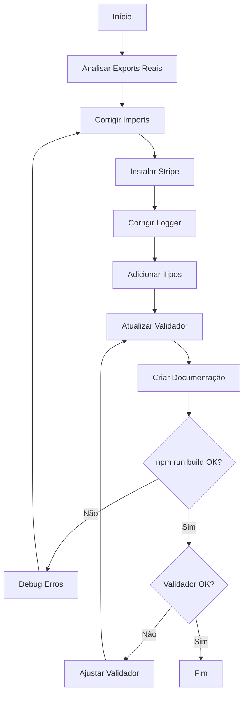
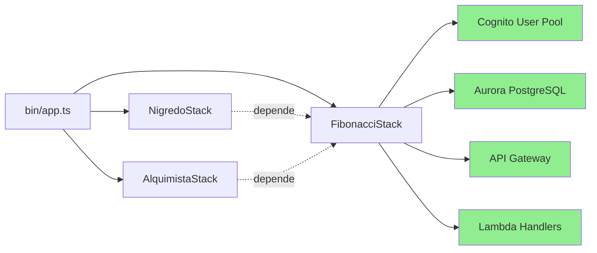

# Design Document - Correção de Validação CDK e TypeScript

## Overview

Este documento detalha a solução técnica para corrigir os avisos de validação do sistema AlquimistaAI, focando em:
1. Ajustar o script de validação para refletir a arquitetura CDK real
2. Corrigir 19 erros de compilação TypeScript em 9 arquivos
3. Documentar o estado atual do sistema

**Princípio fundamental**: Não alterar migrations, fluxo Aurora ou código funcional. Apenas corrigir validações e erros de compilação.

## Architecture

### Arquitetura CDK Atual

```
bin/app.ts
├── FibonacciStack (lib/fibonacci-stack.ts)
│   ├── VPC, Aurora, EventBridge
│   ├── Cognito User Pool ✅ (já implementado)
│   ├── S3, CloudFront, WAF
│   └── Lambda API Handler
├── NigredoStack (lib/nigredo-stack.ts)
│   └── Depende de recursos do FibonacciStack
└── AlquimistaStack (lib/alquimista-stack.ts)
    └── Depende de recursos do FibonacciStack
```

**Decisão Arquitetural**: O Cognito User Pool está integrado ao FibonacciStack (não em stack separada) porque:
- Compartilha recursos (VPC, KMS, secrets)
- Reduz complexidade de dependências entre stacks
- Facilita deployment atômico do core

### Erros TypeScript Identificados

#### Categoria 1: Imports Incorretos (12 erros)
- **Arquivos afetados**: `commercial-contact.ts`, `get-agents.ts`, `trial-invoke.ts`, `trial-start.ts`
- **Problema**: Tentam importar `getDatabase` e `handleError` que não existem nos módulos compartilhados
- **Causa raiz**: Módulos `lambda/shared/database.ts` e `lambda/shared/error-handler.ts` exportam funções com nomes diferentes

#### Categoria 2: Dependência Faltando (4 erros)
- **Arquivos afetados**: `create-checkout-session.ts`, `webhook-payment.ts`
- **Problema**: `Cannot find module 'stripe'`
- **Causa raiz**: Biblioteca Stripe não está no `package.json`

#### Categoria 3: Sintaxe Logger (5 erros)
- **Arquivos afetados**: Vários handlers
- **Problema**: `Object literal may only specify known properties, and 'error' does not exist in type 'Error'`
- **Causa raiz**: Logger estruturado espera formato específico

#### Categoria 4: Tipos Implícitos (2 erros)
- **Arquivo afetado**: `webhook-payment.ts`
- **Problema**: `Parameter implicitly has an 'any' type`
- **Causa raiz**: Falta tipagem explícita em reduce

## Components and Interfaces

### 1. Script de Validação Atualizado

**Arquivo**: `scripts/validate-system-complete.ps1`

**Mudanças**:
```powershell
# ANTES: Valida 4 stacks (incluindo cognito-stack.ts inexistente)
$stacks = @(
    "lib/alquimista-stack.ts",
    "lib/fibonacci-stack.ts",
    "lib/nigredo-stack.ts",
    "lib/cognito-stack.ts"  # ❌ Não existe
)

# DEPOIS: Valida 3 stacks reais + verifica Cognito no FibonacciStack
$stacks = @(
    "lib/alquimista-stack.ts",
    "lib/fibonacci-stack.ts",
    "lib/nigredo-stack.ts"
)

# Adicionar verificação específica do Cognito
Write-Host "`n7.1. Verificando Cognito User Pool..." -ForegroundColor Yellow
$cognitoInFibonacci = Select-String -Path "lib/fibonacci-stack.ts" -Pattern "new cognito\.UserPool" -Quiet
if ($cognitoInFibonacci) {
    Write-Host "  ✅ Cognito User Pool (integrado ao FibonacciStack)" -ForegroundColor Green
} else {
    Write-Host "  ❌ Cognito User Pool não encontrado" -ForegroundColor Red
    $errors++
}
```

### 2. Correções de Imports

**Módulo**: `lambda/shared/database.ts`

**Análise**: Verificar exports reais
```typescript
// Verificar o que realmente é exportado
export const connectToDatabase = async () => { ... }
export const query = async () => { ... }
// OU
export function getDbConnection() { ... }
```

**Correção nos handlers**:
```typescript
// ANTES (incorreto)
import { getDatabase } from '../shared/database';

// DEPOIS (correto - baseado no export real)
import { connectToDatabase } from '../shared/database';
// OU
import { getDbConnection } from '../shared/database';
```

**Módulo**: `lambda/shared/error-handler.ts`

**Análise**: Verificar exports reais
```typescript
// Verificar o que realmente é exportado
export const createErrorResponse = () => { ... }
export const logError = () => { ... }
// OU
export function handleLambdaError() { ... }
```

**Correção nos handlers**:
```typescript
// ANTES (incorreto)
import { handleError } from '../shared/error-handler';

// DEPOIS (correto - baseado no export real)
import { createErrorResponse } from '../shared/error-handler';
// OU
import { handleLambdaError } from '../shared/error-handler';
```

### 3. Adicionar Dependência Stripe

**Arquivo**: `package.json`

**Mudança**:
```json
{
  "dependencies": {
    "stripe": "^14.0.0"
  },
  "devDependencies": {
    "@types/stripe": "^8.0.0"
  }
}
```

**Comando de instalação**:
```powershell
npm install stripe
npm install --save-dev @types/stripe
```

### 4. Correções de Sintaxe Logger

**Padrão correto do logger estruturado**:
```typescript
// ANTES (incorreto)
logger.error('Mensagem', { error });

// DEPOIS (correto)
logger.error('Mensagem', { 
  error: error.message,
  stack: error.stack,
  name: error.name
});

// OU usar helper
logger.error('Mensagem', { 
  err: error  // Alguns loggers usam 'err' como chave especial
});
```

**Arquivos a corrigir**:
- `lambda/platform/commercial-contact.ts` (linha 89)
- `lambda/platform/get-agents.ts` (linha 55)
- `lambda/platform/trial-invoke.ts` (linha 142)
- `lambda/platform/trial-start.ts` (linha 147)
- `lambda/platform/get-tenant-subscription.ts` (linha 110)
- `lambda/platform/list-plans.ts` (linha 51)
- `lambda/platform/update-tenant-subscription.ts` (linha 203)

### 5. Correções de Tipos

**Arquivo**: `lambda/platform/webhook-payment.ts` (linhas 198)

**Correção**:
```typescript
// ANTES (incorreto)
const totalMonthly = subscription.items.data.reduce((sum, item) => {
  // sum e item têm tipo 'any' implícito
}, 0);

// DEPOIS (correto)
const totalMonthly = subscription.items.data.reduce(
  (sum: number, item: Stripe.SubscriptionItem) => {
    return sum + (item.price?.unit_amount || 0) / 100;
  }, 
  0
);
```

## Data Models

### Estrutura de Validação

```typescript
interface ValidationResult {
  component: string;
  status: 'OK' | 'WARNING' | 'ERROR';
  message: string;
  details?: string;
}

interface SystemStatus {
  migrations: ValidationResult;
  seeds: ValidationResult;
  lambdaHandlers: ValidationResult;
  frontendPages: ValidationResult;
  stores: ValidationResult;
  apiClients: ValidationResult;
  cdkStacks: ValidationResult;
  typescript: ValidationResult;
  documentation: ValidationResult;
}
```

### Documento de Status

```markdown
# Status do Sistema Alquimista.AI

## Banco de Dados (Aurora PostgreSQL)
- [x] Migrations 001-010 validadas
- [x] Fluxo DEV automatizado
- [x] Seeds aplicados
- [ ] Fluxo PROD (futuro)

## Infraestrutura (CDK)
- [x] FibonacciStack (core + Cognito)
- [x] NigredoStack (prospecção)
- [x] AlquimistaStack (plataforma)
- [x] Cognito User Pool (integrado ao Fibonacci)

## Código (TypeScript)
- [x] Build sem erros
- [x] Imports corrigidos
- [x] Dependências instaladas
- [x] Tipos explícitos

## Decisões Arquiteturais
- Cognito integrado ao FibonacciStack (não stack separada)
- Aurora como banco principal (Supabase apenas legado)
- Lambda Node.js 20 para todos os handlers
```

## Error Handling

### Estratégia de Correção

1. **Validação Incremental**: Corrigir erros por categoria, validar após cada categoria
2. **Rollback Seguro**: Manter backups antes de alterações
3. **Testes Locais**: Executar `npm run build` após cada correção
4. **Documentação**: Registrar cada mudança no documento de status

### Tratamento de Erros Específicos

```typescript
// Padrão para imports
try {
  const { correctFunction } = await import('../shared/module');
} catch (error) {
  logger.error('Failed to import module', {
    module: '../shared/module',
    error: error.message
  });
  throw error;
}

// Padrão para logger
try {
  // operação
} catch (error) {
  logger.error('Operation failed', {
    operation: 'operationName',
    error: error instanceof Error ? error.message : String(error),
    stack: error instanceof Error ? error.stack : undefined
  });
}
```

## Testing Strategy

### Validação de Correções

1. **Teste de Compilação**:
   ```powershell
   npm run build
   # Deve completar com exit code 0
   ```

2. **Teste de Validação**:
   ```powershell
   .\scripts\validate-system-complete.ps1
   # Deve reportar 0 erros
   ```

3. **Teste de Sintaxe CDK**:
   ```powershell
   npx cdk synth --context env=dev
   # Deve gerar templates sem erros
   ```

4. **Verificação de Imports**:
   ```powershell
   # Verificar que módulos compartilhados exportam o esperado
   Get-Content lambda/shared/database.ts | Select-String "export"
   Get-Content lambda/shared/error-handler.ts | Select-String "export"
   ```

### Checklist de Validação

- [ ] `npm run build` executa sem erros
- [ ] `validate-system-complete.ps1` reporta 0 erros
- [ ] CDK stacks: 3/3 OK
- [ ] Cognito verificado no FibonacciStack
- [ ] Documentação atualizada
- [ ] Nenhuma migration alterada
- [ ] Nenhum script de banco alterado

## Implementation Notes

### Ordem de Execução

1. **Fase 1**: Analisar exports reais dos módulos compartilhados
2. **Fase 2**: Corrigir imports em todos os handlers
3. **Fase 3**: Adicionar dependência Stripe
4. **Fase 4**: Corrigir sintaxe do logger
5. **Fase 5**: Adicionar tipos explícitos
6. **Fase 6**: Atualizar script de validação
7. **Fase 7**: Criar documento de status
8. **Fase 8**: Validação final

### Arquivos que NÃO devem ser alterados

- `database/migrations/*.sql`
- `scripts/apply-migrations-aurora-dev.ps1`
- `database/RESUMO-AURORA-OFICIAL.md`
- `database/COMANDOS-RAPIDOS-AURORA.md`
- `database/AURORA-MIGRATIONS-AUDIT.md`
- `lib/fibonacci-stack.ts` (exceto se necessário para Cognito)
- `lib/nigredo-stack.ts`
- `lib/alquimista-stack.ts`

### Arquivos a serem criados/atualizados

**Criar**:
- `STATUS-SISTEMA-ALQUIMISTA-AI.md`
- `.kiro/specs/fix-cdk-typescript-validation/IMPLEMENTATION-LOG.md`

**Atualizar**:
- `scripts/validate-system-complete.ps1`
- `package.json`
- 9 arquivos Lambda com erros TypeScript

## Diagrams

### Fluxo de Correção



### Arquitetura CDK (Estado Final)



## Conclusão

Este design fornece uma abordagem sistemática para:
1. Corrigir validações falsas do CDK
2. Resolver todos os 19 erros TypeScript
3. Documentar o estado real do sistema
4. Manter integridade do banco Aurora
5. Garantir compatibilidade Windows

Todas as correções são não-invasivas e focadas em alinhamento entre código, validação e documentação.
