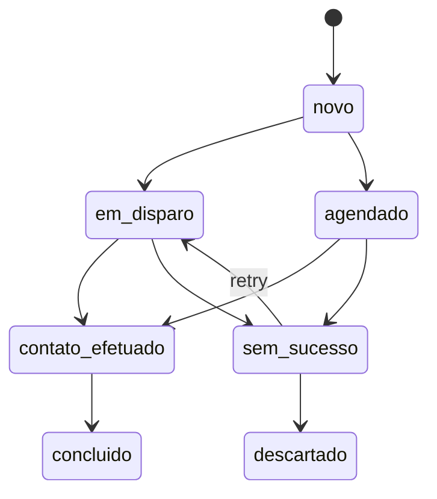

# Spec Técnica · Micro Agente de Disparos & Agendamentos

## Versão: v1.0

---

## 📋 Índice

1. [Visão Geral](#1-visão-geral)
2. [Modelo de Dados](#2-modelo-de-dados)
3. [Pipeline de Ingestão](#3-pipeline-de-ingestão)
4. [API REST](#4-api-rest)
5. [Máquina de Estados](#5-máquina-de-estados)
6. [Integrações](#6-integrações)
7. [Arquitetura AWS](#7-arquitetura-aws)
8. [Segurança](#8-segurança)
9. [Observabilidade](#9-observabilidade)
10. [Deployment](#10-deployment)

---

## 1. Visão Geral

O Micro Agente de Disparos & Agendamentos é responsável por:

1. **Ingerir leads** a partir da planilha oficial `Leads_Organizados.xlsx` (aba `Leads`)
2. **Normalizar** emails e telefones em estruturas internas (`leads`, `lead_emails`, `lead_telefones`)
3. **Orquestrar disparos** (WhatsApp / Email) e **agendamentos** (callbacks, reuniões)
4. Manter **rastreabilidade** até a origem da planilha (arquivo + linha)

### Fonte Oficial de Dados

**Arquivo**: `Leads_Organizados.xlsx`  
**Aba**: `Leads`  
**Colunas fixas**: Nome, Contato, CNPJ/CPF, Email, Telefone

> **Importante**: Esta planilha é a saída do **Organizador de Leads**, que já aplicou transformações e padronizações.

### Etapa Intermediária: Consolidação de Leads

Antes do Organizador de Leads, existe uma etapa de consolidação executada pelo script `consolida_telefones_emails.py`:

**Entrada**:
- `Planilha Telefones 1.xlsx.xlsx`
- `Planilha Telefones 2.xlsx.xlsx`
- `Planilha Telefones.xlsx.xlsx`

**Saída**:
- `Leads_Consolidados_Telefones_Emails_DEDUP.xlsx`
- `Leads_Consolidados_Telefones_Emails_DEDUP.csv`

**Auditoria**: Para garantir rastreabilidade e entendimento de alterações automáticas (Autofix do Kiro IDE) nesta etapa, consulte:
- [Auditoria da Etapa Leads_Consolidados_Telefones_Emails](../../../docs/prompts/auditoria/LEADS_CONSOLIDADOS_TELEFONES_EMAILS_AUDITORIA.md)

### Fluxo Mínimo (Dry-Run) do Micro Agente

Esta sessão implementa um fluxo mínimo em modo **dry-run**:

**Objetivo**: Testar o fluxo end-to-end sem disparar mensagens reais

**Componentes**:
- Handler: `lambda-src/agente-disparo-agenda/src/handlers/dry-run.ts`
- Módulo de decisão: `lambda-src/agente-disparo-agenda/src/utils/canal-decision.ts`
- Tabela de log: `dry_run_log` (migration 007)

**Funcionamento**:
1. Consome 1 lead (ou pequeno lote) da fonte derivada de `Leads_Consolidados_Telefones_Emails`
2. Decide o canal preferido (WhatsApp, Email, Agenda) baseado em:
   - Disponibilidade de telefone válido (+55 DDD NÚMERO)
   - Disponibilidade de email válido
   - Prioridade: WhatsApp > Email > None
3. Não dispara mensagens reais quando `MICRO_AGENT_DISPARO_ENABLED != "true"`
4. Registra o "disparo pretendido" em:
   - Log estruturado (CloudWatch)
   - Tabela `dry_run_log` (auditoria persistente)

**Variáveis de Ambiente**:
- `MICRO_AGENT_DISPARO_ENABLED`: `"true"` | `"false"` (default: `"false"`)
- `DB_SECRET_ARN`: ARN do secret com credenciais do Aurora
- `EVENT_BUS_NAME`: Nome do EventBridge bus
- `ENVIRONMENT`: `"dev"` | `"prod"`

**Segurança**: Este fluxo não substitui o fluxo completo de produção, mas garante um caminho seguro para testes de ponta a ponta sem risco de disparos acidentais.

---

## 2. Modelo de Dados

### 2.1. Entidade Lead

```typescript
interface Lead {
  lead_id: string;                    // UUID interno
  lead_id_externo: string;            // "Leads_Organizados.xlsx:1234"
  origem_arquivo: string;             // "Leads_Organizados.xlsx"
  origem_aba: string;                 // "Leads"
  linha_planilha: number;             // 1234
  
  nome: string;                       // "Empresa Exemplo Ltda"
  contato_nome: string;               // "joao.silva"
  documento: string;                  // "12345678000199" (CNPJ/CPF dígitos)
  
  email_raw: string;                  // "a@b.com | c@d.com"
  telefone_raw: string;               // "+55 71 999999999 | +55 11 32221111"
  
  status: LeadStatus;                 // novo | em_disparo | agendado | ...
  tags: string[];                     // ["origem:c3"]
  
  data_ingestao: Date;                // 2024-11-26T21:00:00Z
  data_ultimo_evento: Date;           // 2024-11-26T21:15:00Z
  created_at: Date;
  updated_at: Date;
}

type LeadStatus = 
  | 'novo'
  | 'em_disparo'
  | 'agendado'
  | 'contato_efetuado'
  | 'sem_sucesso'
  | 'descartado'
  | 'concluido';
```

### 2.2. Entidade LeadTelefone

```typescript
interface LeadTelefone {
  telefone_id: string;                // UUID
  lead_id: string;                    // FK para leads
  
  telefone: string;                   // "+55 71 999999999"
  telefone_principal: boolean;        // true para o primeiro
  tipo_origem: string;                // "movel" | "fixo" | "internacional"
  valido_para_disparo: boolean;       // true se passou validações
  
  created_at: Date;
}
```

### 2.3. Entidade LeadEmail

```typescript
interface LeadEmail {
  email_id: string;                   // UUID
  lead_id: string;                    // FK para leads
  
  email: string;                      // "contato@empresa.com.br"
  email_principal: boolean;           // true para o primeiro
  valido_para_disparo: boolean;       // true se passou validações
  
  created_at: Date;
}
```

### 2.4. Entidade Disparo

```typescript
interface Disparo {
  disparo_id: string;                 // UUID
  lead_id: string;                    // FK para leads
  
  canal: 'whatsapp' | 'email';
  destino: string;                    // "+55 71 999999999" ou "email@example.com"
  template: string;                   // "cobranca_padrao_1"
  payload: {
    variaveis: Record<string, string>;
  };
  
  status: DisparoStatus;
  mensagem_erro?: string;
  
  data_agendado: Date;                // Quando deve ser enviado
  data_envio?: Date;                  // Quando foi enviado
  data_retorno?: Date;                // Quando recebeu confirmação
  
  created_at: Date;
  updated_at: Date;
}

type DisparoStatus = 
  | 'pendente'
  | 'enviado'
  | 'erro'
  | 'confirmado';
```

### 2.5. Entidade Agendamento

```typescript
interface Agendamento {
  agendamento_id: string;             // UUID
  lead_id: string;                    // FK para leads
  
  tipo: 'callback' | 'reuniao';
  canal: 'telefone' | 'whatsapp' | 'video';
  
  data_agendada: Date;                // 2024-11-27T14:00:00Z
  data_criacao: Date;
  
  status: AgendamentoStatus;
  observacoes?: string;
  
  created_at: Date;
  updated_at: Date;
}

type AgendamentoStatus = 
  | 'pendente'
  | 'realizado'
  | 'cancelado';
```

---

## 3. Pipeline de Ingestão

### 3.1. Fonte de Dados

**Arquivo**: `Leads_Organizados.xlsx`  
**Aba**: `Leads`  
**Colunas (ordem fixa)**:
1. Nome
2. Contato
3. CNPJ/CPF
4. Email
5. Telefone

### 3.2. Regras Herdadas do Organizador

O Organizador de Leads já aplicou as seguintes transformações:

#### Nome
- ✅ Prefixos numéricos removidos (ex.: `000011-`)
- ✅ Se vazio e existia email, preenchido com domínio privado

#### Contato
- ✅ Prefixo do primeiro email (parte antes do `@`)

#### CNPJ/CPF
- ✅ Apenas dígitos
- ✅ Nunca usado como telefone

#### Email
- ✅ Pode conter múltiplos emails separados por `" | "`
- ✅ Correções conservadoras aplicadas (TLDs, domínios comuns)

#### Telefone
- ✅ Vem da coluna explícita `telefone` da aba `Telefones`
- ✅ Já padronizado para `+55 DDD NÚMERO` quando possível
- ✅ Pode conter múltiplos valores separados por `" | "`

### 3.3. Passos da Ingestão

#### Passo 1: Leitura da Planilha

```typescript
// Ler aba "Leads" linha a linha
const rows = parseXLSX(buffer, 'Leads');

for (const [index, row] of rows.entries()) {
  const linha_planilha = index + 2; // +2 porque linha 1 é header
  
  // Processar linha...
}
```

#### Passo 2: Criação do Lead

```typescript
const lead: Lead = {
  lead_id: uuid(),
  lead_id_externo: `Leads_Organizados.xlsx:${linha_planilha}`,
  origem_arquivo: 'Leads_Organizados.xlsx',
  origem_aba: 'Leads',
  linha_planilha,
  
  nome: row.Nome,
  contato_nome: row.Contato,
  documento: row['CNPJ/CPF'].replace(/\D/g, ''),
  email_raw: row.Email,
  telefone_raw: row.Telefone,
  
  status: 'novo',
  tags: ['origem:planilha', 'organizador_v5'],
  
  data_ingestao: new Date(),
  data_ultimo_evento: new Date(),
};
```

#### Passo 3: Explosão de Emails

```typescript
if (lead.email_raw) {
  const emails = lead.email_raw
    .split('|')
    .map(e => e.trim())
    .filter(e => e.length > 0);
  
  for (const [index, email] of emails.entries()) {
    const leadEmail: LeadEmail = {
      email_id: uuid(),
      lead_id: lead.lead_id,
      email: email.toLowerCase(),
      email_principal: index === 0,
      valido_para_disparo: validateEmail(email),
    };
    
    await insertLeadEmail(leadEmail);
  }
}
```

#### Passo 4: Explosão de Telefones

```typescript
if (lead.telefone_raw) {
  const telefones = lead.telefone_raw
    .split('|')
    .map(t => t.trim())
    .filter(t => t.length > 0);
  
  for (const [index, telefone] of telefones.entries()) {
    const leadTelefone: LeadTelefone = {
      telefone_id: uuid(),
      lead_id: lead.lead_id,
      telefone,
      telefone_principal: index === 0,
      tipo_origem: detectTipoTelefone(telefone),
      valido_para_disparo: validateTelefoneBR(telefone),
    };
    
    await insertLeadTelefone(leadTelefone);
  }
}
```

#### Passo 5: Validações

**Validação de Email**:
```typescript
function validateEmail(email: string): boolean {
  const regex = /^[^\s@]+@[^\s@]+\.[^\s@]+$/;
  return regex.test(email);
}
```

**Validação de Telefone BR**:
```typescript
function validateTelefoneBR(telefone: string): boolean {
  // Deve começar com +55
  if (!telefone.startsWith('+55')) return false;
  
  // Extrair dígitos
  const digits = telefone.replace(/\D/g, '');
  
  // Deve ter 12 ou 13 dígitos (55 + DDD + número)
  if (digits.length !== 12 && digits.length !== 13) return false;
  
  // DDD deve estar entre 11 e 99
  const ddd = parseInt(digits.substring(2, 4));
  if (ddd < 11 || ddd > 99) return false;
  
  return true;
}
```

#### Passo 6: Persistência e Logs

```typescript
// Salvar no banco
await insertLead(lead);

// Logar progresso
console.log({
  linhas_processadas: totalLinhas,
  leads_criados: totalLeads,
  telefones_criados: totalTelefones,
  emails_criados: totalEmails,
  telefones_validos: totalTelefonesValidos,
  emails_validos: totalEmailsValidos,
});
```

---

## 4. API REST

### 4.1. Ingestão de Planilha

#### POST /ingest/leads/xlsx

**Descrição**: Inicia processo de ingestão de arquivo Excel

**Opção A: Upload Direto**

```http
POST /ingest/leads/xlsx
Content-Type: multipart/form-data

file=Leads_Organizados.xlsx
```

**Opção B: Referência S3**

```http
POST /ingest/leads/xlsx
Content-Type: application/json

{
  "bucket": "alquimista-leads",
  "key": "imports/2024-11-26/Leads_Organizados.xlsx"
}
```

**Resposta (202 Accepted)**:

```json
{
  "job_id": "550e8400-e29b-41d4-a716-446655440000",
  "status": "accepted",
  "message": "Ingestão iniciada"
}
```

---

#### GET /ingest/leads/jobs/{job_id}

**Descrição**: Consulta status de job de ingestão

**Resposta (200 OK)**:

```json
{
  "job_id": "550e8400-e29b-41d4-a716-446655440000",
  "status": "concluido",
  "arquivo": "Leads_Organizados.xlsx",
  "linhas_processadas": 164809,
  "leads_criados": 164809,
  "telefones_criados": 107835,
  "emails_criados": 57117,
  "erros": [],
  "data_inicio": "2024-11-26T21:00:00Z",
  "data_fim": "2024-11-26T21:04:32Z"
}
```

**Status possíveis**: `accepted`, `processando`, `concluido`, `erro`

---

### 4.2. Listagem de Leads

#### GET /leads

**Parâmetros de Query**:
- `status` (opcional): Filtrar por status
- `limit` (opcional, default: 50): Limite de resultados
- `offset` (opcional, default: 0): Offset para paginação

**Exemplo**:
```http
GET /leads?status=novo&limit=100&offset=0
```

**Resposta (200 OK)**:

```json
{
  "items": [
    {
      "lead_id": "uuid",
      "lead_id_externo": "Leads_Organizados.xlsx:1234",
      "nome": "Empresa Exemplo Ltda",
      "contato_nome": "joao.silva",
      "documento": "12345678000199",
      "status": "novo",
      "data_ingestao": "2024-11-26T21:00:00Z"
    }
  ],
  "total": 12345,
  "limit": 100,
  "offset": 0
}
```

---

### 4.3. Disparo para um Lead

#### POST /leads/{lead_id}/disparos

**Descrição**: Cria disparo de mensagem para um lead

**Body**:

```json
{
  "canal": "whatsapp",
  "telefone_id": "uuid",
  "template": "cobranca_padrao_1",
  "payload": {
    "variaveis": {
      "nome": "João",
      "valor_aberto": "R$ 1.250,00",
      "data_vencimento": "15/11/2024"
    }
  },
  "agendar_para": "2024-11-27T09:00:00Z"
}
```

**Campos**:
- `canal`: `"whatsapp"` ou `"email"`
- `telefone_id`: Obrigatório se `canal = "whatsapp"`
- `email_id`: Obrigatório se `canal = "email"`
- `template`: Nome do template de mensagem
- `payload.variaveis`: Variáveis do template
- `agendar_para`: Opcional, se nulo dispara "o quanto antes"

**Resposta (201 Created)**:

```json
{
  "disparo_id": "uuid",
  "status": "pendente",
  "data_agendado": "2024-11-27T09:00:00Z"
}
```

---

### 4.4. Agendamento de Contato

#### POST /leads/{lead_id}/agendamentos

**Descrição**: Cria agendamento de callback ou reunião

**Body**:

```json
{
  "tipo": "callback",
  "canal": "telefone",
  "data_agendada": "2024-11-27T14:00:00Z",
  "observacoes": "Cliente prefere contato à tarde."
}
```

**Campos**:
- `tipo`: `"callback"` ou `"reuniao"`
- `canal`: `"telefone"`, `"whatsapp"` ou `"video"`
- `data_agendada`: Data/hora do agendamento
- `observacoes`: Texto livre (opcional)

**Resposta (201 Created)**:

```json
{
  "agendamento_id": "uuid",
  "status": "pendente",
  "data_agendada": "2024-11-27T14:00:00Z"
}
```

---

### 4.5. Buscar Leads para Disparo

#### GET /leads/para-disparo

**Descrição**: Busca leads prontos para disparo com contatos válidos

**Parâmetros de Query**:
- `limit` (opcional, default: 100): Limite de resultados
- `status` (opcional, default: "novo"): Status dos leads

**Exemplo**:
```http
GET /leads/para-disparo?limit=50&status=novo
```

**Resposta (200 OK)**:

```json
{
  "items": [
    {
      "lead_id": "uuid",
      "nome": "Empresa Exemplo Ltda",
      "email": "contato@empresa.com.br",
      "telefone": "+55 71 999999999",
      "tipo_contato": "ambos"
    }
  ],
  "total": 50
}
```

**Valores de `tipo_contato`**: `"ambos"`, `"email"`, `"telefone"`, `"nenhum"`

---

## 5. Máquina de Estados

### 5.1. Estados do Lead



### 5.2. Descrição dos Estados

| Estado | Descrição |
|--------|-----------|
| `novo` | Recém-ingestão, nenhum disparo ainda |
| `em_disparo` | Existe disparo pendente ou em andamento |
| `agendado` | Existe agendamento futuro relevante |
| `contato_efetuado` | Houve contato bem-sucedido (respondeu, negociou) |
| `sem_sucesso` | Esgotou tentativas sem resposta |
| `descartado` | Lead inválido (número inexistente, email bounce) |
| `concluido` | Ciclo de cobrança/atendimento encerrado |

### 5.3. Transições

**novo → em_disparo**:
- Trigger: Criação de disparo pendente
- Condição: Lead tem contato válido

**em_disparo → contato_efetuado**:
- Trigger: Confirmação de recebimento/resposta
- Condição: Disparo foi bem-sucedido

**em_disparo → sem_sucesso**:
- Trigger: Esgotou tentativas (3x)
- Condição: Nenhuma resposta após retries

**novo → agendado**:
- Trigger: Criação de agendamento
- Condição: Data futura válida

**agendado → contato_efetuado**:
- Trigger: Agendamento realizado
- Condição: Contato foi efetivado

**contato_efetuado → concluido**:
- Trigger: Finalização do ciclo
- Condição: Objetivo alcançado (pagamento, acordo, etc.)

**sem_sucesso → descartado**:
- Trigger: Decisão de descartar
- Condição: Lead inválido ou irrecuperável

---

## 6. Integrações

### 6.1. MCP WhatsApp Server

**Endpoint**: Configurado via `MCP_WHATSAPP_ENDPOINT`

**Operação: Enviar Mensagem**

```http
POST /mcp/whatsapp/send
Content-Type: application/json

{
  "to": "+5584997084444",
  "message": "Olá {{nome}}, você tem um débito de {{valor}}.",
  "templateId": "cobranca_padrao_1",
  "variables": {
    "nome": "João",
    "valor": "R$ 1.250,00"
  }
}
```

**Resposta**:

```json
{
  "messageId": "uuid",
  "status": "sent",
  "timestamp": "2024-11-26T21:00:00Z"
}
```

---

### 6.2. MCP Email Server

**Endpoint**: Configurado via `MCP_EMAIL_ENDPOINT`

**Operação: Enviar Email**

```http
POST /mcp/email/send
Content-Type: application/json

{
  "to": "contato@empresa.com.br",
  "subject": "Cobrança - Débito em Aberto",
  "body": "Olá {{nome}}, você tem um débito de {{valor}}.",
  "html": "<p>Olá <strong>{{nome}}</strong>...</p>",
  "templateId": "cobranca_padrao_1",
  "variables": {
    "nome": "João",
    "valor": "R$ 1.250,00"
  }
}
```

**Resposta**:

```json
{
  "messageId": "uuid",
  "status": "sent",
  "timestamp": "2024-11-26T21:00:00Z"
}
```

---

### 6.3. MCP Calendar Server (Futuro)

**Endpoint**: Configurado via `MCP_CALENDAR_ENDPOINT`

**Operação: Criar Evento**

```http
POST /mcp/calendar/events
Content-Type: application/json

{
  "calendarId": "vendas@empresa.com",
  "summary": "Reunião com Empresa Exemplo Ltda",
  "description": "Briefing: ...",
  "startDateTime": "2024-11-27T14:00:00Z",
  "endDateTime": "2024-11-27T15:00:00Z",
  "attendees": ["joao.silva@empresa.com.br"],
  "conferenceData": {
    "createRequest": true
  }
}
```

---

## 7. Arquitetura AWS

### 7.1. Componentes

```
┌─────────────────────────────────────────────────────────────┐
│                         S3 Bucket                            │
│                   alquimista-leads-input                     │
└────────────────────────┬────────────────────────────────────┘
                         │ S3 Event
                         ↓
┌─────────────────────────────────────────────────────────────┐
│                    Lambda Ingestão                           │
│                  (Node.js 20, 1024MB)                        │
└────────────────────────┬────────────────────────────────────┘
                         │ Insert
                         ↓
┌─────────────────────────────────────────────────────────────┐
│                  Aurora Serverless v2                        │
│                    (PostgreSQL 15)                           │
└─────────────────────────────────────────────────────────────┘
                         │
                         ↓
┌─────────────────────────────────────────────────────────────┐
│                    EventBridge Bus                           │
│                   fibonacci-bus-{env}                        │
└────────────────────────┬────────────────────────────────────┘
                         │ Events
                         ↓
┌─────────────────────────────────────────────────────────────┐
│              Lambda Disparo / Agendamento                    │
│                  (Node.js 20, 512MB)                         │
└─────────────────────────────────────────────────────────────┘
```

### 7.2. Lambdas

#### Lambda Ingestão

- **Nome**: `alquimista-ingestao-leads-{env}`
- **Runtime**: Node.js 20
- **Memory**: 1024 MB
- **Timeout**: 300 segundos (5 minutos)
- **Trigger**: S3 Event (ObjectCreated)
- **Concurrency**: 10

#### Lambda Disparo

- **Nome**: `alquimista-disparo-{env}`
- **Runtime**: Node.js 20
- **Memory**: 512 MB
- **Timeout**: 30 segundos
- **Trigger**: EventBridge Scheduler + EventBridge Rule
- **Concurrency**: 10

#### Lambda Agendamento

- **Nome**: `alquimista-agendamento-{env}`
- **Runtime**: Node.js 20
- **Memory**: 512 MB
- **Timeout**: 30 segundos
- **Trigger**: EventBridge Rule
- **Concurrency**: 5

### 7.3. Aurora Serverless v2

- **Engine**: PostgreSQL 15
- **Min ACU**: 0.5
- **Max ACU**: 16
- **Multi-AZ**: Sim
- **Backup**: 7 dias
- **Encryption**: KMS

### 7.4. S3 Buckets

- `alquimista-leads-input-{env}` - Upload de planilhas
- `alquimista-lambda-artifacts-{env}` - Artefatos de deploy

---

## 8. Segurança

### 8.1. Secrets Manager

Todos os secrets em: `/alquimista/{env}/`

```
/alquimista/dev/aurora/credentials
/alquimista/dev/mcp/whatsapp
/alquimista/dev/mcp/email
/alquimista/dev/mcp/calendar
```

### 8.2. IAM Roles

**Lambda Ingestão**:
```json
{
  "Version": "2012-10-17",
  "Statement": [
    {
      "Effect": "Allow",
      "Action": ["s3:GetObject"],
      "Resource": "arn:aws:s3:::alquimista-leads-input-*/*"
    },
    {
      "Effect": "Allow",
      "Action": ["events:PutEvents"],
      "Resource": "arn:aws:events:us-east-1:*:event-bus/fibonacci-bus-*"
    },
    {
      "Effect": "Allow",
      "Action": ["secretsmanager:GetSecretValue"],
      "Resource": "arn:aws:secretsmanager:us-east-1:*:secret:/alquimista/*"
    }
  ]
}
```

### 8.3. Criptografia

- **Em trânsito**: TLS 1.3
- **Em repouso**: Aurora KMS, S3 SSE-KMS

---

## 9. Observabilidade

### 9.1. Métricas CloudWatch

```typescript
const metrics = {
  namespace: 'Alquimista/MicroAgente',
  metrics: [
    'IngestaoLeadsProcessados',
    'IngestaoErros',
    'MessagesSent',
    'MessagesFailedRate',
    'RateLimitHits',
    'MeetingsScheduled',
  ]
};
```

### 9.2. Alarmes

- Taxa de erro > 10%
- Rate limit excedido > 100/hora
- Duração Lambda > 4 minutos

### 9.3. Logs Estruturados

```typescript
console.log(JSON.stringify({
  timestamp: new Date().toISOString(),
  level: 'INFO',
  service: 'ingestao',
  action: 'process_lead',
  lead_id: 'uuid',
  result: 'success',
  duration: 123,
}));
```

---

## 10. Deployment

### 10.1. Build

```powershell
cd lambda-src\agente-disparo-agenda
npm install
npm run build
```

### 10.2. Package

```powershell
.\build-ingestao-lambda.ps1 -Environment dev
```

### 10.3. Deploy

```powershell
# Deploy completo
.\build-ingestao-lambda.ps1 -Environment dev

# Apenas build
.\build-ingestao-lambda.ps1 -Environment dev -SkipUpload

# Apenas upload
.\build-ingestao-lambda.ps1 -Environment dev -SkipBuild
```

---

## 11. Fluxo Dry-Run (Testes sem Disparos Reais)

### 11.1. Visão Geral

O fluxo dry-run permite testar o Micro Agente end-to-end **sem enviar mensagens reais** via WhatsApp ou Email.

**Objetivo**: Validar lógica de decisão de canal, rate limiting, horário comercial e outras regras de negócio sem custos ou riscos de disparos acidentais.

### 11.2. Handler Dry-Run

**Arquivo**: `lambda-src/agente-disparo-agenda/src/handlers/dry-run.ts`

**Trigger**: 
- Invocação manual via AWS CLI
- API Gateway (rota `/dry-run`)
- EventBridge (para testes agendados)

**Input**:
```typescript
{
  tenantId?: string;
  leadId?: string;
  batchSize?: number; // Quantos leads processar (default: 1)
}
```

**Output**:
```typescript
{
  success: boolean;
  leadsProcessados: number;
  decisoes: Array<{
    lead: { id?: string; nome: string };
    canal: 'whatsapp' | 'email' | 'calendar' | 'none';
    motivo: string;
    seria_executado: boolean;
    razao_bloqueio?: string;
  }>;
  logs: string[];
}
```

### 11.3. Feature Flag

**Variável de Ambiente**: `MICRO_AGENT_DISPARO_ENABLED`

**Valores**:
- `"false"` (default): Modo dry-run - **NÃO envia** mensagens reais
- `"true"`: Modo produção - **ENVIA** mensagens reais via MCP

**Configuração no Terraform**:
```hcl
environment {
  variables = {
    MICRO_AGENT_DISPARO_ENABLED = "false" # Default: dry-run
    # ... outras variáveis
  }
}
```

### 11.4. Lógica de Decisão de Canal

**Módulo**: `lambda-src/agente-disparo-agenda/src/utils/canal-decision.ts`

**Prioridade de Canais**:
1. **WhatsApp** (se houver telefone válido no formato `+55 DDD NÚMERO`)
2. **Email** (se houver email válido)
3. **None** (sem canal disponível)

**Funções Principais**:

```typescript
// Decide qual canal usar
function decidirCanal(lead: Lead): CanalDecision

// Valida telefone para WhatsApp
function validarTelefoneWhatsApp(telefone: string): boolean

// Valida email
function validarEmail(email: string): boolean

// Verifica se disparo seria executado
function verificarSeDisparoSeriaExecutado(
  decision: CanalDecision,
  options: {
    rateLimitAtingido?: boolean;
    horarioComercial?: boolean;
    leadEmBlacklist?: boolean;
  }
): DisparoCheck

// Verifica horário comercial (08:00-18:00, Seg-Sex)
function estaEmHorarioComercial(data?: Date): boolean
```

### 11.5. Tabela de Log Dry-Run

**Migration**: `007_create_dry_run_log_table.sql`

**Schema**:
```sql
CREATE TABLE dry_run_log (
  log_id UUID PRIMARY KEY,
  tenant_id UUID NOT NULL,
  
  -- Dados do lead
  lead_id UUID,
  lead_nome VARCHAR(500),
  lead_telefone VARCHAR(50),
  lead_email VARCHAR(255),
  lead_documento VARCHAR(20),
  
  -- Decisão de canal
  canal_decidido VARCHAR(20) NOT NULL,
  motivo_decisao TEXT NOT NULL,
  template_selecionado VARCHAR(100),
  
  -- Controle de execução
  disparo_seria_executado BOOLEAN DEFAULT TRUE,
  razao_bloqueio TEXT,
  
  -- Metadata
  ambiente VARCHAR(10) DEFAULT 'dev',
  feature_flag_enabled BOOLEAN DEFAULT FALSE,
  
  created_at TIMESTAMP DEFAULT NOW()
);
```

### 11.6. Como Testar

#### Teste Local (Sem AWS)

```powershell
cd .kiro\specs\micro-agente-disparo-agendamento

# Teste básico (1 lead)
.\test-dry-run-local.ps1

# Teste com múltiplos leads
.\test-dry-run-local.ps1 -BatchSize 3

# Teste com disparo habilitado (simulado)
.\test-dry-run-local.ps1 -EnableDisparo
```

#### Teste na AWS (Após Deploy)

```bash
# Invocar Lambda via AWS CLI
aws lambda invoke \
  --function-name micro-agente-disparo-agendamento-dev-dry-run \
  --payload '{"tenantId":"test-001","batchSize":1}' \
  --region us-east-1 \
  response.json

# Ver resultado
cat response.json | jq .
```

### 11.7. Exemplo de Saída

**Lead com Telefone Válido**:
```json
{
  "success": true,
  "leadsProcessados": 1,
  "decisoes": [
    {
      "lead": {
        "id": "mock-lead-001",
        "nome": "Empresa Teste Ltda"
      },
      "canal": "whatsapp",
      "motivo": "Lead possui 1 telefone(s) válido(s) para WhatsApp",
      "seria_executado": true
    }
  ],
  "logs": [
    "[DRY-RUN] Iniciando em ambiente: dev",
    "[DRY-RUN] Feature flag DISPARO_ENABLED: false",
    "[DRY-RUN] Canal decidido: whatsapp",
    "[DRY-RUN] Seria executado: true",
    "[DRY-RUN] Processamento concluído com sucesso"
  ]
}
```

**Lead Sem Contatos**:
```json
{
  "success": true,
  "leadsProcessados": 1,
  "decisoes": [
    {
      "lead": {
        "id": "mock-lead-003",
        "nome": "Indústria Sem Contato SA"
      },
      "canal": "none",
      "motivo": "Lead não possui telefone nem email válidos para contato",
      "seria_executado": false,
      "razao_bloqueio": "Nenhum canal disponível para contato"
    }
  ]
}
```

### 11.8. Regras de Bloqueio

Um disparo pode ser bloqueado por:

1. **Canal indisponível**: Lead sem telefone nem email válidos
2. **Rate limit atingido**: Limite de disparos por tenant/canal excedido
3. **Horário não comercial**: Fora do horário 08:00-18:00, Seg-Sex
4. **Lead em blacklist**: Lead marcado como não contactável

### 11.9. Próximos Passos

- [ ] Executar migration `007_create_dry_run_log_table.sql` no Aurora dev
- [ ] Testar handler localmente com script PowerShell
- [ ] Implementar busca real de leads no banco (substituir mock)
- [ ] Deploy da Lambda dry-run via Terraform
- [ ] Integrar com MCP WhatsApp/Email quando `DISPARO_ENABLED=true`

---

## 12. Pontos em Aberto

### Fase 1 (MVP)
- [ ] Definir templates oficiais de mensagem
- [ ] Definir limites de tentativas por lead
- [ ] Implementar testes unitários
- [ ] Implementar testes de integração

### Fase 2 (Disparo)
- [ ] Integrar com MCP WhatsApp
- [ ] Integrar com MCP Email
- [ ] Implementar rate limiting
- [ ] Implementar scheduler EventBridge

### Fase 3 (Agendamento)
- [ ] Integrar com MCP Calendar
- [ ] Implementar geração de briefings
- [ ] Implementar sistema de lembretes

---

## 12. Referências

- [Requirements](./requirements.md)
- [Design](./design.md)
- [Tasks](./tasks.md)
- [Fluxo de Ingestão](./FLUXO-INGESTAO-LEADS.md)
- [Implementação](./IMPLEMENTACAO-INGESTAO.md)
- [Blueprint](../../../.kiro/steering/blueprint-disparo-agendamento.md)

---

**Última atualização**: 2024-11-26  
**Versão**: 1.0.0  
**Status**: Pronto para implementação  
**Mantido por**: Equipe AlquimistaAI
