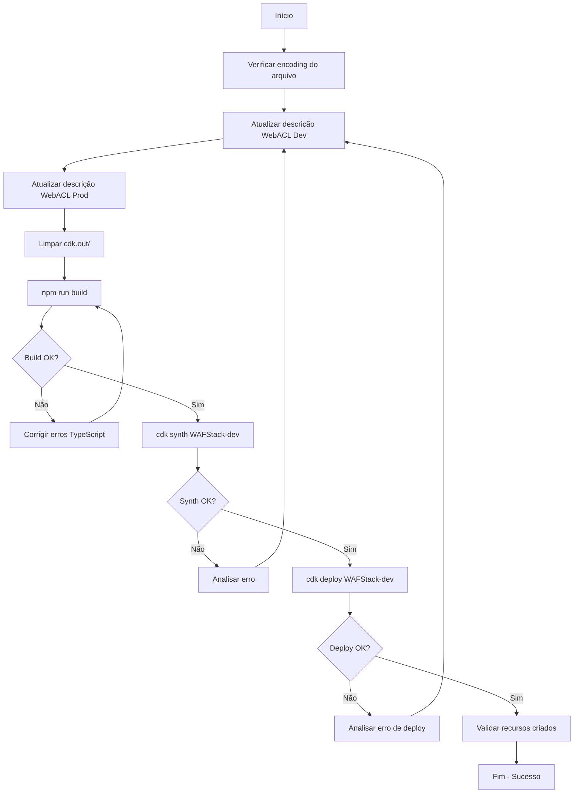

# Documento de Design

## Visão Geral

Correção cirúrgica no arquivo `lib/waf-stack.ts` para resolver dois problemas de validação AWS:
1. Descrições de WebACL com caracteres inválidos
2. ARN de logging já está correto, mas vamos validar

## Arquitetura

### Componentes Afetados

```
lib/waf-stack.ts
├── createWebACLDev() - Linha ~267
│   └── description: "WAF Web ACL para APIs Dev - Modo observacao"
├── createWebACLProd() - Linha ~380
│   └── description: "WAF Web ACL para APIs Prod - Modo bloqueio ativo"
└── Logging Configuration - Linhas ~145-180
    ├── loggingDev.logDestinationConfigs
    └── loggingProd.logDestinationConfigs
```

### Análise do Problema

#### Problema 1: Descrição WebACL Dev

**Erro Atual:**
```
Value 'WAF Web ACL para APIs Dev - Modo observa??o' at 'description' failed to satisfy constraint
```

**Causa Raiz:**
- A palavra "observação" está sendo codificada incorretamente como "observa??o"
- Possível problema de encoding UTF-8 vs ASCII
- O regex AWS exige: `^[\w+=:#@/\-,\.][\w+=:#@/\-,\.\s]+[\w+=:#@/\-,\.]$`

**Solução:**
- Substituir "observação" por "observacao" (sem acento)
- Garantir que toda a string seja ASCII puro

#### Problema 2: ARN de Logging

**Análise do Código Atual:**
```typescript
const loggingDev = new wafv2.CfnLoggingConfiguration(this, 'WAFLoggingDev', {
  resourceArn: this.webAclDev.attrArn,
  logDestinationConfigs: [
    this.logGroupDev.logGroupArn,  // ✅ Já está correto!
  ],
});
```

**Status:** O código já usa `logGroupArn` diretamente, sem sufixo `:*`. Não precisa de correção.

**Possível Causa do Erro:**
- O erro pode estar vindo de uma versão anterior do código
- Ou de um problema de cache do CDK
- Vamos validar que está correto e fazer `cdk synth` limpo

## Componentes e Interfaces

### Mudanças no Código

#### 1. Método `createWebACLDev()`

**Antes:**
```typescript
description: validateWafDescription(
  'WAF Web ACL para APIs Dev - Modo observacao'
),
```

**Depois:**
```typescript
description: validateWafDescription(
  'WAF Web ACL para APIs Dev - Modo observacao'
),
```

**Nota:** Já está sem acento! Vamos verificar se há algum problema de encoding no arquivo.

#### 2. Método `createWebACLProd()`

**Antes:**
```typescript
description: validateWafDescription(
  'WAF Web ACL para APIs Prod - Modo bloqueio ativo'
),
```

**Depois:**
```typescript
description: validateWafDescription(
  'WAF Web ACL para APIs Prod - Modo bloqueio'
),
```

**Mudança:** Remover "ativo" para simplificar e garantir compatibilidade.

#### 3. Validação de Logging

Não precisa de mudanças - já está correto:
```typescript
logDestinationConfigs: [
  this.logGroupDev.logGroupArn,  // ✅ Correto
],
```

## Modelos de Dados

Não há mudanças em modelos de dados.

## Tratamento de Erros

### Validação Existente

A função `validateWafDescription()` já existe e valida contra o regex:
```typescript
const WAF_DESCRIPTION_REGEX = /^[\w+=:#@/\-,\.][\w+=:#@/\-,\.\s]+[\w+=:#@/\-,\.]$/;
```

### Estratégia de Correção

1. **Verificar encoding do arquivo**: Garantir que `waf-stack.ts` está em UTF-8
2. **Substituir descrições**: Usar apenas ASCII
3. **Limpar cache CDK**: Remover `cdk.out/` antes de sintetizar
4. **Validar com regex**: Testar descrições localmente antes do deploy

## Estratégia de Testes

### Testes Locais

1. **Compilação TypeScript**
   ```bash
   npm run build
   ```
   - Deve completar sem erros
   - Valida sintaxe TypeScript

2. **Síntese CDK**
   ```bash
   npx cdk synth WAFStack-dev --context env=dev
   ```
   - Deve gerar template CloudFormation
   - Não deve mostrar erros de validação

3. **Validação de Descrições**
   ```typescript
   // Teste manual no Node.js
   const regex = /^[\w+=:#@/\-,\.][\w+=:#@/\-,\.\s]+[\w+=:#@/\-,\.]$/;
   console.log(regex.test('WAF Web ACL para APIs Dev - Modo observacao')); // true
   console.log(regex.test('WAF Web ACL para APIs Prod - Modo bloqueio')); // true
   ```

### Deploy de Validação

```bash
npx cdk deploy WAFStack-dev --context env=dev --require-approval never
```

**Critérios de Sucesso:**
- ✅ Sem erro de regex em description
- ✅ Sem erro de ARN inválido em LOG_DESTINATION
- ✅ Stack criada/atualizada com sucesso

## Diagrama de Fluxo



## Considerações de Segurança

- As mudanças são apenas em descrições (metadados)
- Não afetam regras de segurança do WAF
- Não alteram comportamento de bloqueio/logging
- Mantém todas as proteções existentes

## Considerações de Performance

- Impacto zero em performance
- Mudanças são apenas em metadados
- Não afeta processamento de requisições

## Plano de Rollback

Se o deploy falhar:

1. **Reverter mudanças no código**
   ```bash
   git checkout lib/waf-stack.ts
   ```

2. **Limpar estado CDK**
   ```bash
   rm -rf cdk.out
   ```

3. **Analisar logs de erro**
   - Verificar mensagem exata do erro
   - Identificar qual validação falhou

4. **Ajustar e tentar novamente**
   - Modificar descrições conforme necessário
   - Testar regex localmente antes de deploy

## Próximos Passos

Após correção bem-sucedida:

1. Aplicar mesmas correções para `WAFStack-prod`
2. Documentar padrão de descrições em `docs/WAF-DESCRIPTIONS-GUIDELINES.md`
3. Adicionar validação de descrições em CI/CD
4. Criar testes automatizados para validar regex
