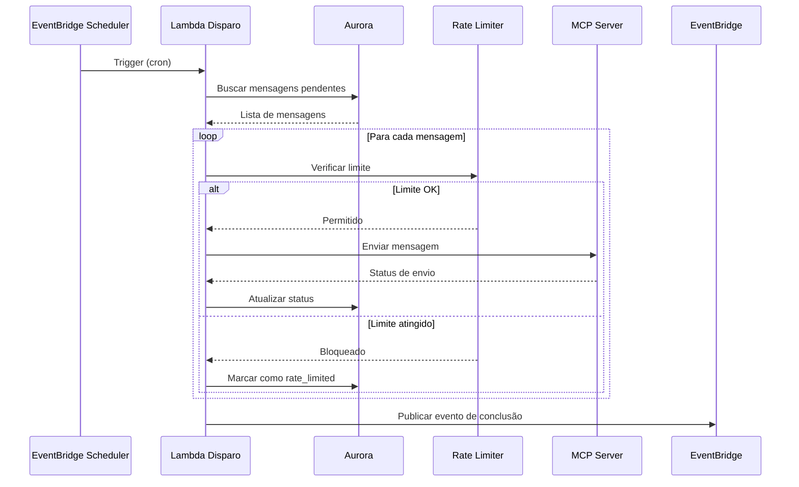
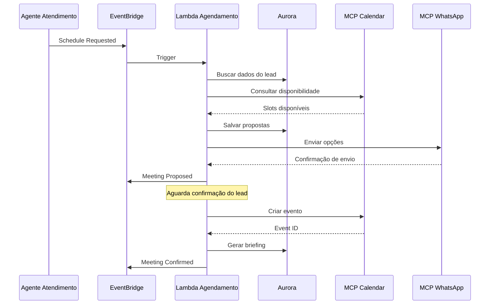

# BLUEPRINT · Micro Agente de Disparo Automático & Agendamento

## Visão Geral

Sistema integrado de disparo automático de mensagens e agendamento inteligente de reuniões para o ecossistema Alquimista.AI. Este micro agente combina automação de campanhas com gestão de calendário, respeitando limites de taxa, horários comerciais e preferências dos leads.

---

## ARQUITETURA DE REFERÊNCIA

### Stack Tecnológico

- **Backend**: AWS Lambda (Node.js 20) + EventBridge
- **Database**: Aurora Serverless v2 (PostgreSQL)
- **Scheduler**: EventBridge Scheduler + Cron
- **Integrações**: MCP Servers (WhatsApp, Email, Google Calendar)
- **Observabilidade**: CloudWatch Logs + X-Ray + Métricas customizadas

### Princípios de Design

- **Event-Driven**: Comunicação via EventBridge
- **Idempotência**: Evita duplicatas em envios
- **Rate Limiting**: Respeita limites por tenant e canal
- **Retry Logic**: Backoff exponencial em falhas
- **Observabilidade**: Logs estruturados e métricas detalhadas

---

## COMPONENTE 1: DISPARO AUTOMÁTICO

### Responsabilidades

1. **Execução de Campanhas**: Envio massivo de mensagens via WhatsApp/Email
2. **Controle de Horário**: Respeita horários comerciais e fusos horários
3. **Rate Limiting**: Gerencia limites por tenant e canal
4. **Humanização**: Adiciona variações de tempo para parecer natural
5. **Tracking**: Acompanha status de entrega e falhas


### Regras de Negócio - Disparo

#### Horários Comerciais

- **Dias úteis**: Segunda a Sexta-feira
- **Horário padrão**: 08:00 - 18:00 (horário local do lead)
- **Variação humana**: ±5 minutos aleatórios
- **Feriados**: Bloqueio automático baseado em calendário brasileiro
- **Fuso horário**: Detectado automaticamente pela localização do lead

#### Rate Limits

**Por Tenant:**
- Máximo: 100 mensagens/hora
- Máximo diário: 500 mensagens/dia
- Burst: 10 mensagens/minuto

**Por Canal:**
- WhatsApp: 80 mensagens/segundo
- Email: 50 mensagens/segundo
- SMS: 10 mensagens/segundo

**Comportamento em Limite:**
- Backoff exponencial: 1s, 2s, 4s, 8s, 16s
- Máximo de 3 tentativas
- Fila de espera para próxima janela disponível

#### Priorização de Envios

1. **Alta prioridade**: Leads quentes (interesse > 80%)
2. **Média prioridade**: Leads mornos (interesse 50-80%)
3. **Baixa prioridade**: Leads frios (interesse < 50%)
4. **Follow-ups**: Sempre prioritários sobre novos contatos


### Estrutura Técnica - Disparo

#### Lambda Handler

**Arquivo**: `lambda/agents/disparo.ts`

**Triggers:**
- EventBridge Scheduler (cron: `0 8-18 * * MON-FRI`)
- EventBridge Rule: `nigredo.estrategia.campaign_ready`

**Configuração:**
- Timeout: 30 segundos
- Memory: 512MB
- Concurrency: 10 execuções simultâneas
- Dead Letter Queue: Habilitada

**Variáveis de Ambiente:**
```typescript
{
  EVENT_BUS_NAME: string;           // fibonacci-bus-{env}
  DB_SECRET_ARN: string;            // ARN do Aurora
  MCP_WHATSAPP_ENDPOINT: string;    // URL do MCP WhatsApp
  MCP_EMAIL_ENDPOINT: string;       // URL do MCP Email
  RATE_LIMIT_TENANT_HOURLY: number; // 100
  RATE_LIMIT_TENANT_DAILY: number;  // 500
  RATE_LIMIT_WHATSAPP: number;      // 80
  RATE_LIMIT_EMAIL: number;         // 50
  BUSINESS_HOURS_START: number;     // 8
  BUSINESS_HOURS_END: number;       // 18
}
```


#### Input Event (EventBridge)

```typescript
interface DisparoScheduledEvent {
  source: 'aws.scheduler' | 'nigredo.estrategia';
  'detail-type': 'Scheduled Event' | 'Campaign Ready';
  detail: {
    scheduleName?: string;
    campaignId?: string;
    tenantId: string;
    priority: 'high' | 'medium' | 'low';
  };
}
```

#### Output Event (EventBridge)

```typescript
interface DisparoCompletedEvent {
  source: 'nigredo.disparo';
  'detail-type': 'Messages Sent' | 'Dispatch Failed';
  detail: {
    campaignId: string;
    tenantId: string;
    messagesSent: number;
    channels: {
      whatsapp: number;
      email: number;
      sms: number;
    };
    failures: number;
    failureReasons: Array<{
      leadId: string;
      channel: string;
      reason: string;
    }>;
    nextRun?: string; // ISO 8601
    rateLimitHit: boolean;
  };
}
```


#### Schema de Banco de Dados

```sql
-- Tabela de controle de disparos
CREATE TABLE nigredo.dispatch_queue (
  id UUID PRIMARY KEY DEFAULT gen_random_uuid(),
  tenant_id UUID NOT NULL REFERENCES tenants(id),
  campaign_id UUID NOT NULL,
  lead_id UUID NOT NULL REFERENCES nigredo.leads(id),
  channel VARCHAR(20) NOT NULL, -- 'whatsapp', 'email', 'sms'
  message_template_id UUID NOT NULL,
  scheduled_at TIMESTAMP NOT NULL,
  sent_at TIMESTAMP,
  status VARCHAR(20) DEFAULT 'pending', -- 'pending', 'sent', 'failed', 'rate_limited'
  attempts INTEGER DEFAULT 0,
  last_error TEXT,
  priority INTEGER DEFAULT 5, -- 1-10, menor = maior prioridade
  created_at TIMESTAMP DEFAULT NOW(),
  updated_at TIMESTAMP DEFAULT NOW()
);

-- Tabela de rate limiting
CREATE TABLE nigredo.rate_limit_tracker (
  id UUID PRIMARY KEY DEFAULT gen_random_uuid(),
  tenant_id UUID NOT NULL REFERENCES tenants(id),
  channel VARCHAR(20) NOT NULL,
  window_start TIMESTAMP NOT NULL,
  window_end TIMESTAMP NOT NULL,
  message_count INTEGER DEFAULT 0,
  limit_reached BOOLEAN DEFAULT FALSE,
  created_at TIMESTAMP DEFAULT NOW()
);

-- Índices para performance
CREATE INDEX idx_dispatch_queue_scheduled ON nigredo.dispatch_queue(scheduled_at, status);
CREATE INDEX idx_dispatch_queue_tenant ON nigredo.dispatch_queue(tenant_id, status);
CREATE INDEX idx_rate_limit_tenant_window ON nigredo.rate_limit_tracker(tenant_id, window_start, window_end);
```


---

## COMPONENTE 2: AGENDAMENTO INTELIGENTE

### Responsabilidades

1. **Consulta de Disponibilidade**: Verifica calendários via Google Calendar API
2. **Proposta de Horários**: Sugere 3 opções baseadas em preferências
3. **Criação de Eventos**: Confirma reuniões no calendário
4. **Briefing Automático**: Gera resumo completo do lead para o vendedor
5. **Lembretes**: Envia notificações 24h e 1h antes da reunião

### Regras de Negócio - Agendamento

#### Disponibilidade

- **Dias úteis**: Segunda a Sexta-feira
- **Horário comercial**: 09:00 - 18:00
- **Duração padrão**: 60 minutos
- **Buffer entre reuniões**: 15 minutos
- **Bloqueios automáticos**: Feriados e férias configuradas

#### Proposta de Horários

- **Quantidade**: 3 opções diferentes
- **Distribuição**: Diferentes dias e períodos (manhã/tarde)
- **Personalização**: Baseada no perfil e histórico do lead
- **Urgência**: Leads quentes recebem slots mais próximos

#### Confirmação

- **Canais**: WhatsApp (preferencial) ou Email
- **Timeout**: 24 horas para confirmação
- **Reagendamento**: Até 2 vezes sem penalidade
- **No-show**: Marca lead para follow-up especial


### Estrutura Técnica - Agendamento

#### Lambda Handler

**Arquivo**: `lambda/agents/agendamento.ts`

**Triggers:**
- EventBridge Rule: `nigredo.atendimento.schedule_requested`
- EventBridge Rule: `nigredo.agendamento.meeting_confirmed`

**Configuração:**
- Timeout: 30 segundos
- Memory: 512MB
- Concurrency: 5 execuções simultâneas

**Variáveis de Ambiente:**
```typescript
{
  EVENT_BUS_NAME: string;              // fibonacci-bus-{env}
  DB_SECRET_ARN: string;               // ARN do Aurora
  MCP_CALENDAR_ENDPOINT: string;       // URL do MCP Calendar
  GOOGLE_CALENDAR_ID: string;          // vendas@empresa.com
  MEETING_DURATION_DEFAULT: number;    // 60 minutos
  BUFFER_MINUTES: number;              // 15 minutos
  BUSINESS_HOURS_START: number;        // 9
  BUSINESS_HOURS_END: number;          // 18
  CONFIRMATION_TIMEOUT_HOURS: number;  // 24
}
```


#### Input Event (EventBridge)

```typescript
interface AgendamentoRequestEvent {
  source: 'nigredo.atendimento';
  'detail-type': 'Schedule Requested';
  detail: {
    leadId: string;
    tenantId: string;
    preferredDates?: string[]; // ['2024-01-16', '2024-01-17']
    preferredTimes?: ('morning' | 'afternoon' | 'evening')[];
    urgency: 'high' | 'medium' | 'low';
    meetingType: 'demo' | 'discovery' | 'negotiation' | 'closing';
    requestedBy: string; // userId do vendedor
  };
}
```

#### Output Event (EventBridge)

```typescript
interface AgendamentoCompletedEvent {
  source: 'nigredo.agendamento';
  'detail-type': 'Meeting Scheduled' | 'Meeting Confirmed' | 'Meeting Cancelled';
  detail: {
    meetingId: string;
    leadId: string;
    tenantId: string;
    dateTime: string; // ISO 8601
    duration: number; // minutos
    attendees: string[]; // emails
    calendarEventId: string;
    briefingUrl?: string;
    meetingLink?: string; // Google Meet
    status: 'proposed' | 'confirmed' | 'cancelled';
  };
}
```


#### Schema de Banco de Dados

```sql
-- Tabela de reuniões
CREATE TABLE nigredo.meetings (
  id UUID PRIMARY KEY DEFAULT gen_random_uuid(),
  tenant_id UUID NOT NULL REFERENCES tenants(id),
  lead_id UUID NOT NULL REFERENCES nigredo.leads(id),
  calendar_event_id VARCHAR(255),
  scheduled_at TIMESTAMP NOT NULL,
  duration INTEGER DEFAULT 60, -- minutos
  meeting_type VARCHAR(50) NOT NULL,
  status VARCHAR(20) DEFAULT 'proposed', -- 'proposed', 'confirmed', 'cancelled', 'completed', 'no_show'
  attendees JSONB NOT NULL, -- [{email, name, role}]
  meeting_link TEXT,
  briefing_generated BOOLEAN DEFAULT FALSE,
  briefing_content TEXT,
  confirmation_sent_at TIMESTAMP,
  confirmed_at TIMESTAMP,
  cancelled_at TIMESTAMP,
  cancellation_reason TEXT,
  reschedule_count INTEGER DEFAULT 0,
  created_at TIMESTAMP DEFAULT NOW(),
  updated_at TIMESTAMP DEFAULT NOW()
);

-- Tabela de disponibilidade de vendedores
CREATE TABLE nigredo.seller_availability (
  id UUID PRIMARY KEY DEFAULT gen_random_uuid(),
  tenant_id UUID NOT NULL REFERENCES tenants(id),
  seller_id UUID NOT NULL REFERENCES users(id),
  calendar_id VARCHAR(255) NOT NULL,
  day_of_week INTEGER NOT NULL, -- 1-7 (seg-dom)
  start_time TIME NOT NULL,
  end_time TIME NOT NULL,
  is_active BOOLEAN DEFAULT TRUE,
  created_at TIMESTAMP DEFAULT NOW()
);

-- Tabela de bloqueios (férias, feriados)
CREATE TABLE nigredo.calendar_blocks (
  id UUID PRIMARY KEY DEFAULT gen_random_uuid(),
  tenant_id UUID NOT NULL REFERENCES tenants(id),
  seller_id UUID REFERENCES users(id), -- NULL = bloqueio global
  block_type VARCHAR(20) NOT NULL, -- 'holiday', 'vacation', 'internal_meeting'
  start_date DATE NOT NULL,
  end_date DATE NOT NULL,
  description TEXT,
  created_at TIMESTAMP DEFAULT NOW()
);

-- Índices
CREATE INDEX idx_meetings_lead ON nigredo.meetings(lead_id, status);
CREATE INDEX idx_meetings_scheduled ON nigredo.meetings(scheduled_at, status);
CREATE INDEX idx_seller_availability ON nigredo.seller_availability(seller_id, day_of_week, is_active);
CREATE INDEX idx_calendar_blocks_dates ON nigredo.calendar_blocks(start_date, end_date);
```


---

## INTEGRAÇÃO COM MCP SERVERS

### MCP WhatsApp Server

**Endpoint**: Configurado via `MCP_WHATSAPP_ENDPOINT`

**Operações:**
```typescript
// Enviar mensagem
POST /mcp/whatsapp/send
{
  to: string;        // +5584997084444
  message: string;
  templateId?: string;
  variables?: Record<string, string>;
}

// Verificar status
GET /mcp/whatsapp/status/{messageId}
```

### MCP Email Server

**Endpoint**: Configurado via `MCP_EMAIL_ENDPOINT`

**Operações:**
```typescript
// Enviar email
POST /mcp/email/send
{
  to: string;
  subject: string;
  body: string;
  html?: string;
  templateId?: string;
  variables?: Record<string, string>;
}
```

### MCP Calendar Server

**Endpoint**: Configurado via `MCP_CALENDAR_ENDPOINT`

**Operações:**
```typescript
// Consultar disponibilidade
POST /mcp/calendar/availability
{
  calendarId: string;
  startDate: string;
  endDate: string;
  duration: number;
}

// Criar evento
POST /mcp/calendar/events
{
  calendarId: string;
  summary: string;
  description: string;
  startDateTime: string;
  endDateTime: string;
  attendees: string[];
  conferenceData?: {
    createRequest: boolean;
  };
}

// Cancelar evento
DELETE /mcp/calendar/events/{eventId}
```


---

## TEMPLATE DE BRIEFING AUTOMÁTICO

### Estrutura do Briefing

```markdown
# Briefing Comercial - {empresa}

## 📊 Dados da Empresa
- **Nome**: {empresa}
- **CNPJ**: {cnpj}
- **Setor**: {setor}
- **Porte**: {porte} ({num_funcionarios} funcionários)
- **Faturamento estimado**: {faturamento}
- **Website**: {website}
- **Localização**: {cidade}, {estado}

## 📞 Contato Principal
- **Nome**: {nome_contato}
- **Cargo**: {cargo}
- **Email**: {email}
- **Telefone**: {telefone}
- **LinkedIn**: {linkedin}

## 📈 Histórico de Interações
{historico_interacoes}

**Total de interações**: {total_interacoes}
**Última interação**: {data_ultima_interacao}
**Canal preferido**: {canal_preferido}

## 💭 Análise de Sentimento
- **Sentimento atual**: {sentimento} ({score}/100)
- **Nível de interesse**: {interesse}% 
- **Probabilidade de conversão**: {probabilidade}%
- **Estágio no funil**: {estagio}

## ⚠️ Objeções Identificadas
{objecoes_lista}

## 🎯 Pontos de Dor Identificados
{pain_points_lista}

## 💡 Recomendações para a Reunião
- **Abordagem sugerida**: {abordagem}
- **Proposta de valor**: {value_prop}
- **Diferenciais a destacar**: {diferenciais}
- **Perguntas-chave**: {perguntas}

## 📋 Próximos Passos Sugeridos
{proximos_passos}

---
*Briefing gerado automaticamente em {data_geracao}*
*Lead ID: {lead_id} | Meeting ID: {meeting_id}*
```


---

## FLUXOS DE TRABALHO

### Fluxo 1: Disparo Automático de Campanha



### Fluxo 2: Agendamento de Reunião




---

## MÉTRICAS E OBSERVABILIDADE

### Métricas CloudWatch

#### Disparo Automático

```typescript
// Métricas customizadas
{
  namespace: 'Alquimista/Nigredo/Disparo',
  metrics: [
    {
      name: 'MessagesSent',
      unit: 'Count',
      dimensions: { TenantId, Channel }
    },
    {
      name: 'MessagesFailedRate',
      unit: 'Percent',
      dimensions: { TenantId, Channel }
    },
    {
      name: 'RateLimitHits',
      unit: 'Count',
      dimensions: { TenantId, LimitType }
    },
    {
      name: 'AverageDispatchTime',
      unit: 'Milliseconds',
      dimensions: { TenantId }
    },
    {
      name: 'QueueDepth',
      unit: 'Count',
      dimensions: { TenantId, Priority }
    }
  ]
}
```

#### Agendamento

```typescript
{
  namespace: 'Alquimista/Nigredo/Agendamento',
  metrics: [
    {
      name: 'MeetingsScheduled',
      unit: 'Count',
      dimensions: { TenantId, MeetingType }
    },
    {
      name: 'ConfirmationRate',
      unit: 'Percent',
      dimensions: { TenantId }
    },
    {
      name: 'NoShowRate',
      unit: 'Percent',
      dimensions: { TenantId }
    },
    {
      name: 'AverageSchedulingTime',
      unit: 'Milliseconds',
      dimensions: { TenantId }
    },
    {
      name: 'RescheduleCount',
      unit: 'Count',
      dimensions: { TenantId }
    }
  ]
}
```


### Alarmes CloudWatch

```typescript
// Alarmes críticos
const alarms = [
  {
    name: 'DisparoHighFailureRate',
    metric: 'MessagesFailedRate',
    threshold: 10, // %
    evaluationPeriods: 2,
    severity: 'CRITICAL'
  },
  {
    name: 'DisparoRateLimitExceeded',
    metric: 'RateLimitHits',
    threshold: 100,
    evaluationPeriods: 1,
    severity: 'HIGH'
  },
  {
    name: 'AgendamentoLowConfirmationRate',
    metric: 'ConfirmationRate',
    threshold: 60, // %
    evaluationPeriods: 3,
    severity: 'MEDIUM'
  },
  {
    name: 'AgendamentoHighNoShowRate',
    metric: 'NoShowRate',
    threshold: 15, // %
    evaluationPeriods: 3,
    severity: 'HIGH'
  }
];
```

### Logs Estruturados

```typescript
// Formato de log padrão
interface LogEntry {
  timestamp: string;
  level: 'INFO' | 'WARN' | 'ERROR';
  service: 'disparo' | 'agendamento';
  tenantId: string;
  leadId?: string;
  campaignId?: string;
  meetingId?: string;
  action: string;
  result: 'success' | 'failure' | 'rate_limited';
  duration?: number;
  error?: {
    message: string;
    stack?: string;
    code?: string;
  };
  metadata?: Record<string, any>;
}
```


---

## TESTES E VALIDAÇÃO

### Testes Unitários

```typescript
// Exemplo de teste para rate limiter
describe('RateLimiter', () => {
  it('deve permitir envio dentro do limite', async () => {
    const limiter = new RateLimiter({ hourly: 100, daily: 500 });
    const result = await limiter.checkLimit('tenant-123', 'whatsapp');
    expect(result.allowed).toBe(true);
  });

  it('deve bloquear quando limite horário atingido', async () => {
    const limiter = new RateLimiter({ hourly: 100, daily: 500 });
    // Simular 100 envios
    for (let i = 0; i < 100; i++) {
      await limiter.increment('tenant-123', 'whatsapp');
    }
    const result = await limiter.checkLimit('tenant-123', 'whatsapp');
    expect(result.allowed).toBe(false);
    expect(result.reason).toBe('hourly_limit_exceeded');
  });
});
```

### Testes de Integração

```typescript
// Exemplo de teste de integração com MCP
describe('Disparo Integration', () => {
  it('deve enviar mensagem via MCP WhatsApp', async () => {
    const event = createDisparoEvent({
      campaignId: 'camp-123',
      tenantId: 'tenant-456'
    });
    
    const result = await handler(event);
    
    expect(result.messagesSent).toBeGreaterThan(0);
    expect(result.failures).toBe(0);
  });
});
```

### Testes de Carga

```typescript
// Configuração de teste de carga com k6
export const options = {
  stages: [
    { duration: '2m', target: 100 }, // Ramp up
    { duration: '5m', target: 100 }, // Stay at 100
    { duration: '2m', target: 0 },   // Ramp down
  ],
  thresholds: {
    'http_req_duration': ['p(95)<2000'], // 95% < 2s
    'http_req_failed': ['rate<0.05'],    // < 5% falhas
  },
};
```


---

## SEGURANÇA E COMPLIANCE

### Proteção de Dados

- **Criptografia em trânsito**: TLS 1.3 para todas as comunicações
- **Criptografia em repouso**: Aurora com KMS encryption
- **Secrets**: AWS Secrets Manager para credenciais
- **IAM**: Least privilege principle para roles Lambda

### LGPD Compliance

```typescript
// Anonimização de dados em logs
function sanitizeLogData(data: any): any {
  return {
    ...data,
    email: maskEmail(data.email),
    phone: maskPhone(data.phone),
    name: maskName(data.name),
  };
}

// Retenção de dados
const dataRetentionPolicies = {
  dispatchQueue: '90 days',
  meetings: '2 years',
  rateLimitTracker: '30 days',
  logs: '90 days',
};
```

### Rate Limiting de Segurança

```typescript
// Proteção contra abuso
const securityLimits = {
  maxRetriesPerMessage: 3,
  maxReschedulesPerMeeting: 2,
  maxConcurrentDispatches: 10,
  ipRateLimit: '100 req/min',
};
```


---

## TROUBLESHOOTING

### Problemas Comuns - Disparo

#### Mensagens não sendo enviadas

**Sintomas**: Queue crescendo, mensagens com status `pending`

**Diagnóstico**:
```bash
# Verificar logs
aws logs tail /aws/lambda/disparo-{env} --follow

# Verificar métricas
aws cloudwatch get-metric-statistics \
  --namespace Alquimista/Nigredo/Disparo \
  --metric-name QueueDepth \
  --dimensions Name=TenantId,Value=tenant-123
```

**Soluções**:
1. Verificar conectividade com MCP servers
2. Verificar rate limits não estão muito restritivos
3. Verificar horário comercial configurado corretamente
4. Verificar Dead Letter Queue para erros

#### Rate limit sendo atingido frequentemente

**Sintomas**: Muitas mensagens com status `rate_limited`

**Diagnóstico**:
```sql
SELECT 
  tenant_id,
  channel,
  COUNT(*) as rate_limited_count
FROM nigredo.dispatch_queue
WHERE status = 'rate_limited'
  AND created_at > NOW() - INTERVAL '1 hour'
GROUP BY tenant_id, channel;
```

**Soluções**:
1. Aumentar limites se apropriado
2. Distribuir envios ao longo do dia
3. Priorizar mensagens importantes
4. Considerar adicionar mais canais


### Problemas Comuns - Agendamento

#### Reuniões não sendo criadas no calendário

**Sintomas**: Meetings com status `proposed` mas sem `calendar_event_id`

**Diagnóstico**:
```bash
# Verificar logs do agendamento
aws logs tail /aws/lambda/agendamento-{env} --follow

# Verificar eventos no EventBridge
aws events list-rule-names-by-target \
  --target-arn arn:aws:lambda:us-east-1:123456789:function:agendamento-dev
```

**Soluções**:
1. Verificar credenciais do Google Calendar
2. Verificar permissões do MCP Calendar Server
3. Verificar se calendar_id está correto
4. Testar manualmente a API do Google Calendar

#### Alta taxa de no-show

**Sintomas**: Métrica `NoShowRate` acima de 15%

**Diagnóstico**:
```sql
SELECT 
  meeting_type,
  COUNT(*) FILTER (WHERE status = 'no_show') as no_shows,
  COUNT(*) as total,
  ROUND(100.0 * COUNT(*) FILTER (WHERE status = 'no_show') / COUNT(*), 2) as no_show_rate
FROM nigredo.meetings
WHERE scheduled_at > NOW() - INTERVAL '30 days'
GROUP BY meeting_type;
```

**Soluções**:
1. Aumentar frequência de lembretes
2. Confirmar reunião 1 dia antes
3. Facilitar reagendamento
4. Melhorar qualificação de leads antes de agendar


---

## ROADMAP E MELHORIAS FUTURAS

### Fase 1: MVP (Atual)
- ✅ Disparo automático com rate limiting
- ✅ Agendamento via Google Calendar
- ✅ Briefing automático
- ✅ Integração com MCP servers

### Fase 2: Otimizações (Q1 2024)
- [ ] Machine Learning para melhor horário de envio
- [ ] Personalização de mensagens com IA
- [ ] Predição de no-show
- [ ] A/B testing de templates

### Fase 3: Expansão (Q2 2024)
- [ ] Suporte a múltiplos fusos horários
- [ ] Integração com Outlook Calendar
- [ ] SMS como canal adicional
- [ ] Webhooks para integrações externas

### Fase 4: Inteligência (Q3 2024)
- [ ] Recomendação automática de melhor canal
- [ ] Otimização de horários baseada em conversão
- [ ] Análise preditiva de engajamento
- [ ] Auto-ajuste de rate limits por performance

---

## REFERÊNCIAS

### Documentação Relacionada

- [Agente de Disparo](../docs/agents/disparo.md)
- [Agente de Agendamento](../docs/agents/agendamento.md)
- [MCP Integrations](../mcp-integrations/README.md)
- [Nigredo Core Design](../.kiro/specs/nigredo-prospecting-core/design.md)

### APIs Externas

- [Google Calendar API](https://developers.google.com/calendar/api)
- [WhatsApp Business API](https://developers.facebook.com/docs/whatsapp)
- [AWS EventBridge](https://docs.aws.amazon.com/eventbridge/)

---

**Última atualização**: 2024-01-15  
**Versão**: 1.0.0  
**Mantido por**: Equipe Alquimista.AI
