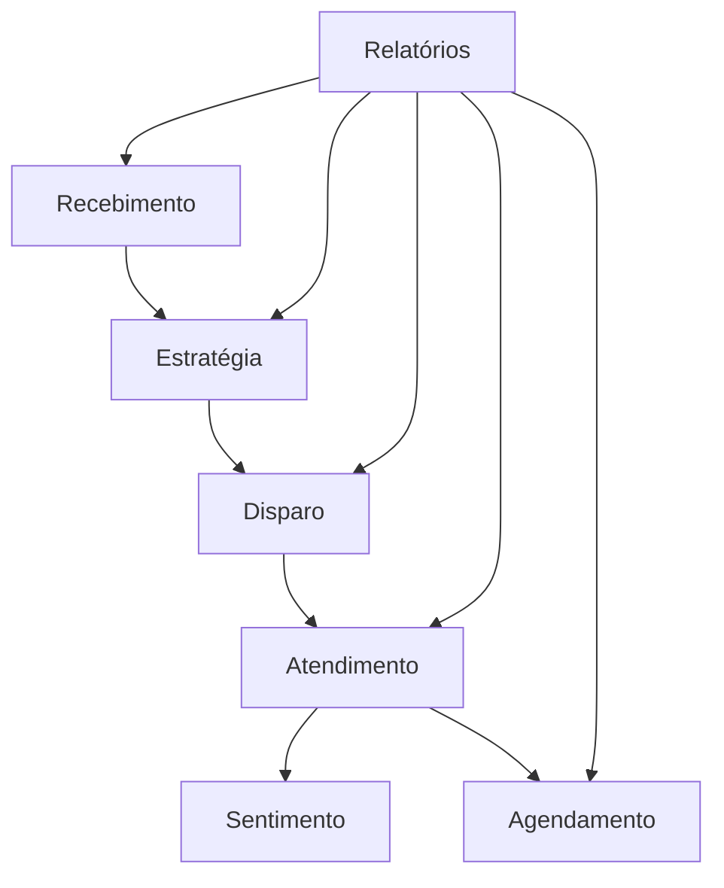

# Documentação dos Agentes Nigredo

## Visão Geral

O sistema Nigredo é composto por 7 agentes especializados que trabalham em conjunto para automatizar o processo de prospecção e vendas. Cada agente tem responsabilidades específicas e se comunica através do EventBridge.

## Arquitetura do Sistema



## Agentes Disponíveis

### 1. [Agente de Recebimento](./recebimento.md)
**Responsabilidade**: Processar e higienizar leads recebidos
- ✅ Validação de dados
- ✅ Enriquecimento via APIs externas
- ✅ Segmentação e priorização
- ✅ Remoção de duplicatas

### 2. [Agente de Estratégia](./estrategia.md)
**Responsabilidade**: Criar campanhas personalizadas
- ✅ Análise de perfil comercial
- ✅ Criação de mensagens para funil completo
- ✅ Testes A/B automáticos
- ✅ Definição de canal e ritmo

### 3. [Agente de Disparo](./disparo.md)
**Responsabilidade**: Executar campanhas ativas
- ✅ Controle de horário comercial
- ✅ Rate limiting por tenant
- ✅ Envio via WhatsApp/Email
- ✅ Tracking de entrega

### 4. [Agente de Atendimento](./atendimento.md)
**Responsabilidade**: Processar respostas de leads
- ✅ Análise de sentimento
- ✅ Geração de respostas via LLM
- ✅ Decisão de próximo passo
- ✅ Contextualização completa

### 5. [Agente de Sentimento](./sentimento.md)
**Responsabilidade**: Analisar emoções e detectar LGPD
- ✅ Classificação emocional
- ✅ Detecção de descadastro
- ✅ Score de intensidade
- ✅ Compliance automático

### 6. [Agente de Agendamento](./agendamento.md)
**Responsabilidade**: Gerenciar reuniões comerciais
- ✅ Consulta de disponibilidade
- ✅ Proposta de horários
- ✅ Criação de eventos
- ✅ Briefing automático

### 7. [Agente de Relatórios](./relatorios.md)
**Responsabilidade**: Gerar insights e métricas
- ✅ Consolidação de dados
- ✅ Análise de performance
- ✅ Insights via LLM
- ✅ Alertas automáticos

## Fluxo de Dados

### 1. Entrada de Leads
```
Planilha/JSON → Recebimento → Higienização → Segmentação
```

### 2. Criação de Campanha
```
Lotes → Estratégia → Análise → Mensagens → Aprovação
```

### 3. Execução
```
Campanha → Disparo → Rate Limit → Envio → Tracking
```

### 4. Interação
```
Resposta → Atendimento → Sentimento → Resposta → Próximo Passo
```

### 5. Agendamento
```
Interesse → Agendamento → Disponibilidade → Evento → Briefing
```

### 6. Análise
```
Dados → Relatórios → Insights → Recomendações → Otimização
```

## Métricas Consolidadas

### Performance Geral
- **Leads processados/dia**: 1000+
- **Taxa de conversão geral**: 15%+
- **Tempo médio do ciclo**: 7 dias
- **Satisfação do lead**: 4.5/5

### SLA por Agente
- **Recebimento**: <60s por lote
- **Estratégia**: <2min por campanha
- **Disparo**: <2s por mensagem
- **Atendimento**: <30s por resposta
- **Sentimento**: <500ms por análise
- **Agendamento**: <2min por solicitação
- **Relatórios**: <2min por relatório

## Configuração Global

### Variáveis de Ambiente Comuns
```bash
# EventBridge
EVENT_BUS_NAME=fibonacci-bus-{env}

# Database
DB_SECRET_ARN=arn:aws:secretsmanager:...

# MCP Integrations
MCP_WHATSAPP_ENDPOINT=https://...
MCP_CALENDAR_ENDPOINT=https://...
MCP_ENRICHMENT_ENDPOINT=https://...

# AI/ML
BEDROCK_MODEL_ID=anthropic.claude-3-sonnet
COMPREHEND_LANGUAGE_CODE=pt
```

### Rate Limits Globais
```bash
# Por Tenant
RATE_LIMIT_HOURLY=100
RATE_LIMIT_DAILY=500

# Por Canal
WHATSAPP_RATE_LIMIT=80/s
EMAIL_RATE_LIMIT=50/s
SMS_RATE_LIMIT=10/s
```

## Monitoramento

### CloudWatch Dashboards
- **Nigredo Overview**: Métricas gerais
- **Agent Performance**: Performance individual
- **Business Metrics**: KPIs de negócio

### Alarmes Críticos
- Taxa de erro >5% em qualquer agente
- Latência >SLA em qualquer agente
- Rate limit violations
- LGPD compliance failures

## Troubleshooting

### Problemas Comuns
1. **Leads não processados**: Verificar SQS DLQ
2. **Mensagens não enviadas**: Verificar rate limits
3. **Respostas não geradas**: Verificar Bedrock quotas
4. **Agendamentos falhando**: Verificar Google Calendar API

### Logs Estruturados
Todos os agentes usam logging estruturado com:
- `trace_id`: Para rastreamento distribuído
- `agent_name`: Identificação do agente
- `lead_id`: Identificação do lead
- `tenant_id`: Identificação do tenant

## Próximos Passos

### Roadmap
- [ ] Integração com CRM externo
- [ ] Suporte a múltiplos idiomas
- [ ] ML para otimização automática
- [ ] Integração com telefonia (voz)
- [ ] Dashboard em tempo real