# Fase 1: Diagramas de Fluxo e Arquitetura

## 🔄 Fluxo de Observabilidade

### Fluxo Completo de uma Requisição

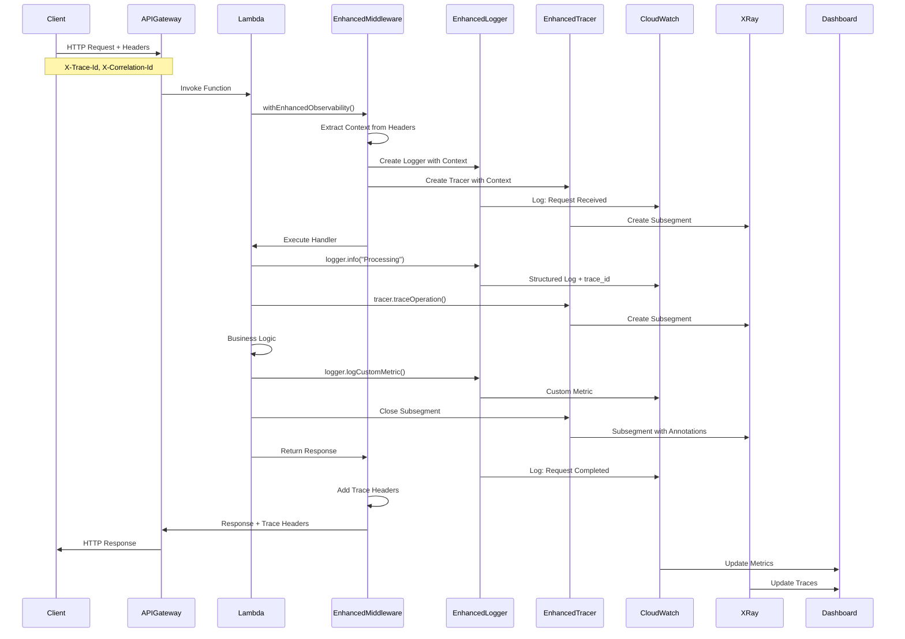

---

## 🏗️ Arquitetura de Componentes

### Estrutura de Componentes

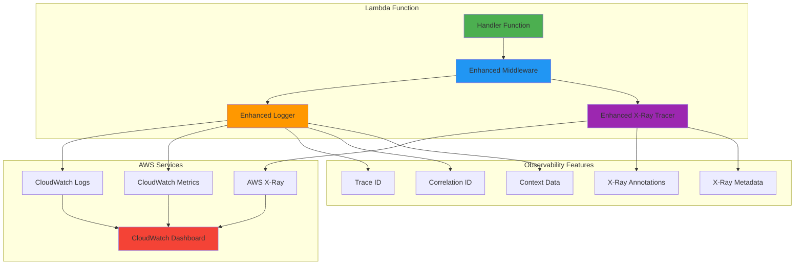

---

## 📊 Fluxo de Dados

### Como os Dados Fluem pelo Sistema

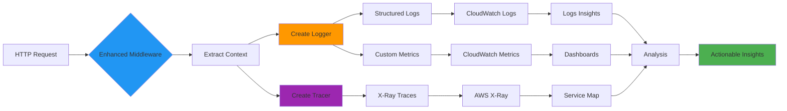

---

## 🔍 Fluxo de Trace ID

### Propagação de Trace ID

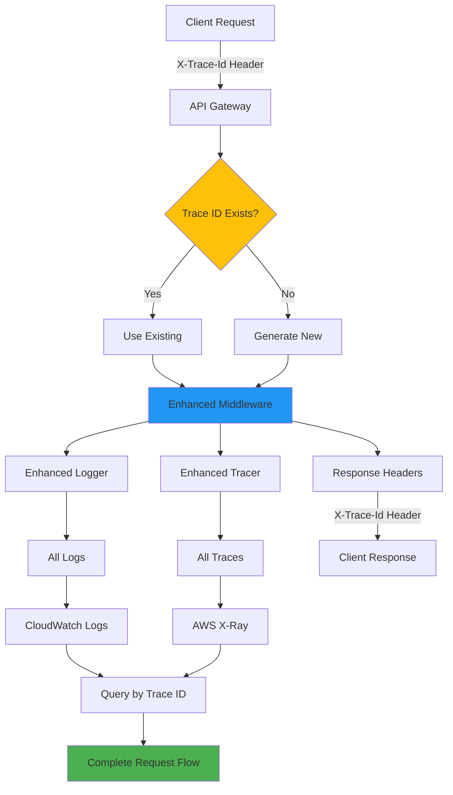

---

## 🎯 Fluxo de Child Logger/Tracer

### Operações Aninhadas

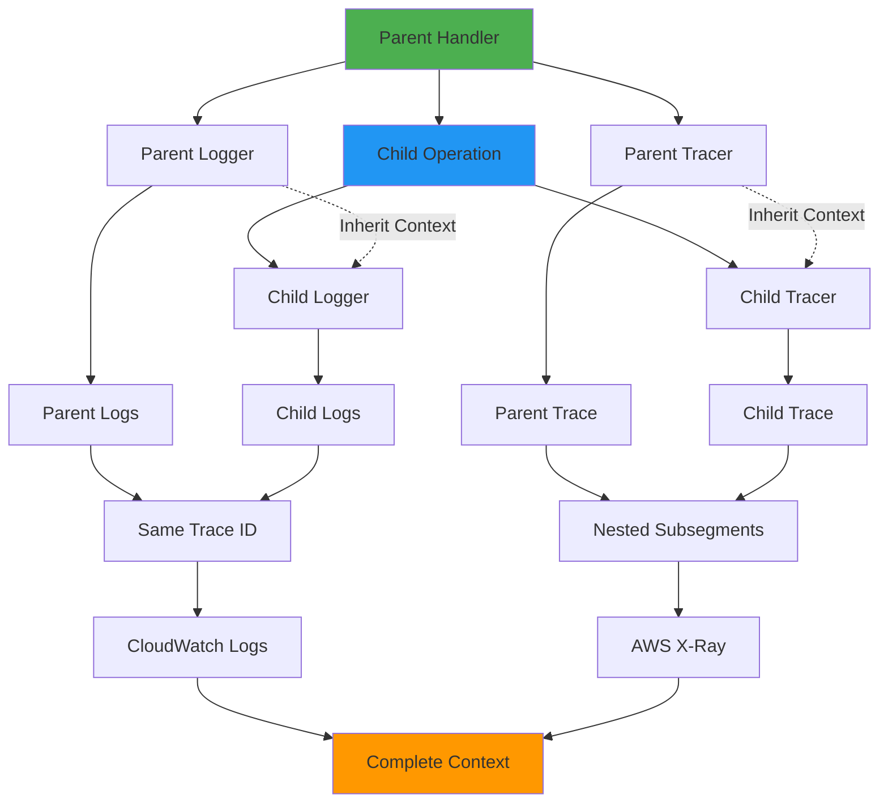

---

## 📈 Fluxo de Métricas

### Métricas Customizadas

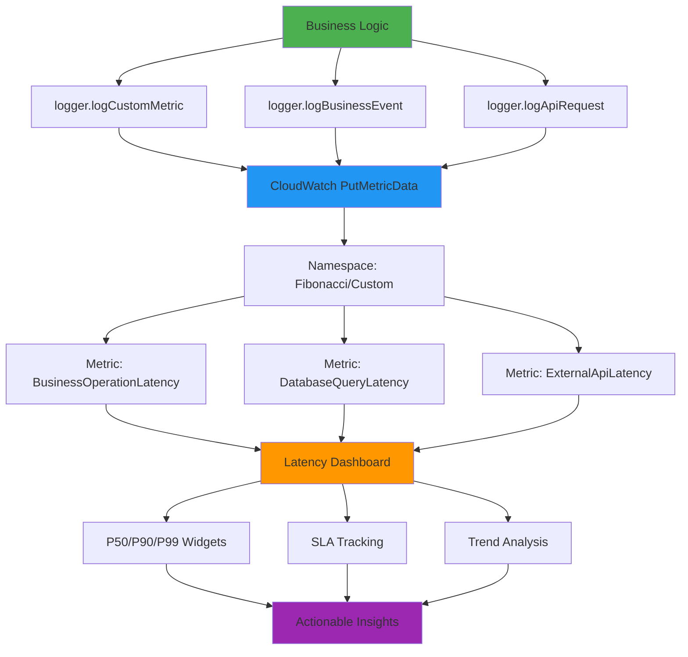

---

## 🔄 Fluxo de Erro

### Tratamento de Erros com Observabilidade

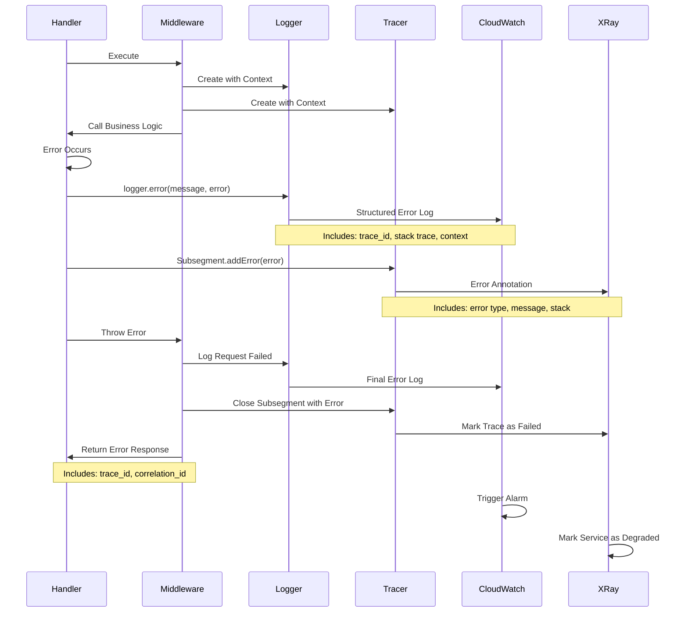

---

## 🎨 Dashboard de Latência

### Estrutura do Dashboard

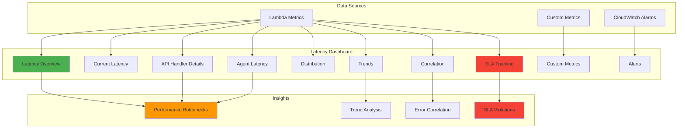

---

## 🔍 Query Flow no CloudWatch Insights

### Como Buscar Logs

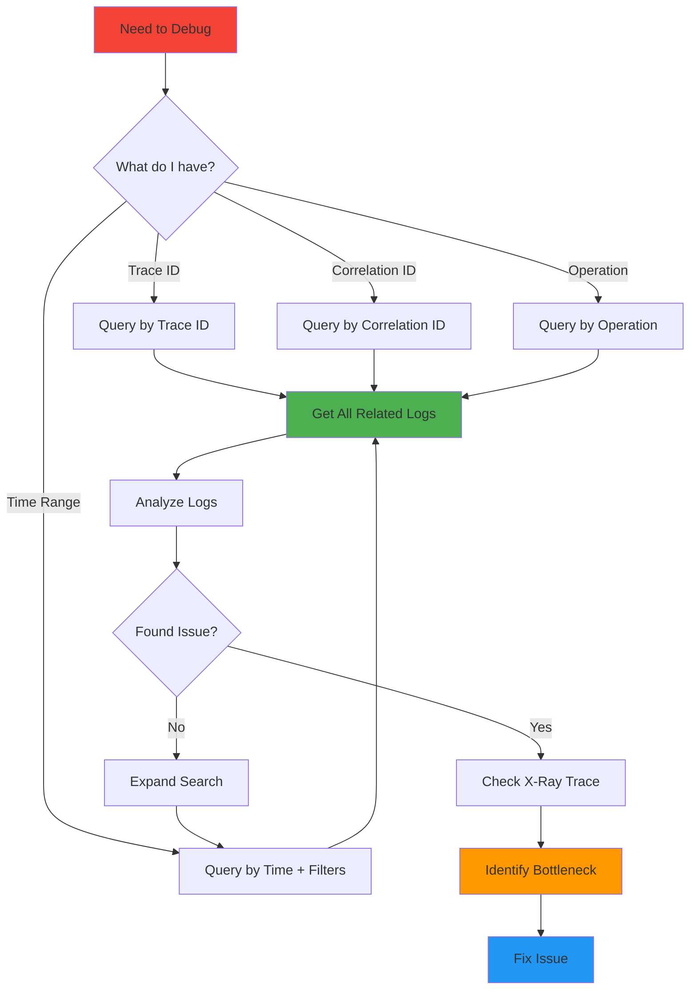

---

## 🚀 Deployment Flow

### Como Deploy Afeta Observabilidade

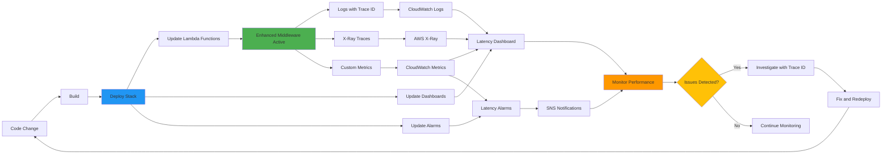

---

## 📊 Métricas de Sucesso

### KPIs e Monitoramento

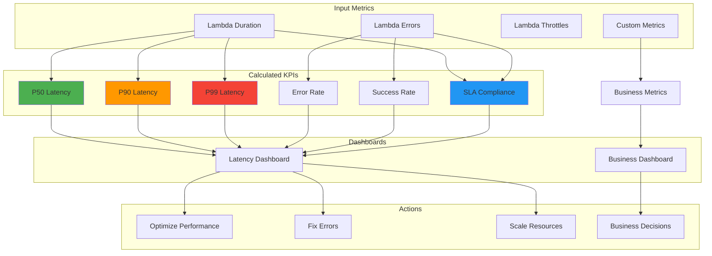

---

## 🎯 Conclusão

Estes diagramas ilustram como a Fase 1 de Observabilidade Avançada funciona em diferentes cenários:

1. **Fluxo de Requisição**: Como uma requisição é rastreada do início ao fim
2. **Arquitetura**: Como os componentes se relacionam
3. **Trace ID**: Como o trace_id é propagado
4. **Child Operations**: Como operações aninhadas mantêm contexto
5. **Métricas**: Como métricas customizadas fluem para dashboards
6. **Erros**: Como erros são capturados e rastreados
7. **Dashboard**: Estrutura do dashboard de latência
8. **Queries**: Como buscar logs eficientemente
9. **Deploy**: Como deploy afeta observabilidade
10. **KPIs**: Como métricas se transformam em insights

**Use estes diagramas como referência visual durante implementação e troubleshooting.**
