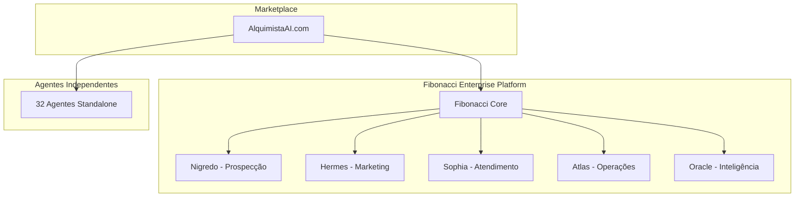

# 🧙‍♂️ Ecossistema AlquimistaAI - 32 Agentes Especializados

## 🌟 Visão Geral

O Ecossistema AlquimistaAI é uma plataforma completa de automação empresarial que oferece 32 agentes especializados organizados em 5 subnúcleos. Cada agente pode ser comercializado individualmente ou como parte de subnúcleos integrados ao Fibonacci Enterprise.

## 🏗️ Arquitetura do Ecossistema

## 🎯 Modelo de Negócio

### **Duas Modalidades de Comercialização:**

#### 1. **Agentes Independentes (SaaS)**
- Venda individual por assinatura
- Integração via API/Webhook
- Ideal para PMEs e profissionais autônomos

#### 2. **Fibonacci Enterprise (Subnúcleos)**
- Plataforma completa com múltiplos agentes
- Orquestração centralizada
- Ideal para empresas médias e grandes

## 📊 32 Agentes Especializados

### **🎯 Subnúcleo Nigredo - Prospecção (10 Agentes)**
1. **Agente de Recebimento** - Higienização e enriquecimento de leads
2. **Agente de Estratégia** - Criação de campanhas personalizadas
3. **Agente de Disparo** - Envio automatizado de mensagens
4. **Agente de Atendimento** - Conversas humanizadas com leads
5. **Agente de Sentimento** - Análise emocional e LGPD
6. **Agente de Agendamento** - Gestão de reuniões comerciais
7. **Agente de Relatórios** - Insights e métricas de vendas
8. **Agente de Qualificação** - Scoring avançado de leads
9. **Agente de Follow-up** - Sequências de nutrição
10. **Agente de Objeções** - Tratamento de resistências

### **📱 Subnúcleo Hermes - Marketing Digital (6 Agentes)**
11. **Agente de Conteúdo** - Criação de posts e artigos
12. **Agente de SEO** - Otimização para buscadores
13. **Agente de Social Media** - Gestão de redes sociais
14. **Agente de Email Marketing** - Campanhas automatizadas
15. **Agente de Landing Pages** - Criação e otimização
16. **Agente de Ads** - Gestão de campanhas pagas

### **🤝 Subnúcleo Sophia - Atendimento (6 Agentes)**
17. **Agente de Suporte** - Atendimento técnico automatizado
18. **Agente de FAQ** - Base de conhecimento inteligente
19. **Agente de Escalação** - Roteamento de tickets
20. **Agente de Satisfação** - Pesquisas e NPS
21. **Agente de Retenção** - Prevenção de churn
22. **Agente de Upsell** - Identificação de oportunidades

### **⚙️ Subnúcleo Atlas - Operações (6 Agentes)**
23. **Agente de Agenda** - Gestão de calendários
24. **Agente de Documentos** - Processamento inteligente
25. **Agente de Contratos** - Análise contratual
26. **Agente de Financeiro** - Controle de fluxo de caixa
27. **Agente de RH** - Recrutamento e gestão
28. **Agente de Compliance** - Auditoria e conformidade

### **🔮 Subnúcleo Oracle - Inteligência (4 Agentes)**
29. **Agente de Analytics** - Análise de dados
30. **Agente de Previsão** - Forecasting e predições
31. **Agente de Competição** - Monitoramento competitivo
32. **Agente de Tendências** - Análise de mercado

## 💰 Estrutura de Preços

### **Agentes Independentes**
| Plano | Preço/mês | Agentes | Público-Alvo |
|-------|-----------|---------|--------------|
| **Starter** | R$ 97 | 1 agente | Freelancers |
| **Professional** | R$ 297 | 3 agentes | PMEs |
| **Business** | R$ 597 | 7 agentes | Empresas |
| **Enterprise** | R$ 997 | Ilimitados | Corporações |

### **Fibonacci Enterprise (Subnúcleos)**
| Subnúcleo | Preço/mês | Agentes | ROI Estimado |
|-----------|-----------|---------|--------------|
| **Nigredo** | R$ 2.997 | 10 | 300-500% |
| **Hermes** | R$ 2.497 | 6 | 200-400% |
| **Sophia** | R$ 1.997 | 6 | 150-300% |
| **Atlas** | R$ 2.497 | 6 | 200-350% |
| **Oracle** | R$ 1.497 | 4 | 100-250% |
| **Completo** | R$ 9.997 | 32 | 400-800% |

## 🚀 Roadmap de Implementação

### **Fase 1: Expansão Nigredo (Q1 2024)**
- Implementar agentes 8-10
- Otimizar subnúcleo existente
- Lançar marketplace de agentes independentes

### **Fase 2: Subnúcleo Hermes (Q2 2024)**
- Desenvolver agentes 11-16
- Integrar com plataformas de marketing
- Beta testing com clientes selecionados

### **Fase 3: Subnúcleo Sophia (Q3 2024)**
- Implementar agentes 17-22
- Integração com sistemas de CRM
- Lançamento comercial

### **Fase 4: Subnúcleos Atlas e Oracle (Q4 2024)**
- Desenvolver agentes 23-32
- Plataforma Fibonacci completa
- Expansão internacional

## 🎯 Métricas de Sucesso

### **KPIs por Subnúcleo**
- **Nigredo**: Taxa de conversão de leads (>15%)
- **Hermes**: ROI de campanhas (>300%)
- **Sophia**: NPS de atendimento (>70)
- **Atlas**: Redução de custos operacionais (>30%)
- **Oracle**: Precisão de previsões (>85%)

### **Métricas Gerais**
- **ARR Target**: R$ 100M até 2025
- **Clientes Ativos**: 10.000+ empresas
- **Agentes Processados**: 1B+ interações/mês
- **Market Share**: 15% do mercado brasileiro

## 🔗 Integrações Nativas

### **CRMs**
- Salesforce, HubSpot, Pipedrive, RD Station

### **Marketing**
- Google Ads, Meta Ads, LinkedIn Ads, Mailchimp

### **Comunicação**
- WhatsApp Business, Telegram, Slack, Teams

### **Produtividade**
- Google Workspace, Microsoft 365, Notion, Asana

### **E-commerce**
- Shopify, WooCommerce, Magento, Vtex

## 🛡️ Segurança e Compliance

### **Certificações**
- ISO 27001 (Segurança da Informação)
- SOC 2 Type II (Controles de Segurança)
- LGPD Compliant (Proteção de Dados)

### **Infraestrutura**
- AWS com criptografia end-to-end
- Backup automático e disaster recovery
- Monitoramento 24/7 com SLA 99.9%

## 📞 Suporte e Onboarding

### **Níveis de Suporte**
- **Básico**: Chat e email (agentes independentes)
- **Premium**: Telefone + chat (subnúcleos)
- **Enterprise**: CSM dedicado + suporte 24/7

### **Onboarding**
- Setup automatizado em 15 minutos
- Treinamento personalizado
- Consultoria estratégica (Enterprise)

---

**🧙‍♂️ AlquimistaAI - Transformando Dados em Ouro Digital**