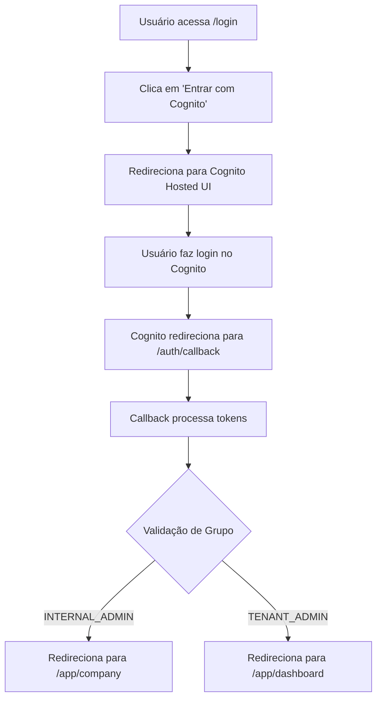

# 🔐 Rota de Login - Referência Rápida

## ✅ Rota Oficial de Login

```
http://localhost:3000/login
```

**IMPORTANTE:** Esta é a única rota oficial de login do sistema.

---

## 📁 Estrutura de Arquivos

### Página de Login
```
frontend/src/app/(auth)/login/page.tsx
```

**Nota sobre Route Groups:**
- `(auth)` é um route group do Next.js
- Route groups **não aparecem na URL**
- Por isso, `(auth)/login` → URL: `/login`

---

## 🔄 Fluxo de Autenticação



---

## 🛠️ Desenvolvimento Local

### 1. Iniciar o servidor
```bash
cd frontend
npm run dev
```

### 2. Acessar no navegador
```
http://localhost:3000/login
```

**⚠️ Aviso de Segurança do Navegador:**
- Se aparecer "Sua conexão não é particular"
- Digite: `thisisunsafe` (sem espaços)
- Isso é normal em desenvolvimento local com HTTPS

---

## 📝 Constantes de Rota

**Arquivo:** `frontend/src/lib/constants.ts`

```typescript
export const ROUTES = {
  LOGIN: '/login', // Rota oficial de login com Cognito OAuth
  // ... outras rotas
} as const;
```

**Uso recomendado:**
```typescript
import { ROUTES } from '@/lib/constants';

// ✅ Correto
router.push(ROUTES.LOGIN);

// ❌ Evitar
router.push('/login'); // Hard-coded
```

---

## 🔒 Middleware de Proteção

**Arquivo:** `frontend/middleware.ts`

### Rotas Públicas (não requerem autenticação)
```typescript
const publicPaths = [
  '/login',              // ✅ Rota oficial de login
  '/auth/callback',      // Callback OAuth
  '/auth/logout',        // Logout
  '/auth/logout-callback', // Callback de logout
  '/',                   // Home pública
];
```

### Redirecionamento para Login
```typescript
// Quando usuário não autenticado tenta acessar rota protegida
const loginUrl = new URL('/login', request.url);
loginUrl.searchParams.set('redirect', pathname);
return NextResponse.redirect(loginUrl);
```

---

## 🧪 Testes

### Teste Manual
1. Acesse: `http://localhost:3000/login`
2. Clique em "Entrar com Cognito"
3. Faça login no Cognito
4. Verifique redirecionamento para dashboard apropriado

### Teste de Redirecionamento
```bash
# Acessar rota protegida sem autenticação
curl -I http://localhost:3000/app/dashboard

# Deve redirecionar para:
# Location: http://localhost:3000/login?redirect=/app/dashboard
```

---

## 📚 Documentação Relacionada

- **Implementação Completa:** `COGNITO-FINAL-IMPLEMENTATION.md`
- **Guia de Setup:** `COGNITO-SETUP-COMPLETE.md`
- **Fluxo Visual:** `docs/operational-dashboard/LOGIN-VISUAL-FLOW.md`
- **Validação de Rotas:** `docs/operational-dashboard/LOGIN-ROUTE-VALIDATION-GUIDE.md`

---

## ❓ Troubleshooting

### Problema: 404 Not Found

**Causa:** Tentando acessar rota antiga `/auth/login`

**Solução:** Use a rota oficial `/login`

### Problema: Redirecionamento infinito

**Causa:** Middleware não reconhece `/login` como rota pública

**Solução:** Verificar `publicPaths` em `frontend/middleware.ts`

### Problema: Erro ao iniciar OAuth

**Causa:** Variáveis de ambiente não configuradas

**Solução:** Verificar `frontend/.env.local`:
```bash
NEXT_PUBLIC_COGNITO_DOMAIN=alquimistaai-dev.auth.us-east-1.amazoncognito.com
NEXT_PUBLIC_COGNITO_CLIENT_ID=<seu-client-id>
NEXT_PUBLIC_COGNITO_REDIRECT_URI=http://localhost:3000/auth/callback
```

---

## 🎯 Checklist de Validação

- [ ] Página `/login` carrega sem erros
- [ ] Botão "Entrar com Cognito" funciona
- [ ] Redireciona para Cognito Hosted UI
- [ ] Após login, redireciona para dashboard apropriado
- [ ] Middleware protege rotas corretamente
- [ ] Redirecionamento de rotas protegidas funciona
- [ ] Constante `ROUTES.LOGIN` está atualizada

---

## 📞 Suporte

**Problemas com login?**
- Verifique logs do navegador (F12 → Console)
- Verifique logs do servidor (`npm run dev`)
- Consulte documentação completa em `COGNITO-FINAL-IMPLEMENTATION.md`

---

**Última atualização:** 2024
**Versão:** 1.0
**Status:** ✅ Produção
