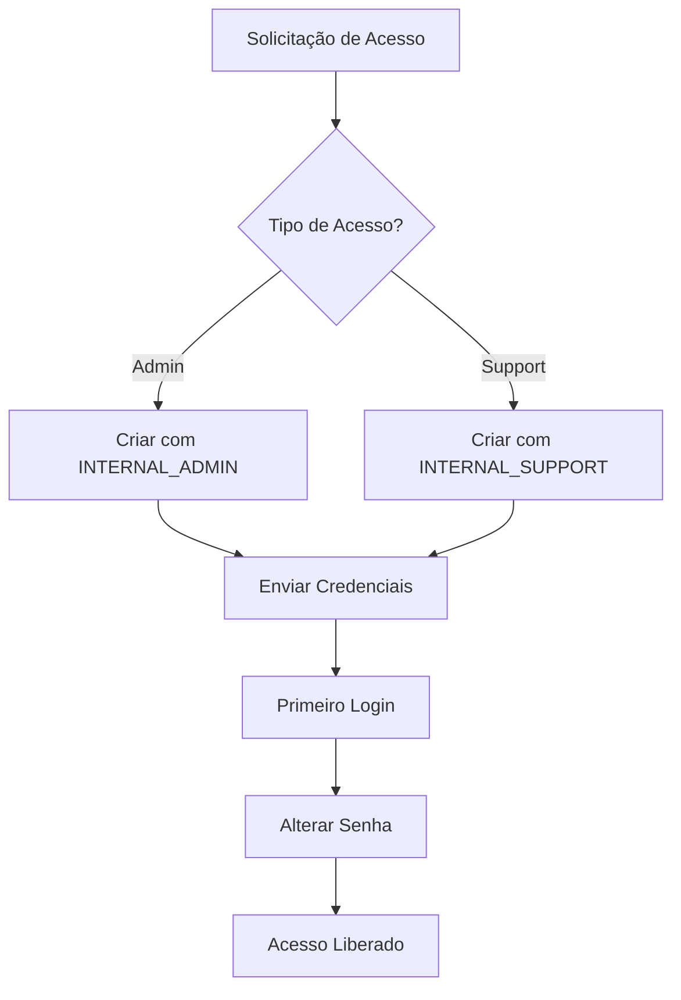
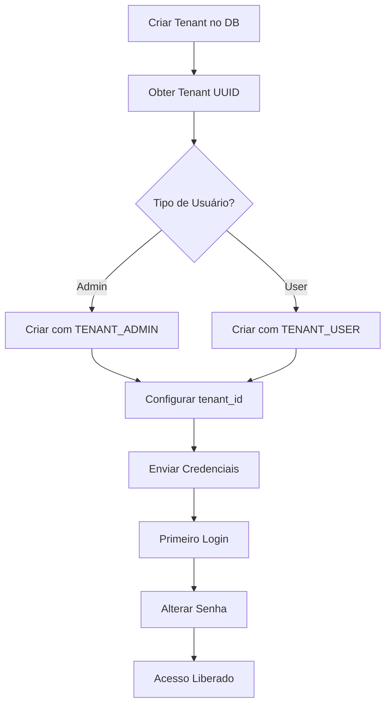

# Processo de Atribuição de Grupos

## Visão Geral

Este documento descreve os processos para atribuir usuários aos grupos corretos no Cognito User Pool.

## Fluxos de Atribuição

### 1. Novo Usuário Interno

#### Pré-requisitos
- Aprovação do gestor
- E-mail corporativo @alquimista.ai

#### Processo



#### Comandos

```powershell
# Admin
.\scripts\create-internal-user.ps1 `
    -Email "admin@alquimista.ai" `
    -Role "admin" `
    -FullName "Nome Completo" `
    -Environment "prod"

# Support
.\scripts\create-internal-user.ps1 `
    -Email "support@alquimista.ai" `
    -Role "support" `
    -FullName "Nome Completo" `
    -Environment "prod"
```

### 2. Novo Usuário de Tenant

#### Pré-requisitos
- Tenant criado no banco de dados
- UUID do tenant disponível
- Contrato assinado

#### Processo



#### Comandos

```powershell
# Admin do Tenant
.\scripts\create-tenant-user.ps1 `
    -Email "admin@empresa.com" `
    -TenantId "550e8400-e29b-41d4-a716-446655440000" `
    -CompanyName "Empresa LTDA" `
    -Role "admin" `
    -Environment "prod"

# Usuário do Tenant
.\scripts\create-tenant-user.ps1 `
    -Email "user@empresa.com" `
    -TenantId "550e8400-e29b-41d4-a716-446655440000" `
    -CompanyName "Empresa LTDA" `
    -Role "user" `
    -Environment "prod"
```

### 3. Adicionar Usuário Existente a Grupo

#### Quando Usar
- Usuário já existe mas precisa de novo grupo
- Mudança de papel/função
- Correção de configuração

#### Comandos

```powershell
.\scripts\add-user-to-group.ps1 `
    -Email "user@example.com" `
    -GroupName "TENANT_ADMIN" `
    -TenantId "550e8400-e29b-41d4-a716-446655440000" `
    -Environment "prod"
```

## Validações Obrigatórias

### Antes de Criar Usuário Interno

- [ ] E-mail é @alquimista.ai
- [ ] Aprovação documentada
- [ ] Papel apropriado (admin ou support)
- [ ] MFA será configurado após primeiro login

### Antes de Criar Usuário de Tenant

- [ ] Tenant existe no banco de dados
- [ ] UUID do tenant é válido
- [ ] Contrato assinado e ativo
- [ ] E-mail do usuário é válido
- [ ] Papel apropriado (admin ou user)

## Checklist de Segurança

### Usuários Internos

- [ ] Verificar identidade do solicitante
- [ ] Confirmar necessidade de acesso
- [ ] Aplicar princípio do menor privilégio
- [ ] Documentar atribuição em audit log
- [ ] Configurar MFA obrigatório
- [ ] Revisar acessos trimestralmente

### Usuários de Tenant

- [ ] Validar tenant_id correto
- [ ] Confirmar vínculo com empresa
- [ ] Verificar papel apropriado
- [ ] Documentar atribuição
- [ ] Enviar credenciais de forma segura
- [ ] Revisar acessos mensalmente

## Remoção de Acesso

### Usuário Interno

```powershell
# Remover de grupo
aws cognito-idp admin-remove-user-from-group `
    --user-pool-id <USER_POOL_ID> `
    --username admin@alquimista.ai `
    --group-name INTERNAL_ADMIN `
    --region us-east-1

# Desabilitar usuário
aws cognito-idp admin-disable-user `
    --user-pool-id <USER_POOL_ID> `
    --username admin@alquimista.ai `
    --region us-east-1
```

### Usuário de Tenant

```powershell
# Remover de grupo
aws cognito-idp admin-remove-user-from-group `
    --user-pool-id <USER_POOL_ID> `
    --username user@empresa.com `
    --group-name TENANT_ADMIN `
    --region us-east-1

# Desabilitar usuário
aws cognito-idp admin-disable-user `
    --user-pool-id <USER_POOL_ID> `
    --username user@empresa.com `
    --region us-east-1
```

## Auditoria

### Logs a Manter

- Data e hora da atribuição
- Usuário que executou a atribuição
- E-mail do usuário criado/modificado
- Grupo atribuído
- Tenant ID (se aplicável)
- Motivo da atribuição

### Relatórios Mensais

```bash
# Listar todos os usuários internos
aws cognito-idp list-users-in-group \
    --user-pool-id <USER_POOL_ID> \
    --group-name INTERNAL_ADMIN \
    --region us-east-1

# Listar todos os admins de tenants
aws cognito-idp list-users-in-group \
    --user-pool-id <USER_POOL_ID> \
    --group-name TENANT_ADMIN \
    --region us-east-1
```

## Troubleshooting

### Usuário não consegue fazer login

1. Verificar se usuário está ativo
2. Verificar se está em algum grupo
3. Verificar se tenant_id está configurado (para tenants)
4. Verificar logs do Cognito

### Usuário não tem acesso a recursos

1. Verificar grupo correto
2. Verificar tenant_id (para tenants)
3. Verificar middleware de autorização
4. Verificar logs da aplicação

### Erro ao criar usuário

1. Verificar se e-mail já existe
2. Verificar formato do e-mail
3. Verificar se grupo existe
4. Verificar permissões AWS CLI

## Referências

- [Cognito Groups Setup](./COGNITO-GROUPS-SETUP.md)
- [Quick Reference](./COGNITO-GROUPS-QUICK-REFERENCE.md)
- [Requirements](../../.kiro/specs/operational-dashboard-alquimistaai/requirements.md)
