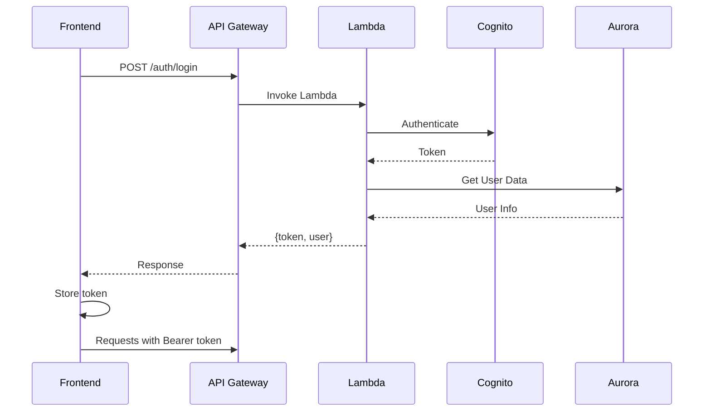

# 🔗 Integração Frontend-Backend - Alquimista.AI

**Status**: ✅ CONFIGURADO  
**Data**: 14 de Novembro de 2025

---

## 📊 Resumo da Integração

O frontend Next.js está configurado para se conectar com as APIs AWS deployadas.

### URLs Configuradas

#### Desenvolvimento
```
NEXT_PUBLIC_API_URL=https://c5loeivg0k.execute-api.us-east-1.amazonaws.com
```

#### Produção
```
NEXT_PUBLIC_API_URL=https://ogsd1547nd.execute-api.us-east-1.amazonaws.com
```

---

## 📁 Arquivos Criados/Atualizados

### 1. API Client
**Arquivo**: `frontend/src/lib/api-client.ts`

Cliente HTTP configurado para:
- ✅ Conectar com APIs AWS
- ✅ Gerenciar autenticação (Bearer token)
- ✅ Tratar erros
- ✅ Suportar múltiplos ambientes

**Métodos disponíveis**:
- `healthCheck()` - Verificar status da API
- `login()` / `signup()` / `logout()` - Autenticação
- `listAgents()` / `activateAgent()` - Gerenciar agentes
- `listLeads()` / `createLead()` - Gerenciar leads
- `getAnalytics()` / `getFunnelMetrics()` - Analytics
- `publishEvent()` - Publicar eventos no EventBridge

### 2. Variáveis de Ambiente
**Arquivos**: 
- `frontend/.env.development` - URLs de DEV
- `frontend/.env.production` - URLs de PROD

### 3. Auth Store (Atualizado)
**Arquivo**: `frontend/src/stores/auth-store.ts`

Integrado com API real:
- ✅ Login via API AWS
- ✅ Signup via API AWS
- ✅ Token management
- ✅ Persistência local

---

## 🧪 Como Testar

### 1. Testar Conectividade

```bash
cd frontend
npm run dev
```

Abra o console do navegador e execute:

```javascript
// Testar health check
fetch('https://c5loeivg0k.execute-api.us-east-1.amazonaws.com/')
  .then(r => r.json())
  .then(console.log)

// Deve retornar:
// {
//   "ok": true,
//   "service": "Fibonacci Orquestrador",
//   "environment": "dev",
//   "db_status": "connected"
// }
```

### 2. Testar Login

```javascript
import { apiClient } from '@/lib/api-client';

// Tentar login (quando endpoint estiver implementado)
apiClient.login('user@example.com', 'password')
  .then(console.log)
  .catch(console.error);
```

### 3. Testar Agentes

```javascript
import { apiClient } from '@/lib/api-client';

// Listar agentes disponíveis
apiClient.listAgents()
  .then(console.log)
  .catch(console.error);
```

---

## 🔄 Fluxo de Autenticação



---

## 📡 Endpoints Disponíveis

### Health Check
```
GET https://c5loeivg0k.execute-api.us-east-1.amazonaws.com/
Status: ✅ Funcionando
```

### Autenticação (A implementar)
```
POST /auth/login
POST /auth/signup
POST /auth/logout
```

### Agentes (A implementar)
```
GET /api/agents
GET /api/agents/:id
POST /api/agents/:id/activate
POST /api/agents/:id/deactivate
```

### Leads (A implementar)
```
GET /api/leads
POST /api/leads
GET /api/leads/:id
PUT /api/leads/:id
```

### Analytics (A implementar)
```
GET /api/analytics
GET /api/analytics/funnel
GET /api/analytics/agents
```

---

## 🚀 Deploy do Frontend

### Opção 1: Vercel (Recomendado)

```bash
cd frontend

# Configurar variáveis de ambiente no Vercel
vercel env add NEXT_PUBLIC_API_URL production
# Valor: https://ogsd1547nd.execute-api.us-east-1.amazonaws.com

# Deploy
vercel --prod
```

### Opção 2: AWS Amplify

1. Conectar repositório GitHub
2. Configurar build settings:
   ```yaml
   version: 1
   frontend:
     phases:
       preBuild:
         commands:
           - cd frontend
           - npm ci
       build:
         commands:
           - npm run build
     artifacts:
       baseDirectory: frontend/.next
       files:
         - '**/*'
     cache:
       paths:
         - frontend/node_modules/**/*
   ```
3. Adicionar variáveis de ambiente:
   - `NEXT_PUBLIC_API_URL`

### Opção 3: S3 + CloudFront

```bash
cd frontend
npm run build
aws s3 sync out/ s3://alquimista-frontend-prod/
```

---

## 🔐 Segurança

### CORS
As APIs AWS precisam ter CORS configurado para aceitar requests do frontend:

```javascript
// No API Gateway
{
  "Access-Control-Allow-Origin": "*",
  "Access-Control-Allow-Methods": "GET,POST,PUT,DELETE,OPTIONS",
  "Access-Control-Allow-Headers": "Content-Type,Authorization"
}
```

### Autenticação
- ✅ Bearer token via Authorization header
- ✅ Token armazenado em localStorage (persistente)
- ✅ Token enviado em todas as requests autenticadas

---

## 📊 Monitoramento

### CloudWatch
Monitorar:
- Requests do frontend para API
- Latência das chamadas
- Erros 4xx e 5xx
- Taxa de sucesso de login

### Frontend
Implementar:
- Error boundary para capturar erros
- Analytics de uso (Google Analytics / Mixpanel)
- Performance monitoring (Web Vitals)

---

## 🐛 Troubleshooting

### Erro: CORS
**Problema**: `Access to fetch has been blocked by CORS policy`

**Solução**: Configurar CORS no API Gateway:
```bash
# Via Terraform
resource "aws_apigatewayv2_api" "main" {
  cors_configuration {
    allow_origins = ["*"]
    allow_methods = ["GET", "POST", "PUT", "DELETE", "OPTIONS"]
    allow_headers = ["Content-Type", "Authorization"]
  }
}
```

### Erro: 401 Unauthorized
**Problema**: Token inválido ou expirado

**Solução**: 
1. Verificar se token está sendo enviado
2. Verificar validade do token
3. Fazer logout e login novamente

### Erro: Network Error
**Problema**: API não responde

**Solução**:
1. Verificar se API está online: `curl https://c5loeivg0k.execute-api.us-east-1.amazonaws.com/`
2. Verificar logs no CloudWatch
3. Verificar se Lambda está funcionando

---

## ✅ Checklist de Integração

- [x] API Client criado
- [x] Variáveis de ambiente configuradas
- [x] Auth Store integrado com API
- [x] URLs de DEV e PROD configuradas
- [ ] Endpoints de autenticação implementados no backend
- [ ] Endpoints de agentes implementados no backend
- [ ] Endpoints de leads implementados no backend
- [ ] Endpoints de analytics implementados no backend
- [ ] CORS configurado no API Gateway
- [ ] Frontend deployado
- [ ] Testes E2E executados

---

## 📞 Próximos Passos

1. **Implementar endpoints faltantes no backend**:
   - `/auth/login`
   - `/auth/signup`
   - `/api/agents`
   - `/api/leads`
   - `/api/analytics`

2. **Configurar CORS no API Gateway**

3. **Deploy do frontend Next.js**

4. **Testes de integração completos**

5. **Configurar domínio customizado**

---

**Documentação criada por**: Kiro AI  
**Data**: 14 de Novembro de 2025  
**Status**: ✅ INTEGRAÇÃO CONFIGURADA
