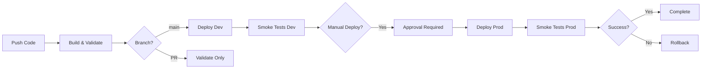

# 🧙‍♂️ Ecossistema Alquimista.AI - Arquitetura Fractal Serverless

[](https://github.com/MarcelloHollanda/AlquimistaAI/actions)
[](https://github.com/MarcelloHollanda/AlquimistaAI/actions)
[](https://aws.amazon.com/)
[](https://www.typescriptlang.org/)
[](https://aws.amazon.com/cdk/)

---

## 🚀 SISTEMA PRONTO PARA DEPLOY

**Status:** ✅ 100% COMPLETO E FUNCIONAL  
**Versão:** 1.0.0  
**Data:** 17 de Janeiro de 2025

### ⚡ Deploy Rápido (30-45 min)
1. **[INDEX-DEPLOY.md](./INDEX-DEPLOY.md)** - Índice completo
2. **[COMANDOS-DEPLOY.md](./COMANDOS-DEPLOY.md)** - Comandos prontos
3. **[GUIA-DEPLOY-RAPIDO.md](./GUIA-DEPLOY-RAPIDO.md)** - Guia passo-a-passo

### 🧪 Teste de CI/CD (5 min)
1. **[TESTE-CI-CD-AGORA.md](./TESTE-CI-CD-AGORA.md)** - Teste em 3 passos
2. **[RESUMO-TESTE-CI-CD.md](./RESUMO-TESTE-CI-CD.md)** - Resumo executivo
3. **[docs/ci-cd/INDEX-TESTE-WORKFLOW.md](./docs/ci-cd/INDEX-TESTE-WORKFLOW.md)** - Índice completo

```powershell
# Teste rápido do workflow CI/CD
.\scripts\test-ci-cd-workflow.ps1 -TestType basic
```

### 📊 Sistema Completo
- ✅ **32 Agentes IA** organizados em 7 SubNúcleos
- ✅ **4 Planos de Assinatura** (Starter, Profissional, Expert, Enterprise)
- ✅ **Backend AWS** (50+ Lambda handlers, 6 CDK stacks)
- ✅ **Frontend Next.js** (30+ páginas, 100+ componentes)
- ✅ **Acessos Admin** (CEO + Master configurados)
- ✅ **Documentação Completa** (Guias de deploy e troubleshooting)

### 👥 Acessos Administrativos
- **CEO:** José Marcello Rocha Hollanda (jmrhollanda@gmail.com)
- **Master:** AlquimistaAI (alquimistafibonacci@gmail.com)

---

## 🌟 Visão Geral

O Ecossistema Alquimista.AI é uma plataforma serverless de próxima geração que implementa uma arquitetura fractal para automação inteligente de processos de negócio. Construída inteiramente na AWS usando CDK, a plataforma oferece agentes especializados que trabalham em harmonia para transformar leads em oportunidades de negócio.

### 🎯 Missão
Democratizar a automação inteligente através de agentes especializados, permitindo que empresas de qualquer porte tenham acesso a tecnologias de ponta para otimizar seus processos comerciais.

### ✨ Diferenciais
- **Arquitetura Fractal**: Cada núcleo é independente mas interconectado
- **100% Serverless**: Escala automaticamente, pague apenas pelo uso
- **Event-Driven**: Comunicação assíncrona via EventBridge
- **LGPD Compliant**: Conformidade automática com proteção de dados
- **Multi-tenant**: Isolamento seguro entre clientes
- **Observabilidade Total**: Monitoramento e alertas em tempo real
- **✨ Observabilidade Avançada**: Logging estruturado, X-Ray tracing, dashboards P50/P90/P99 ([Fase 1 Completa](./PHASE-1-COMPLETE.md))
- **🛡️ Resiliência Enterprise**: Circuit breakers, retry com exponential backoff, timeouts configuráveis ([Fase 2 Completa](./PHASE-2-COMPLETE.md))
- **⚡ Cache Distribuído**: ElastiCache Redis, multi-level cache, estratégias otimizadas ([Fase 3 Completa](./PHASE-3-COMPLETE.md))
- **🔒 Segurança Avançada**: Rate limiting inteligente, input validation, SQL/XSS prevention ([Fase 4 Completa](./PHASE-4-COMPLETE.md))

## 🏗️ Arquitetura Fractal

A plataforma implementa uma arquitetura fractal com três núcleos especializados:

### 🔧 Núcleo Fibonacci (Infraestrutura)
**Responsabilidade**: Fundação tecnológica e orquestração central
- **VPC Multi-AZ**: Rede privada com subnets isoladas
- **Aurora Serverless v2**: Banco de dados auto-escalável
- **EventBridge**: Barramento de eventos para comunicação
- **S3 + CloudFront**: Armazenamento e CDN global
- **API Gateway**: Ponto de entrada unificado
- **Cognito**: Autenticação e autorização
- **CloudWatch**: Observabilidade completa

### 🎯 Núcleo Alquimista (Plataforma SaaS)
**Responsabilidade**: Marketplace de agentes e gestão multi-tenant
- **Marketplace**: Catálogo de agentes disponíveis
- **Ativação**: Sistema de ativação/desativação de agentes
- **Permissões**: Controle granular de acesso
- **Auditoria**: Log completo de todas as ações
- **Métricas**: Performance e custos por agente
- **Aprovação**: Workflow para ações críticas

### 🤖 Núcleo Nigredo (Agentes de Prospecção)
**Responsabilidade**: Automação do processo comercial end-to-end
- **7 Agentes Especializados**: Cada um com função específica
- **MCP Integrations**: Conectores para serviços externos
- **Circuit Breakers**: Resiliência e recuperação automática
- **Rate Limiting**: Controle de uso e custos
- **LGPD Compliance**: Conformidade automática

## 🚀 Ambientes e Deploy

### 🔧 Desenvolvimento
- **URL**: https://dev-api.alquimista.ai
- **Deploy**: Automático via push para `develop`
- **Finalidade**: Testes e desenvolvimento ativo
- **Retenção**: 7 dias para logs e backups

### 🧪 Staging
- **URL**: https://staging-api.alquimista.ai
- **Deploy**: Automático via push para `main`
- **Finalidade**: Testes de integração e homologação
- **Retenção**: 30 dias para logs e backups

### 🚀 Produção
- **URL**: https://api.alquimista.ai
- **Deploy**: Manual com aprovação obrigatória
- **Finalidade**: Ambiente de produção
- **Retenção**: 90 dias para logs, backups permanentes
- **SLA**: 99.9% de disponibilidade

### 🔄 Pipeline CI/CD

O AlquimistaAI possui um pipeline CI/CD completo com guardrails de segurança, custo e observabilidade.

**Status**: ✅ Implementado e Funcional

#### Características Principais
- ✅ **Deploy Automático em Dev**: Push para main dispara deploy automático
- ✅ **Deploy Manual em Prod**: Workflow dispatch ou tag de versão com aprovação obrigatória
- ✅ **Smoke Tests Automáticos**: Validação pós-deploy de endpoints críticos
- ✅ **Guardrails de Segurança**: CloudTrail, GuardDuty, SNS alerts
- ✅ **Guardrails de Custo**: AWS Budget, Cost Anomaly Detection
- ✅ **Guardrails de Observabilidade**: CloudWatch Alarms, Logs estruturados

#### Documentação Completa
- 📖 [Pipeline Overview](./docs/ci-cd/PIPELINE-OVERVIEW.md) - Visão geral completa
- 📖 [Deploy Flows](./docs/CI-CD-DEPLOY-FLOWS-DEV-PROD.md) - Fluxos práticos de deploy
- 📖 [Guardrails Guide](./docs/ci-cd/GUARDRAILS-GUIDE.md) - Guia de guardrails
- 📖 [Troubleshooting](./docs/ci-cd/TROUBLESHOOTING.md) - Solução de problemas
- 📖 [Quick Commands](./docs/ci-cd/QUICK-COMMANDS.md) - Comandos rápidos
- 📖 [GitHub Secrets](./docs/ci-cd/GITHUB-SECRETS.md) - Configuração de secrets

#### Fluxo de Deploy


#### Comandos Rápidos
```powershell
# Deploy automático em dev (push para main)
git push origin main

# Deploy manual em prod (via GitHub Actions)
# 1. Acessar: https://github.com/MarcelloHollanda/alquimistaai-aws-architecture/actions
# 2. Clicar em "CI/CD AlquimistaAI" → "Run workflow"
# 3. Selecionar environment: prod
# 4. Aguardar aprovação e aprovar

# Validação local
.\scripts\validate-system-complete.ps1

# Smoke tests
.\scripts\smoke-tests-api-dev.ps1 -Environment dev

# Rollback guiado
.\scripts\manual-rollback-guided.ps1 -Environment dev
```

## 🤖 Agentes Nigredo - Automação Comercial

### 📥 [Agente de Recebimento](./docs/agents/recebimento.md)
**Função**: Processar e higienizar leads recebidos
- ✅ Validação de dados obrigatórios
- ✅ Enriquecimento via Receita Federal e Google Places
- ✅ Detecção e remoção de duplicatas
- ✅ Segmentação automática por perfil
- ✅ Cálculo de score de prioridade (0-100)

### 🎯 [Agente de Estratégia](./docs/agents/estrategia.md)
**Função**: Criar campanhas personalizadas
- ✅ Análise de perfil comercial detalhado
- ✅ Criação de mensagens para funil completo
- ✅ Testes A/B automáticos
- ✅ Seleção de canal ideal (WhatsApp/Email)
- ✅ Otimização de timing e frequência

### 📤 [Agente de Disparo](./docs/agents/disparo.md)
**Função**: Executar campanhas ativas
- ✅ Controle de horário comercial
- ✅ Rate limiting inteligente (100 msg/h, 500 msg/dia)
- ✅ Envio via WhatsApp Business API
- ✅ Tracking de entrega e status
- ✅ Variações de horário para humanização

### 💬 [Agente de Atendimento](./docs/agents/atendimento.md)
**Função**: Processar respostas de leads
- ✅ Análise de sentimento em tempo real
- ✅ Geração de respostas via LLM (Claude 3)
- ✅ Contextualização com histórico completo
- ✅ Decisão automática de próximo passo
- ✅ Validação contra políticas de marca

### 🧠 [Agente de Sentimento](./docs/agents/sentimento.md)
**Função**: Analisar emoções e detectar LGPD
- ✅ Classificação emocional (positivo/neutro/negativo)
- ✅ Detecção de palavras-chave de descadastro
- ✅ Score de intensidade (0-100)
- ✅ Compliance automático com LGPD
- ✅ Análise via AWS Comprehend

### 📅 [Agente de Agendamento](./docs/agents/agendamento.md)
**Função**: Gerenciar reuniões comerciais
- ✅ Consulta de disponibilidade no Google Calendar
- ✅ Proposta de 3 horários alternativos
- ✅ Criação automática de eventos
- ✅ Geração de briefing comercial completo
- ✅ Lembretes automáticos (24h e 1h antes)

### 📊 [Agente de Relatórios](./docs/agents/relatorios.md)
**Função**: Gerar insights e métricas
- ✅ Consolidação de dados de todos os agentes
- ✅ Análise de funil de conversão
- ✅ Identificação de objeções recorrentes
- ✅ Insights estratégicos via LLM
- ✅ Alertas automáticos para anomalias
- Respeita horário comercial
- Controla rate limits

### 💬 Agente de Atendimento
- Responde leads automaticamente
- Usa análise de sentimento
- Integra com IA (Claude/Bedrock)

### 📊 Agente de Análise de Sentimento
- Classifica sentimento das mensagens
- Detecta intenção de descadastro (LGPD)
- Usa AWS Comprehend

### 📅 Agente de Agendamento
- Marca reuniões automaticamente
- Verifica disponibilidade em tempo real
- Integra com Google Calendar

### 📈 Agente de Relatórios
- Gera relatórios de performance
- Calcula métricas de conversão
- Exporta dados para análise

## 🛠️ Tecnologias

### ☁️ AWS Services
- **Compute**: Lambda, API Gateway
- **Storage**: S3, Aurora Serverless v2
- **Messaging**: EventBridge, SQS
- **Security**: WAF, CloudTrail, KMS
- **Monitoring**: CloudWatch, X-Ray
- **AI/ML**: Bedrock, Comprehend

### 💻 Development Stack
- **Language**: TypeScript/Node.js 20.x
- **Infrastructure**: AWS CDK
- **CI/CD**: GitHub Actions
- **Testing**: Jest, Vitest
- **Security**: Snyk, npm audit
- **Notifications**: Slack integration

## 🚀 Quick Start

### Pré-requisitos
- Node.js 20.x
- AWS CLI configurado
- CDK CLI instalado
- Conta AWS com permissões adequadas

### Instalação
```bash
# Clone o repositório
git clone https://github.com/MarcelloHollanda/AlquimistaAI.git
cd AlquimistaAI

# Instale dependências
npm install

# Configure variáveis de ambiente
cp .env.example .env.local
# Edite .env.local com suas configurações

# Deploy para desenvolvimento
npm run deploy:dev
```

### Configuração de Secrets
```bash
# AWS Credentials
gh secret set AWS_ACCESS_KEY_ID --body "your-access-key"
gh secret set AWS_SECRET_ACCESS_KEY --body "your-secret-key"

# Slack Notifications
gh secret set SLACK_WEBHOOK_URL --body "your-webhook-url"

# MCP Integrations (opcional)
gh secret set WHATSAPP_API_KEY --body "your-whatsapp-key"
gh secret set GOOGLE_CALENDAR_CLIENT_ID --body "your-client-id"
gh secret set GOOGLE_CALENDAR_CLIENT_SECRET --body "your-client-secret"
```

## 📚 Documentação

### 🏗️ Infraestrutura
- [Setup Guide](./SETUP.md)
- [AWS Architecture](./Docs/Deploy/)
- [Security Configuration](./Docs/Deploy/SECURITY-SCANNING.md)
- [Backup & Recovery](./Docs/Deploy/BACKUP-RESTORE-PROCEDURES.md)

### 🔧 CI/CD
- [GitHub Actions Workflows](./.github/workflows/)
- [Deployment Guide](./Docs/Deploy/GITHUB-SECRETS-CONFIGURATION.md)
- [Slack Notifications](./Docs/Deploy/SLACK-NOTIFICATIONS.md)

### 🤖 Agentes
- [Nigredo Agents](./lambda/agents/)
- [Platform API](./lambda/platform/)
- [MCP Integrations](./mcp-integrations/)

## 🔐 Segurança

### 🛡️ Recursos Implementados
- ✅ WAF com proteção contra ataques comuns
- ✅ Criptografia end-to-end com KMS
- ✅ VPC com subnets isoladas
- ✅ CloudTrail para auditoria completa
- ✅ Scanning automático de vulnerabilidades
- ✅ Compliance LGPD

### 🔍 Monitoramento
- ✅ CloudWatch Dashboards
- ✅ Alarmes automáticos
- ✅ Logs estruturados
- ✅ X-Ray tracing
- ✅ Métricas de negócio

## 📊 Métricas e Dashboards

### 📈 Business Metrics
- Taxa de conversão por agente
- Tempo médio de resposta
- Volume de leads processados
- ROI por campanha

### 🔧 Technical Metrics
- Performance das Lambdas
- Utilização do Aurora
- Latência da API
- Erros e exceções

## 🤝 Contribuição

### 🔄 Workflow
1. Fork o repositório
2. Crie uma branch: `git checkout -b feature/nova-funcionalidade`
3. Commit suas mudanças: `git commit -m 'feat: adiciona nova funcionalidade'`
4. Push para a branch: `git push origin feature/nova-funcionalidade`
5. Abra um Pull Request

### 📝 Padrões
- Use [Conventional Commits](https://www.conventionalcommits.org/)
- Mantenha cobertura de testes > 80%
- Documente APIs com JSDoc
- Siga as guidelines de segurança

## 📞 Suporte

### 🆘 Canais de Suporte
- **Issues**: [GitHub Issues](https://github.com/MarcelloHollanda/AlquimistaAI/issues)
- **Slack**: #alquimista-support
- **Email**: suporte@alquimista.ai

### 🐛 Reportar Bugs
Use o template de issue para reportar bugs com:
- Descrição detalhada
- Passos para reproduzir
- Logs relevantes
- Ambiente (dev/staging/prod)

## 📄 Licença

Este projeto está licenciado sob a [MIT License](./LICENSE).

## 🏆 Créditos

Desenvolvido com ❤️ pela equipe AlquimistaAI

### 👥 Contribuidores
- **Marcello Hollanda** - Arquiteto Principal
- **Kiro AI** - Assistente de Desenvolvimento

---

**🚀 Transformando leads em oportunidades através da inteligência artificial**

## 🔧 Pré-requisitos

### Ferramentas Necessárias
- **Node.js**: 20.x ou superior
- **AWS CLI**: v2 configurado com credenciais
- **AWS CDK**: v2.100.0 ou superior
- **Git**: Para controle de versão
- **TypeScript**: Instalado globalmente

### Contas e APIs Necessárias
- **AWS Account**: Com permissões administrativas
- **WhatsApp Business API**: Token do Meta for Developers
- **Google Cloud Platform**: Para Calendar e Places API
- **Receita Federal API**: Para enriquecimento de dados

## 🚀 Instalação e Setup

### 1. Clone do Repositório
```bash
git clone https://github.com/MarcelloHollanda/AlquimistaAI.git
cd AlquimistaAI
```

### 2. Instalação de Dependências
```bash
npm install
```

### 3. Configuração de Ambiente
```bash
# Copiar arquivo de exemplo
cp .env.example .env

# Configurar variáveis de ambiente
# Editar .env com suas credenciais
```

### 4. Bootstrap do CDK
```bash
# Primeira vez apenas
npm run bootstrap
```

### 5. Deploy de Desenvolvimento
```bash
# Deploy completo para dev
npm run deploy:dev
```

## 📋 Comandos Disponíveis

### Desenvolvimento
```bash
npm run build          # Compilar TypeScript
npm run watch          # Compilar em modo watch
npm run lint           # Executar linter
npm run format         # Formatar código
npm run test           # Executar testes
```

### Deploy
```bash
npm run synth          # Gerar templates CloudFormation
npm run diff           # Visualizar mudanças
npm run deploy:dev     # Deploy para desenvolvimento
npm run deploy:staging # Deploy para staging
npm run deploy:prod    # Deploy para produção
```

### Monitoramento
```bash
npm run alarms:list    # Listar alarmes ativos
npm run logs:tail      # Acompanhar logs em tempo real
npm run metrics:view   # Visualizar métricas
```

### Segurança
```bash
npm run security:scan  # Scan completo de segurança
npm run audit          # Auditoria de dependências
npm run cdk:nag        # Validação de segurança CDK
```

### Versionamento
```bash
npm run stack:version:list     # Listar versões das stacks
npm run stack:version:rollback # Rollback para versão anterior
npm run blue-green-deploy      # Deploy blue-green
```

## 🔐 Configuração de Segurança

### Secrets Manager
A plataforma utiliza AWS Secrets Manager para armazenar credenciais sensíveis:

```bash
# WhatsApp Business API
fibonacci/mcp/whatsapp

# Google APIs
fibonacci/mcp/enrichment

# Database
fibonacci/database/credentials
```

### IAM Roles
Todas as funções Lambda seguem o princípio de menor privilégio:
- **fibonacci-api-handler-role**: Acesso a EventBridge, Secrets, SQS
- **nigredo-agent-role**: Acesso específico por agente
- **alquimista-platform-role**: Gestão de agentes e auditoria

### Criptografia
- **Em repouso**: KMS para Aurora, S3, SQS, Secrets Manager
- **Em trânsito**: TLS 1.2+ para todas as comunicações
- **Logs**: Criptografados no CloudWatch

## 📊 Monitoramento e Observabilidade

### CloudWatch Dashboards
- **Fibonacci Core**: Métricas de infraestrutura
- **Nigredo Agents**: Performance dos agentes
- **Business Metrics**: KPIs de negócio
- **Security Overview**: Métricas de segurança

### Alarmes Críticos
- Taxa de erro >5% em qualquer componente
- Latência p95 >3s no API Gateway
- DLQ não vazia por >5 minutos
- Custos acima do budget mensal

### X-Ray Tracing
Rastreamento distribuído completo com:
- Trace ID único por requisição
- Subsegments para MCP calls
- Annotations para filtros
- Metadata para debugging

## 🧪 Testes

### Estrutura de Testes
```
tests/
├── unit/           # Testes unitários
├── integration/    # Testes de integração
├── e2e/           # Testes end-to-end
└── load/          # Testes de carga
```

### Executar Testes
```bash
npm run test              # Todos os testes
npm run test:unit         # Apenas unitários
npm run test:integration  # Apenas integração
npm run test:e2e          # End-to-end
npm run test:load         # Testes de carga
```

### Cobertura
Target de cobertura: 80%+ para código crítico

## 📈 Performance e Escalabilidade

### Métricas de Performance
- **API Gateway**: <100ms p95 latency
- **Lambda Cold Start**: <2s
- **Database**: <50ms query time
- **MCP Calls**: <1s timeout

### Limites de Escala
- **Concurrent Lambdas**: 10,000 por região
- **EventBridge**: 10,000 events/second
- **Aurora**: Auto-scaling 0.5-128 ACUs
- **API Gateway**: 10,000 RPS

### Otimizações
- **Lambda Provisioned Concurrency**: Para funções críticas
- **Connection Pooling**: Para Aurora
- **Circuit Breakers**: Para resiliência
- **Caching**: CloudFront e ElastiCache

## 💰 Custos Estimados

### Ambiente de Desenvolvimento
- **Mensal**: ~$50-100 USD
- **Por lead processado**: ~$0.01 USD

### Ambiente de Produção (1000 leads/dia)
- **Mensal**: ~$200-500 USD
- **Por lead processado**: ~$0.005 USD

### Otimização de Custos
- **Serverless**: Pague apenas pelo uso
- **Reserved Capacity**: Para Aurora em produção
- **S3 Intelligent Tiering**: Para armazenamento
- **CloudWatch Logs**: Retenção otimizada

## 🤝 Contribuição

### Processo de Contribuição
1. Fork do repositório
2. Criar branch feature (`git checkout -b feature/nova-funcionalidade`)
3. Commit das mudanças (`git commit -m 'feat: adicionar nova funcionalidade'`)
4. Push para branch (`git push origin feature/nova-funcionalidade`)
5. Abrir Pull Request

### Padrões de Código
- **Conventional Commits**: Para mensagens de commit
- **ESLint + Prettier**: Para formatação
- **TypeScript**: Tipagem estrita
- **Testes**: Obrigatórios para novas funcionalidades

### Code Review
- Aprovação de 2 reviewers obrigatória
- Testes passando
- Cobertura mantida
- Documentação atualizada

## 📚 Documentação Adicional

### Guias Técnicos
- [Configuração de API Keys](./docs/CONFIGURACAO-API-KEYS.md)
- [Guia de Segurança](./docs/SECURITY.md)
- [Troubleshooting](./docs/TROUBLESHOOTING.md)
- [Backup e Restore](./docs/BACKUP-RESTORE.md)

### Documentação dos Agentes
- [Visão Geral dos Agentes](./docs/agents/README.md)
- [Documentação Individual](./docs/agents/)

### Deploy e Operações
- [Guia de Deploy](./docs/deploy/README.md)
- [Monitoramento](./docs/monitoring/README.md)
- [Disaster Recovery](./docs/disaster-recovery/README.md)

## 📞 Suporte

### Canais de Suporte
- **Issues**: GitHub Issues para bugs e features
- **Discussions**: GitHub Discussions para dúvidas
- **Email**: suporte@alquimista.ai
- **Slack**: Canal #alquimista-ai

### SLA de Suporte
- **Crítico**: 2 horas
- **Alto**: 8 horas
- **Médio**: 24 horas
- **Baixo**: 72 horas

## 📄 Licença

Este projeto está licenciado sob a Licença MIT - veja o arquivo [LICENSE](LICENSE) para detalhes.

## 🙏 Agradecimentos

- **AWS**: Pela infraestrutura serverless robusta
- **CDK Community**: Pelas ferramentas e exemplos
- **Open Source**: Pelas bibliotecas utilizadas
- **Beta Testers**: Pelo feedback valioso

---

<div align="center">
  <strong>🧙‍♂️ Transforme seus processos com Alquimista.AI</strong><br>
  <em>Onde a automação encontra a inteligência</em>
</div>

---


## 🔗 Links Importantes

### Repositório GitHub
- **URL**: https://github.com/MarcelloHollanda/alquimistaai-aws-architecture
- **Issues**: https://github.com/MarcelloHollanda/alquimistaai-aws-architecture/issues
- **Pull Requests**: https://github.com/MarcelloHollanda/alquimistaai-aws-architecture/pulls

### APIs em Produção
- **DEV**: https://c5loeivg0k.execute-api.us-east-1.amazonaws.com
- **PROD**: https://ogsd1547nd.execute-api.us-east-1.amazonaws.com

### Frontend em Produção
- **Site**: http://alquimistaai-fibonacci-frontend-prod.s3-website-us-east-1.amazonaws.com

### Documentação Completa
- [AWS Deployment Info](./AWS-DEPLOYMENT-INFO.md)
- [GitHub Repository Info](./GITHUB-REPOSITORY-INFO.md)
- [Frontend-Backend Integration](./FRONTEND-BACKEND-INTEGRATION.md)
- [Integration Status](./INTEGRATION-STATUS.md)
