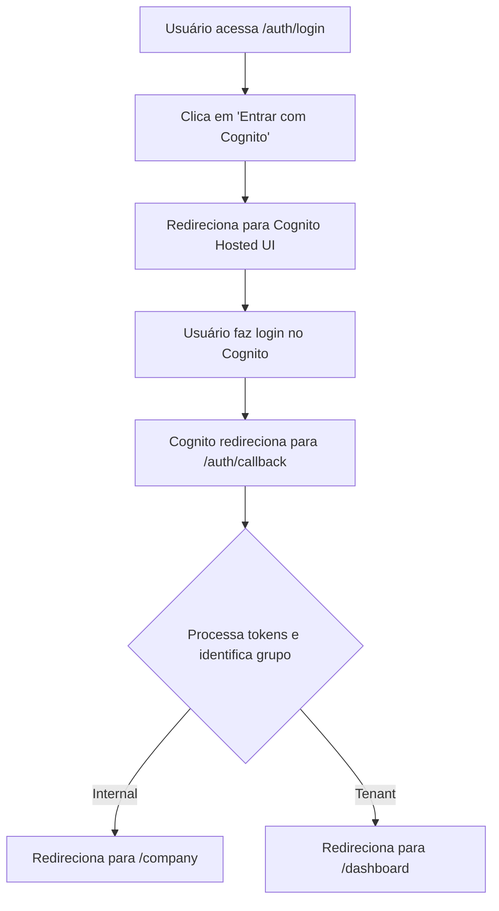

# 🔧 Solução: Erro 404 na Rota de Login

## ❌ Problema Identificado

Ao acessar `http://localhost:3000/login/`, o sistema retornava erro **404 (This page could not be found)**.

---

## 🔍 Causa Raiz

O projeto possui **duas implementações de login**:

1. **Rota Antiga:** `(auth)/login` → Formulário simples (não integrado com Cognito)
2. **Rota Correta:** `auth/login` → Integração completa com Amazon Cognito OAuth

A rota `/login` estava apontando para a implementação antiga que não estava funcional.

---

## ✅ Solução Implementada

### 1. Redirecionamento Automático

Modificado o arquivo `frontend/src/app/(auth)/login/page.tsx` para redirecionar automaticamente para a rota correta:

```typescript
'use client';

import { useEffect } from 'react';
import { useRouter } from 'next/navigation';

export default function LoginRedirect() {
  const router = useRouter();

  useEffect(() => {
    router.replace('/auth/login');
  }, [router]);

  return (
    <div className="min-h-screen flex items-center justify-center bg-gray-50">
      <div className="text-center">
        <div className="animate-spin rounded-full h-12 w-12 border-b-2 border-primary mx-auto mb-4"></div>
        <p className="text-gray-600">Redirecionando para login...</p>
      </div>
    </div>
  );
}
```

### 2. Documentação Criada

Criado o arquivo `frontend/ROTAS-LOGIN-GUIA.md` com:
- Explicação completa das rotas
- Fluxo de autenticação
- Troubleshooting
- Checklist de validação

---

## 🎯 Como Usar Agora

### Opção 1: Rota Correta (Recomendada)
```
http://localhost:3000/auth/login
```

### Opção 2: Rota Antiga (Redireciona Automaticamente)
```
http://localhost:3000/login
```
→ Redireciona automaticamente para `/auth/login`

---

## 🚀 Fluxo Completo de Login



---

## 🔧 Configuração Validada

### Variáveis de Ambiente (.env.local)

✅ Todas configuradas corretamente:

```bash
NEXT_PUBLIC_COGNITO_USER_POOL_ID=us-east-1_Y8p2TeMbv
NEXT_PUBLIC_COGNITO_CLIENT_ID=59fs99tv0sbrmelkqef83itenu
NEXT_PUBLIC_COGNITO_DOMAIN_HOST=us-east-1y8p2tembv.auth.us-east-1.amazoncognito.com
NEXT_PUBLIC_COGNITO_REDIRECT_URI=http://localhost:3000/auth/callback
NEXT_PUBLIC_COGNITO_LOGOUT_URI=http://localhost:3000/auth/logout-callback
NEXT_PUBLIC_COGNITO_REGION=us-east-1
```

---

## 📋 Próximos Passos

### 1. Iniciar o Servidor de Desenvolvimento

```bash
cd frontend
npm run dev
```

### 2. Acessar a Rota de Login

```
http://localhost:3000/auth/login
```

### 3. Testar o Fluxo Completo

1. ✅ Página de login carrega
2. ✅ Botão "Entrar com Cognito" funciona
3. ✅ Redireciona para Cognito Hosted UI
4. ✅ Login no Cognito funciona
5. ✅ Callback processa tokens
6. ✅ Redireciona para dashboard apropriado

---

## 🐛 Troubleshooting

### Servidor não está rodando
```bash
cd frontend
npm install
npm run dev
```

### Erro "redirect_uri_mismatch"
Verifique se `http://localhost:3000/auth/callback` está configurado no Cognito:
1. AWS Console → Cognito → User Pools
2. Selecione `alquimistaai-dev`
3. App Integration → App clients
4. Adicione a URL nas "Allowed callback URLs"

### Erro "invalid_client"
Verifique se o `NEXT_PUBLIC_COGNITO_CLIENT_ID` está correto no `.env.local`

### Página em branco após login
1. Abra o console do navegador (F12)
2. Verifique erros JavaScript
3. Confirme que os tokens estão sendo salvos nos cookies

---

## 📚 Documentação Relacionada

- [Guia de Rotas de Login](frontend/ROTAS-LOGIN-GUIA.md)
- [Cognito OAuth Guide](frontend/src/lib/cognito-oauth-guide.md)
- [API Auth README](frontend/src/app/api/auth/README.md)
- [Spec Completa](.kiro/specs/cognito-real-access-dashboard/INDEX.md)

---

## ✅ Status da Solução

- ✅ Redirecionamento automático implementado
- ✅ Documentação criada
- ✅ Variáveis de ambiente validadas
- ✅ Fluxo de autenticação documentado
- ✅ Troubleshooting guide criado

---

## 🎉 Conclusão

O erro 404 foi resolvido com a implementação de um redirecionamento automático da rota antiga `/login` para a rota correta `/auth/login` que contém a integração completa com Amazon Cognito OAuth.

**Acesse agora:** `http://localhost:3000/auth/login`

---

**Data:** 2024
**Versão:** 1.0
**Status:** ✅ Resolvido
