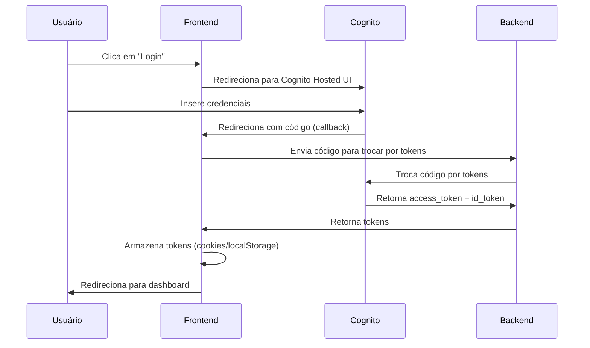

# 🔐 Referência de Configuração do Cognito

## ✅ Status: Configurado

O arquivo `.env.local` está configurado com todas as variáveis necessárias do Cognito.

---

## 📋 Variáveis Configuradas

### Backend (Server-side)

Estas variáveis são usadas apenas no servidor Next.js:

```env
COGNITO_REGION=us-east-1
COGNITO_USER_POOL_ID=us-east-1_Y8p2TeMbv
COGNITO_CLIENT_ID=59fs99tv0sbrmelkqef83itenu
COGNITO_DOMAIN_HOST=us-east-1y8p2tembv.auth.us-east-1.amazoncognito.com
COGNITO_REDIRECT_URI=http://localhost:3000/auth/callback
COGNITO_LOGOUT_REDIRECT_URI=http://localhost:3000/auth/logout
COGNITO_JWKS_URL=https://cognito-idp.us-east-1.amazonaws.com/us-east-1_Y8p2TeMbv/.well-known/jwks.json
```

### Frontend (Client-side)

Estas variáveis são expostas no browser (prefixo `NEXT_PUBLIC_`):

```env
NEXT_PUBLIC_COGNITO_CLIENT_ID=59fs99tv0sbrmelkqef83itenu
NEXT_PUBLIC_COGNITO_DOMAIN_HOST=us-east-1y8p2tembv.auth.us-east-1.amazoncognito.com
NEXT_PUBLIC_COGNITO_REDIRECT_URI=http://localhost:3000/auth/callback
```

---

## 🔧 Como Usar no Código

### 1. No Cliente (Browser)

```typescript
// Acessar variáveis públicas
const clientId = process.env.NEXT_PUBLIC_COGNITO_CLIENT_ID;
const domainHost = process.env.NEXT_PUBLIC_COGNITO_DOMAIN_HOST;
const redirectUri = process.env.NEXT_PUBLIC_COGNITO_REDIRECT_URI;

// Montar URL de login
const loginUrl = `https://${domainHost}/login?client_id=${clientId}&response_type=code&redirect_uri=${redirectUri}`;
```

### 2. No Servidor (API Routes / Server Components)

```typescript
// Acessar variáveis privadas
const region = process.env.COGNITO_REGION;
const userPoolId = process.env.COGNITO_USER_POOL_ID;
const clientId = process.env.COGNITO_CLIENT_ID;
const jwksUrl = process.env.COGNITO_JWKS_URL;

// Validar tokens JWT
import { CognitoJwtVerifier } from 'aws-jwt-verify';

const verifier = CognitoJwtVerifier.create({
  userPoolId: userPoolId!,
  tokenUse: 'access',
  clientId: clientId!,
});
```

### 3. Usando o cognito-client.ts

O arquivo `src/lib/cognito-client.ts` já está configurado para usar essas variáveis:

```typescript
import { cognitoClient } from '@/lib/cognito-client';

// Login
const result = await cognitoClient.signIn(email, password);

// Signup
const result = await cognitoClient.signUp(email, password, {
  name: 'Nome do Usuário',
  'custom:tenantId': 'tenant-123'
});

// Obter usuário atual
const user = await cognitoClient.getCurrentUser();

// Logout
await cognitoClient.signOut();
```

---

## 🌐 URLs Importantes

### Desenvolvimento (localhost:3000)

- **Login**: `https://us-east-1y8p2tembv.auth.us-east-1.amazoncognito.com/login?client_id=59fs99tv0sbrmelkqef83itenu&response_type=code&redirect_uri=http://localhost:3000/auth/callback`
- **Logout**: `https://us-east-1y8p2tembv.auth.us-east-1.amazoncognito.com/logout?client_id=59fs99tv0sbrmelkqef83itenu&logout_uri=http://localhost:3000/auth/logout`
- **Callback**: `http://localhost:3000/auth/callback`

### Produção (quando fizer deploy)

Você precisará atualizar as URLs para o domínio de produção:

```env
COGNITO_REDIRECT_URI=https://alquimista.ai/auth/callback
COGNITO_LOGOUT_REDIRECT_URI=https://alquimista.ai/auth/logout
NEXT_PUBLIC_COGNITO_REDIRECT_URI=https://alquimista.ai/auth/callback
```

---

## ⚠️ Observações Importantes

### 1. Domínio sem HTTPS

As variáveis `COGNITO_DOMAIN_HOST` e `NEXT_PUBLIC_COGNITO_DOMAIN_HOST` **não** incluem `https://`:

✅ **Correto**: `us-east-1y8p2tembv.auth.us-east-1.amazoncognito.com`  
❌ **Errado**: `https://us-east-1y8p2tembv.auth.us-east-1.amazoncognito.com`

As URLs completas são montadas no código quando necessário.

### 2. Variáveis Públicas vs Privadas

- **NEXT_PUBLIC_***: Expostas no browser, podem ser vistas por qualquer usuário
- **Sem prefixo**: Apenas no servidor, nunca expostas ao cliente

### 3. Segurança

- Nunca commite arquivos `.env.local` no Git
- Use `.env.production` para produção com valores diferentes
- Mantenha segredos sensíveis apenas no servidor

---

## 🚀 Testando a Configuração

### 1. Iniciar o servidor de desenvolvimento

```bash
cd frontend
npm run dev
```

### 2. Acessar a aplicação

```
http://localhost:3000
```

### 3. Testar autenticação

- Acesse `/auth/login` ou `/login`
- Tente fazer login com credenciais válidas
- Verifique se o redirecionamento funciona
- Teste o logout

### 4. Verificar variáveis no console

```typescript
// No browser console
console.log('Client ID:', process.env.NEXT_PUBLIC_COGNITO_CLIENT_ID);
console.log('Domain:', process.env.NEXT_PUBLIC_COGNITO_DOMAIN_HOST);
console.log('Redirect:', process.env.NEXT_PUBLIC_COGNITO_REDIRECT_URI);
```

---

## 🔄 Fluxo de Autenticação



---

## 📚 Recursos Adicionais

### Documentação AWS Cognito

- [Cognito User Pools](https://docs.aws.amazon.com/cognito/latest/developerguide/cognito-user-identity-pools.html)
- [Hosted UI](https://docs.aws.amazon.com/cognito/latest/developerguide/cognito-user-pools-app-integration.html)
- [OAuth 2.0 Grants](https://docs.aws.amazon.com/cognito/latest/developerguide/cognito-user-pools-app-idp-settings.html)

### Arquivos Relacionados

- `frontend/.env.local` - Variáveis de ambiente
- `frontend/src/lib/cognito-client.ts` - Cliente Cognito
- `frontend/src/app/auth/login/page.tsx` - Página de login
- `frontend/src/app/auth/callback/page.tsx` - Callback OAuth
- `frontend/src/stores/auth-store.ts` - Estado de autenticação

---

## ✅ Checklist de Configuração

- [x] Arquivo `.env.local` criado
- [x] Variáveis do Cognito configuradas
- [x] Domínio sem `https://` (correto)
- [x] URLs de callback configuradas
- [x] Variáveis públicas com prefixo `NEXT_PUBLIC_`
- [ ] Testar login local
- [ ] Testar logout local
- [ ] Configurar variáveis de produção
- [ ] Atualizar callbacks no Cognito (produção)

---

**Status**: ✅ Configuração completa e pronta para uso em desenvolvimento!
