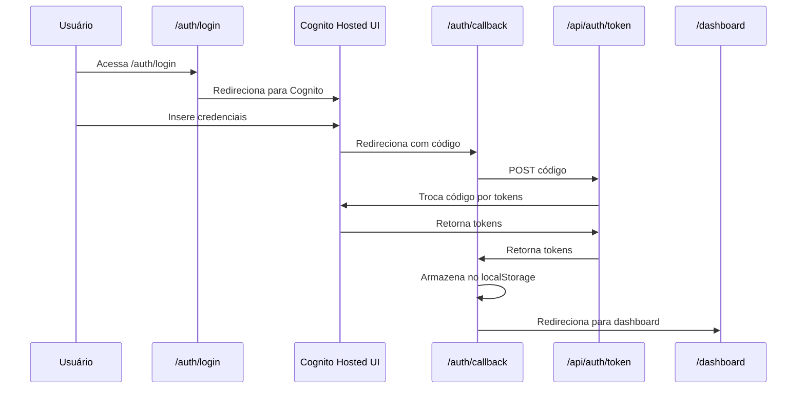
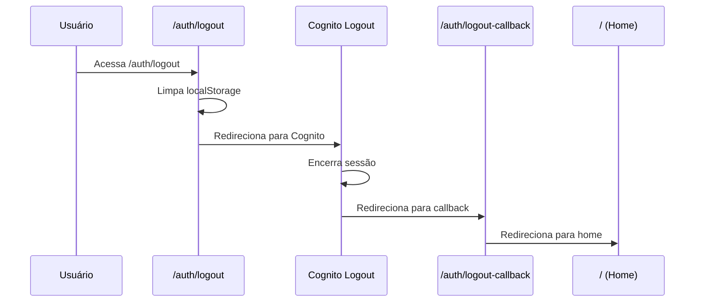

# ✅ Rotas de Autenticação Cognito - Implementadas

## 📋 Resumo

Todas as rotas necessárias para autenticação com Cognito Hosted UI foram implementadas com sucesso!

---

## 🔗 Rotas Criadas

### 1. `/auth/login` - Página de Login

**Arquivo:** `frontend/src/app/auth/login/page.tsx`

**Função:**
- Redireciona automaticamente para o Cognito Hosted UI
- Usa as variáveis `NEXT_PUBLIC_COGNITO_*` do `.env.local`
- Monta a URL de autorização OAuth 2.0

**Fluxo:**
```
Usuário acessa /auth/login
  ↓
Componente carrega
  ↓
useEffect redireciona para:
https://us-east-1y8p2tembv.auth.us-east-1.amazoncognito.com/oauth2/authorize?
  client_id=59fs99tv0sbrmelkqef83itenu
  &response_type=code
  &scope=openid email profile
  &redirect_uri=http://localhost:3000/auth/callback
```

**UI:**
- Spinner de loading
- Mensagem: "Redirecionando para a página de login segura..."

---

### 2. `/auth/callback` - Callback OAuth

**Arquivo:** `frontend/src/app/auth/callback/page.tsx`

**Função:**
- Recebe o código de autorização do Cognito
- Chama API interna para trocar código por tokens
- Armazena tokens no localStorage
- Redireciona para dashboard

**Fluxo:**
```
Cognito redireciona para /auth/callback?code=xxx
  ↓
Componente extrai o código
  ↓
Chama POST /api/auth/token com o código
  ↓
Recebe access_token, id_token, refresh_token
  ↓
Armazena no localStorage
  ↓
Redireciona para /dashboard
```

**Tratamento de Erros:**
- Exibe mensagem de erro se houver
- Redireciona para login após 3 segundos

---

### 3. `/api/auth/token` - API de Troca de Tokens

**Arquivo:** `frontend/src/app/api/auth/token/route.ts`

**Função:**
- API Route do Next.js (server-side)
- Troca o código de autorização por tokens no Cognito
- Usa variáveis privadas (sem `NEXT_PUBLIC_`)

**Endpoint:**
```
POST /api/auth/token
Body: { "code": "authorization_code_here" }
```

**Resposta:**
```json
{
  "access_token": "...",
  "id_token": "...",
  "refresh_token": "...",
  "expires_in": 3600,
  "token_type": "Bearer"
}
```

**Segurança:**
- Executa no servidor (não expõe client_secret se houver)
- Valida código antes de fazer request
- Trata erros do Cognito

---

### 4. `/auth/logout` - Página de Logout

**Arquivo:** `frontend/src/app/auth/logout/page.tsx`

**Função:**
- Limpa tokens do localStorage
- Redireciona para logout do Cognito Hosted UI

**Fluxo:**
```
Usuário acessa /auth/logout
  ↓
Limpa localStorage (tokens)
  ↓
Redireciona para:
https://us-east-1y8p2tembv.auth.us-east-1.amazoncognito.com/logout?
  client_id=59fs99tv0sbrmelkqef83itenu
  &logout_uri=http://localhost:3000/auth/logout-callback
```

**UI:**
- Spinner de loading
- Mensagem: "Encerrando sessão..."

---

### 5. `/auth/logout-callback` - Callback de Logout

**Arquivo:** `frontend/src/app/auth/logout-callback/page.tsx`

**Função:**
- Recebe callback do Cognito após logout
- Exibe mensagem de sucesso
- Redireciona para home após 2 segundos

**UI:**
- Ícone de sucesso (check verde)
- Mensagem: "Logout Realizado"
- "Você foi desconectado com sucesso"

---

## 🔄 Fluxo Completo de Autenticação

### Login



### Logout



---

## 🧪 Como Testar

### 1. Iniciar o Servidor

```bash
cd frontend
npm run dev
```

### 2. Testar Login

1. Acesse: `http://localhost:3000/auth/login`
2. Você será redirecionado para o Cognito Hosted UI
3. Faça login com credenciais válidas
4. Será redirecionado para `/auth/callback`
5. Tokens serão armazenados
6. Será redirecionado para `/dashboard`

### 3. Verificar Tokens

Abra o console do browser:

```javascript
console.log('Access Token:', localStorage.getItem('access_token'));
console.log('ID Token:', localStorage.getItem('id_token'));
console.log('Refresh Token:', localStorage.getItem('refresh_token'));
```

### 4. Testar Logout

1. Acesse: `http://localhost:3000/auth/logout`
2. Tokens serão limpos
3. Será redirecionado para Cognito logout
4. Será redirecionado para `/auth/logout-callback`
5. Após 2 segundos, será redirecionado para home

---

## 🔧 Configuração Necessária no Cognito

Para que tudo funcione, você precisa configurar no AWS Cognito Console:

### 1. Allowed Callback URLs

Adicione no User Pool App Client:

```
http://localhost:3000/auth/callback
https://alquimista.ai/auth/callback (produção)
```

### 2. Allowed Sign-out URLs

Adicione no User Pool App Client:

```
http://localhost:3000/auth/logout-callback
https://alquimista.ai/auth/logout-callback (produção)
```

### 3. OAuth 2.0 Flows

Habilite:
- ✅ Authorization code grant
- ✅ Implicit grant (opcional)

### 4. OAuth Scopes

Habilite:
- ✅ openid
- ✅ email
- ✅ profile

---

## 📝 Variáveis de Ambiente Usadas

### Cliente (Browser)

```env
NEXT_PUBLIC_COGNITO_CLIENT_ID=59fs99tv0sbrmelkqef83itenu
NEXT_PUBLIC_COGNITO_DOMAIN_HOST=us-east-1y8p2tembv.auth.us-east-1.amazoncognito.com
NEXT_PUBLIC_COGNITO_REDIRECT_URI=http://localhost:3000/auth/callback
```

### Servidor (API Routes)

```env
COGNITO_DOMAIN_HOST=us-east-1y8p2tembv.auth.us-east-1.amazoncognito.com
COGNITO_CLIENT_ID=59fs99tv0sbrmelkqef83itenu
COGNITO_REDIRECT_URI=http://localhost:3000/auth/callback
```

---

## 🎯 Próximos Passos

### 1. Integrar com Sistema de Billing

Agora que a autenticação está funcionando, você pode:

```typescript
// Em qualquer página protegida
const accessToken = localStorage.getItem('access_token');

// Fazer requests autenticados
const response = await fetch('/api/billing/checkout', {
  headers: {
    'Authorization': `Bearer ${accessToken}`
  }
});
```

### 2. Criar Middleware de Proteção

Proteger rotas que requerem autenticação:

```typescript
// middleware.ts
export function middleware(request: NextRequest) {
  const token = request.cookies.get('access_token');
  
  if (!token && request.nextUrl.pathname.startsWith('/dashboard')) {
    return NextResponse.redirect(new URL('/auth/login', request.url));
  }
}
```

### 3. Decodificar ID Token

Obter informações do usuário:

```typescript
import jwt_decode from 'jwt-decode';

const idToken = localStorage.getItem('id_token');
const user = jwt_decode(idToken);

console.log('Email:', user.email);
console.log('Tenant ID:', user['custom:tenantId']);
```

---

## ✅ Checklist de Implementação

- [x] Página `/auth/login` criada
- [x] Página `/auth/callback` criada
- [x] API `/api/auth/token` criada
- [x] Página `/auth/logout` criada
- [x] Página `/auth/logout-callback` criada
- [x] Variáveis de ambiente configuradas
- [ ] Testar login local
- [ ] Testar logout local
- [ ] Configurar callbacks no Cognito Console
- [ ] Integrar com sistema de billing
- [ ] Criar middleware de proteção
- [ ] Configurar para produção

---

**Status**: ✅ Rotas implementadas e prontas para teste!
**Próximo**: Testar fluxo completo de login/logout
