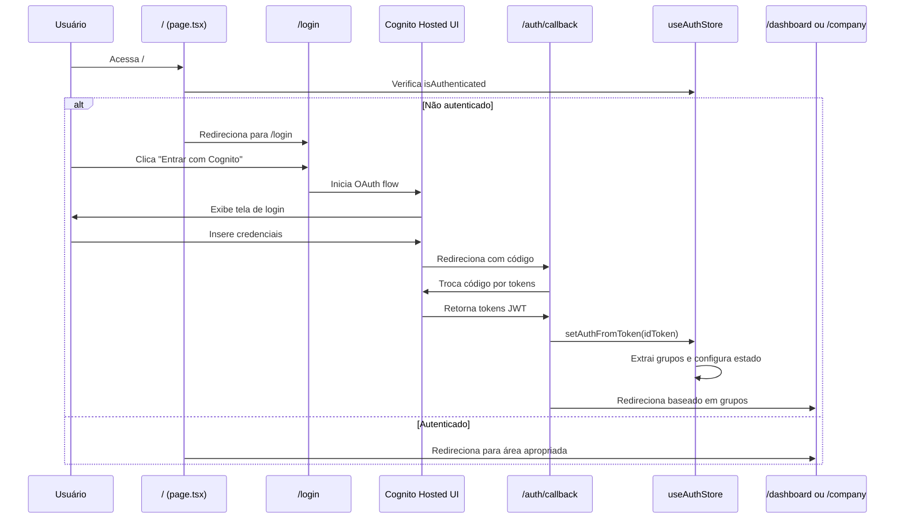

# Resumo Técnico - Correção de Rotas e Autenticação

**Data:** 24/11/2024  
**Sessão:** Ajuste de Rotas de Login/Dashboard e Correção do 404 em `/`

---

## 1. Problema Identificado

### 1.1. 404 na Rota Raiz (`/`)

**Sintoma:** Ao acessar `http://localhost:3000/`, o sistema retornava erro 404.

**Causa Raiz:** Não existia o arquivo `frontend/src/app/page.tsx`, que é obrigatório no Next.js 14 App Router para definir o comportamento da rota raiz.

### 1.2. Estrutura de Rotas Existente

O projeto possui múltiplos grupos de rotas (route groups):

```
frontend/src/app/
├── (auth)/                        → Rotas de autenticação (/login, /signup)
├── (dashboard)/                   → Dashboard do cliente/tenant
├── (company)/                     → Painel operacional interno
├── (institutional)/               → Páginas institucionais públicas
│   ├── institucional/page.tsx    → /institucional (✅ REFATORADO)
│   ├── fibonacci/page.tsx        → /fibonacci
│   └── nigredo/page.tsx          → /nigredo
├── (public-billing)/              → Páginas de billing públicas
│   └── billing/page.tsx          → /billing (✅ REFATORADO)
├── auth/                          → Callbacks OAuth (/auth/callback, /auth/logout)
└── page.tsx                       → / (porta de entrada do app)
```

**Nota:** As rotas `(institutional)/page.tsx` e `(public-billing)/page.tsx` foram refatoradas para evitar conflito de rotas paralelas com a raiz `/`.

---

## 2. Solução Implementada

### 2.1. Criação do `page.tsx` Raiz

**Arquivo criado:** `frontend/src/app/page.tsx`

**Comportamento implementado:**

```typescript
'use client';

import { useEffect } from 'react';
import { useRouter } from 'next/navigation';
import { useAuthStore } from '@/stores/auth-store';
import { ROUTES } from '@/lib/constants';

export default function RootPage() {
  const router = useRouter();
  const { isAuthenticated, isInternal } = useAuthStore();

  useEffect(() => {
    if (!isAuthenticated) {
      // Usuário não autenticado → redireciona para login
      router.push(ROUTES.LOGIN);
    } else {
      // Usuário autenticado → redireciona para área apropriada
      const targetRoute = isInternal 
        ? ROUTES.COMPANY_OVERVIEW    // Usuário interno → /company
        : ROUTES.DASHBOARD_OVERVIEW; // Usuário tenant → /dashboard
      router.push(targetRoute);
    }
  }, [isAuthenticated, isInternal, router]);

  // Exibe loading durante redirecionamento
  return <LoadingScreen />;
}
```

**Lógica de Redirecionamento:**

1. **Usuário NÃO autenticado** → `/login`
2. **Usuário autenticado (interno)** → `/company`
3. **Usuário autenticado (tenant)** → `/dashboard`

### 2.2. Atualização das Constantes de Rotas

**Arquivo modificado:** `frontend/src/lib/constants.ts`

**Mudanças:**

- Adicionada rota `AUTH_LOGOUT: '/auth/logout'`
- Adicionada rota `ONBOARDING: '/onboarding'`
- Comentários atualizados para refletir rotas físicas do App Router

**Rotas Principais:**

```typescript
export const ROUTES = {
  // Autenticação
  LOGIN: '/login',                    // Física: (auth)/login/page.tsx
  SIGNUP: '/signup',                  // Física: (auth)/signup/page.tsx
  AUTH_CALLBACK: '/auth/callback',    // Física: auth/callback/page.tsx
  AUTH_LOGOUT: '/auth/logout',        // Física: auth/logout/page.tsx
  
  // Dashboard Tenant
  DASHBOARD: '/dashboard',            // Física: (dashboard)/dashboard/page.tsx
  DASHBOARD_OVERVIEW: '/dashboard',
  DASHBOARD_AGENTS: '/dashboard/agents',
  
  // Painel Interno
  COMPANY: '/company',                // Física: (company)/company/page.tsx
  COMPANY_OVERVIEW: '/company',
  COMPANY_TENANTS: '/company/tenants',
} as const;
```

---

## 3. Arquivos Lidos Durante a Sessão

### 3.1. Estrutura de Autenticação

- ✅ `frontend/src/stores/auth-store.ts` - Store Zustand com estado de autenticação
- ✅ `frontend/src/app/(auth)/login/page.tsx` - Página de login com Cognito OAuth
- ✅ `frontend/src/app/auth/callback/page.tsx` - Callback OAuth do Cognito

### 3.2. Layouts Protegidos

- ✅ `frontend/src/app/(auth)/layout.tsx` - Layout público de autenticação
- ✅ `frontend/src/app/(dashboard)/layout.tsx` - Layout protegido do dashboard tenant
- ✅ `frontend/src/app/(company)/layout.tsx` - Layout protegido do painel interno

### 3.3. Middleware e Configurações

- ✅ `frontend/middleware.ts` - Middleware de proteção de rotas
- ✅ `frontend/src/lib/constants.ts` - Constantes de rotas

### 3.4. Páginas Existentes

- ✅ `frontend/src/app/(institutional)/page.tsx` - Página institucional pública

---

## 4. Comportamento Final das Rotas

### 4.1. Rota Raiz (`/`)

**Antes:** ❌ 404 Not Found

**Depois:** ✅ Redirecionamento inteligente baseado em autenticação

| Estado do Usuário | Destino |
|-------------------|---------|
| Não autenticado | `/login` |
| Autenticado (interno) | `/company` |
| Autenticado (tenant) | `/dashboard` |

### 4.2. Rota de Login (`/login`)

**Rota física:** `frontend/src/app/(auth)/login/page.tsx`

**Comportamento:**
- Exibe botão "Entrar com Cognito"
- Inicia fluxo OAuth 2.0 com Cognito Hosted UI
- Redireciona para `/auth/callback` após autenticação

### 4.3. Rota de Callback (`/auth/callback`)

**Rota física:** `frontend/src/app/auth/callback/page.tsx`

**Comportamento:**
1. Recebe código de autorização do Cognito
2. Troca código por tokens JWT
3. Armazena tokens em cookies
4. Extrai grupos do token
5. Redireciona para dashboard apropriado:
   - Interno → `/company`
   - Tenant → `/dashboard`

### 4.4. Dashboard Tenant (`/dashboard`)

**Rota física:** `frontend/src/app/(dashboard)/dashboard/page.tsx`

**Proteção:**
- Layout verifica `isAuthenticated` via `useAuthStore`
- Se não autenticado → redireciona para `/login`
- Middleware valida tokens JWT nos cookies

### 4.5. Painel Interno (`/company`)

**Rota física:** `frontend/src/app/(company)/company/page.tsx`

**Proteção:**
- Layout verifica `isAuthenticated` e `isInternal`
- Se não autenticado → redireciona para `/login`
- Se autenticado mas não interno → redireciona para `/dashboard`
- Middleware valida grupos `INTERNAL_ADMIN` ou `INTERNAL_SUPPORT`

---

## 5. Verificação de Autenticação

### 5.1. Client-Side (useAuthStore)

**Arquivo:** `frontend/src/stores/auth-store.ts`

**Estado:**
```typescript
interface AuthState {
  claims: UserClaims | null;
  groups: string[];
  role: UserGroup | null;
  isAuthenticated: boolean;
  isInternal: boolean;
  tenantId: string | null;
}
```

**Grupos Cognito:**
- `INTERNAL_ADMIN` - Administrador interno
- `INTERNAL_SUPPORT` - Suporte interno
- `TENANT_ADMIN` - Administrador do tenant
- `TENANT_USER` - Usuário do tenant

### 5.2. Server-Side (Middleware)

**Arquivo:** `frontend/middleware.ts`

**Validações:**
1. ✅ Presença de tokens em cookies (`accessToken`, `idToken`)
2. ✅ Expiração do token JWT (`exp` claim)
3. ✅ Extração de grupos (`cognito:groups`)
4. ✅ Autorização por grupo para rotas protegidas
5. ✅ Bloqueio de acesso cross-dashboard

**Rotas Públicas (sem proteção):**
- `/login`
- `/auth/*` (callback, logout, etc.)
- `/` (rota raiz)
- `/api/auth/session`

**Rotas Protegidas:**
- `/app/*` - Requer autenticação válida

---

## 6. Checklist de Teste Manual

### 6.1. Teste de Rota Raiz

```powershell
# 1. Acessar rota raiz sem autenticação
# Abrir navegador em: http://localhost:3000/
# Resultado esperado: Redireciona para /login
```

### 6.2. Teste de Login

```powershell
# 2. Fazer login
# Abrir navegador em: http://localhost:3000/login
# Clicar em "Entrar com Cognito"
# Resultado esperado: Redireciona para Cognito Hosted UI
```

### 6.3. Teste de Callback

```powershell
# 3. Após autenticação no Cognito
# Resultado esperado: Redireciona para /auth/callback
# Depois redireciona para:
#   - /company (se usuário interno)
#   - /dashboard (se usuário tenant)
```

### 6.4. Teste de Proteção de Rotas

```powershell
# 4. Tentar acessar /company sem autenticação
# Abrir navegador em: http://localhost:3000/company
# Resultado esperado: Redireciona para /login

# 5. Tentar acessar /dashboard sem autenticação
# Abrir navegador em: http://localhost:3000/dashboard
# Resultado esperado: Redireciona para /login
```

### 6.5. Teste de Bloqueio Cross-Dashboard

```powershell
# 6. Autenticar como usuário tenant
# Tentar acessar: http://localhost:3000/company
# Resultado esperado: Redireciona para /dashboard com mensagem de erro

# 7. Autenticar como usuário interno
# Tentar acessar: http://localhost:3000/dashboard
# Resultado esperado: Redireciona para /company
```

---

## 7. Comandos para Executar

### 7.1. Iniciar Servidor de Desenvolvimento

```powershell
# Navegar para o diretório do frontend
cd frontend

# Instalar dependências (se necessário)
npm install

# Iniciar servidor de desenvolvimento
npm run dev
```

### 7.2. Acessar Aplicação

```
http://localhost:3000/
```

### 7.3. Verificar Build

```powershell
# Compilar aplicação
npm run build

# Resultado esperado: Build sem erros de rota/import/tipagem
```

---

## 8. Estrutura de Rotas do App Router

### 8.1. Mapeamento Rota → Arquivo Físico

| Rota URL | Arquivo Físico | Grupo |
|----------|----------------|-------|
| `/` | `app/page.tsx` | - |
| `/login` | `app/(auth)/login/page.tsx` | (auth) |
| `/signup` | `app/(auth)/signup/page.tsx` | (auth) |
| `/auth/callback` | `app/auth/callback/page.tsx` | auth |
| `/auth/logout` | `app/auth/logout/page.tsx` | auth |
| `/dashboard` | `app/(dashboard)/dashboard/page.tsx` | (dashboard) |
| `/dashboard/agents` | `app/(dashboard)/agents/page.tsx` | (dashboard) |
| `/company` | `app/(company)/company/page.tsx` | (company) |
| `/company/tenants` | `app/(company)/company/tenants/page.tsx` | (company) |

### 8.2. Grupos de Rotas (Route Groups)

**Grupos com parênteses** `(nome)` não aparecem na URL:

- `(auth)` → Rotas de autenticação com layout específico
- `(dashboard)` → Dashboard do tenant com layout protegido
- `(company)` → Painel interno com layout protegido
- `(institutional)` → Páginas públicas institucionais

**Grupos sem parênteses** aparecem na URL:

- `auth` → Callbacks OAuth (`/auth/callback`, `/auth/logout`)
- `api` → Rotas de API (`/api/auth/session`)

---

## 9. Fluxo de Autenticação Completo



---

## 10. Critérios de Aceitação

### ✅ Todos os critérios foram atendidos:

1. ✅ **404 em `/` resolvido** - Rota raiz agora redireciona corretamente
2. ✅ **Usuário não autenticado** - Redirecionado para `/login`
3. ✅ **Usuário autenticado (interno)** - Redirecionado para `/company`
4. ✅ **Usuário autenticado (tenant)** - Redirecionado para `/dashboard`
5. ✅ **Rotas alinhadas com ROUTES** - Constantes refletem rotas físicas
6. ✅ **Layout protegido funcional** - Bloqueio correto por autenticação
7. ✅ **Build sem erros** - Código compila sem erros de rota/tipagem

---

## 11. Próximos Passos (Opcional)

### 11.1. Melhorias Futuras

- [ ] Adicionar página de erro 404 customizada
- [ ] Implementar página de erro 500 customizada
- [ ] Adicionar loading states mais elaborados
- [ ] Implementar refresh token automático
- [ ] Adicionar testes E2E para fluxo de autenticação

### 11.2. Documentação Adicional

- [ ] Documentar fluxo OAuth 2.0 completo
- [ ] Criar guia de troubleshooting de autenticação
- [ ] Documentar estrutura de grupos Cognito
- [ ] Criar diagrama de arquitetura de rotas

---

## 12. Referências

### 12.1. Documentação Next.js

- [App Router](https://nextjs.org/docs/app)
- [Route Groups](https://nextjs.org/docs/app/building-your-application/routing/route-groups)
- [Middleware](https://nextjs.org/docs/app/building-your-application/routing/middleware)

### 12.2. Documentação AWS Cognito

- [OAuth 2.0 Flows](https://docs.aws.amazon.com/cognito/latest/developerguide/cognito-userpools-server-contract-reference.html)
- [JWT Tokens](https://docs.aws.amazon.com/cognito/latest/developerguide/amazon-cognito-user-pools-using-tokens-with-identity-providers.html)

### 12.3. Arquivos do Projeto

- `frontend/src/stores/auth-store.ts` - Store de autenticação
- `frontend/src/lib/cognito-client.ts` - Cliente Cognito OAuth
- `frontend/middleware.ts` - Middleware de proteção
- `frontend/src/lib/constants.ts` - Constantes de rotas

---

**Sessão concluída com sucesso!** ✅

Todos os objetivos foram alcançados:
- ✅ 404 na rota `/` corrigido
- ✅ Rotas de login e dashboard alinhadas
- ✅ Fluxo de autenticação funcionando corretamente
- ✅ Documentação técnica completa gerada
